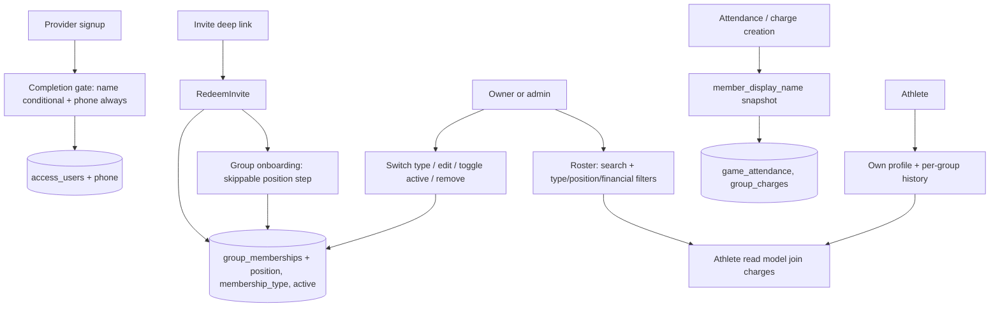

# Athlete Management Design

**Spec:** `.specs/features/athlete-management/spec.md`
**Context:** `.specs/features/athlete-management/context.md`
**Status:** Draft

---

## Architecture Decision

The athlete is the existing `group_memberships` row extended with per-group
attributes (`position`, `membership_type`, `active`); the phone is an
account-level column on `access_users`. No new athlete table, no
pre-registration state, no new entry path: the existing invite redemption is
the sole way a membership is created, and it now lands as `AVULSO`.

This is preferred over a dedicated `athletes` table because the membership
already has the exact identity `(group_id, user_id)` the épico calls "athlete",
and a second table would duplicate that key and require synchronized
creation/deletion for zero current benefit. Per-group attributes deliberately
live on the membership so the same user can hold different position/type per
group — the future seat for per-group skill characteristics and team balancing.

Removal stays a hard `DELETE` of the membership row. To make that safe, the
`game_attendance` FK that today points at `group_memberships` is repointed at
`access_users`, and both `game_attendance` and `group_charges` gain a
`member_display_name` snapshot written at creation time, so history remains
readable after removal or rename.

---

## Architecture Overview



### Boundary Rules

- Backend `features:access` owns `access_users.phone`, its validation, and the
  completion contract in the session bootstrap.
- Backend `features:groups` owns athlete attributes on `group_memberships`,
  roster read model, management commands, snapshots, and every business rule.
- Mobile `features:access` owns the extended completion flow (name + phone).
- Mobile `features:groups` owns onboarding position step, roster, athlete
  profile UI, DTOs, and MVI state.
- Financial status is a read-only derivation over existing `group_charges`
  statuses; no finance model or mutation changes.
- No client-authoritative validation: mobile mirrors checks for UX only
  (AD-005).

---

## Code Reuse Analysis

### Existing Components to Leverage

| Component | Location | How to Use |
| --- | --- | --- |
| Session bootstrap | `backend/features/access/.../application/session/BootstrapSession.kt`, `AccessSessionController.kt` (`PUT /api/session`) | Extend `SessionView`/response with `phone` and a derived `phoneRequired` flag; the completion gate keys off it. |
| Access user schema | `backend/features/access/.../db/migration/` | Additive `V4` migration for `phone`, following existing `CHECK`-constraint style. |
| Invite redemption | `backend/features/groups/.../application/invite/redeem/RedeemInvite.kt` | Unchanged flow; new membership rows land as `AVULSO` via column default. Idempotent re-redeem already preserves existing rows. |
| Membership models/repository | `.../application/membership/MembershipModels.kt`, `.../adapter/output/jdbc/membership/JdbcMembershipRepository.kt` | Extend with athlete attributes; follow existing owner-synthesis and `AccessName` validation patterns. |
| Role policy | `.../domain/GroupAccessPolicy.kt` | Reuse `OWNER`/`ADMIN` organizer checks for management routes; athletes mutate only their own row. |
| Charges schema | `groups` migration `V5` (`group_charges`) | Read-only join for paid/pending; `member_user_id` already FKs `access_users`, so it survives removal. |
| Attendance schema | `groups` migration `V6` (`game_attendance`) | Repoint member FK to `access_users`; add snapshot column. |
| Completion flow (mobile) | `mobile/features/access/.../presentation/namecompletion/`, `ui/NameCompletionRoot.kt`, `IdentityCompletionScreens.kt` | Extend the in-progress name-completion route into profile completion: name conditional, phone always, same MVI/Root pattern. |
| Membership/invite UI | `mobile/features/groups/.../ui/MembershipInviteScreens.kt`, `presentation/GroupAdministrationCoordinator.kt` | Roster and management screens follow the established groups presentation patterns (state machine + Root/Screen split). |
| Existing MVI conventions | `.specs/features/mobile-presentation-compose-mvi/` | New ViewModels follow State/Action/Effect + SavedStateHandle restoration. |

### Integration Points

| System | Integration Method |
| --- | --- |
| PostgreSQL | Two additive Flyway migrations (access: phone; groups: athlete attributes + FK repoint + snapshots + backfill). |
| Session API | `PUT /api/session` response gains `phone`/`phoneRequired`; a new narrow profile mutation sets the phone once validated. |
| Groups API | New athlete routes under `/api/groups/{groupId}/athletes`. |
| Charge generation | Existing monthly-charge member selection additionally excludes `active=false` athletes. |
| Mobile navigation | Completion gate runs before pending-invite resumption (both already sequence through the authenticated bootstrap); onboarding position step is appended to the redeem success flow. |

---

## Backend Components

### Access: Phone

- **Migration `V4__add_user_phone.sql` (access):**
  `ALTER TABLE access_users ADD COLUMN phone varchar(20)` with a `CHECK` for a
  normalized E.164-style Brazilian mobile number (`+55` + 2-digit DDD + mandatory leading `9` + 8 digits = 11 national digits) or `NULL`; a 10-digit landline number is rejected.
  Existing rows stay `NULL`; the completion gate collects them lazily.
- **`PhoneNumber` value object** in access domain: parses user input (masked BR
  formats), normalizes to E.164, rejects implausible numbers. Mirrors
  `AccessName` conventions.
- **Completion contract:** `PUT /api/session` response gains
  `phone: String?` and `phoneRequired: Boolean` (`phone == null`). A new
  `PATCH /api/session/profile` accepts `{ "phone": "..." }` (and optional
  `displayName` for the existing conditional name case), validates, persists,
  and returns the refreshed session view. Setting an already-set phone is
  idempotent overwrite by the owner of the account only.

### Groups: Athlete Attributes

- **Migration `V8__add_athlete_attributes.sql` (groups):**
  - `ALTER TABLE group_memberships ADD COLUMN position varchar(16)`,
    `membership_type varchar(16) NOT NULL DEFAULT 'AVULSO'`,
    `active boolean NOT NULL DEFAULT true`, with `CHECK` constraints
    (`position IN ('LIBERO','PONTA','CENTRAL','OPOSTO','LEVANTADOR')`,
    `membership_type IN ('MENSALISTA','AVULSO')`).
  - Insert a membership row (`role='ADMIN'`) for every group owner that lacks
    one, so owner athlete attributes have a physical seat.
    `GroupRole.resolve` already prioritizes ownership, so the persisted row
    never demotes or changes effective role.
  - `ALTER TABLE game_attendance DROP CONSTRAINT fk_game_attendance_member`,
    add `FOREIGN KEY (member_user_id) REFERENCES access_users (id)`.
  - `ALTER TABLE game_attendance ADD COLUMN member_display_name varchar(80)`,
    `ALTER TABLE group_charges ADD COLUMN member_display_name varchar(80)`;
    backfill both from `access_users.display_name`; then `SET NOT NULL`.
- **Domain:** `AthletePosition` and `AthleteMembershipType` enums;
  `AthleteAttributes(position?, membershipType, active)` on the membership
  models.

### Groups: Commands

- **`UpdateOwnAthleteProfile`** — athlete sets/clears their own `position` in
  one group. Requires current membership in that group; touches only their row.
- **`UpdateAthlete`** — `OWNER`/`ADMIN` sets `position`, `membershipType`,
  `active` for a member. Owner's own row is editable too. `OwnerImmutable`
  guard from `ChangeMemberRole` is not needed here — athlete attributes carry
  no privilege.
- **`RemoveAthlete`** — `OWNER`/`ADMIN` deletes the membership row.
  Removing the group owner is rejected (`OwnerImmutable`). Idempotent: deleting
  an absent row reports success-shaped no-op. Existing attendance/charges are
  untouched (FKs now survive).
- All commands reuse `GroupAccessPolicy` and the existing privacy-preserving
  `GroupNotFound`/`AccessForbidden` result shapes from `MembershipModels`.

### Groups: Roster Read Model

- **`ListAthletes`** — organizer query returning, per member: user id, display
  name, phone, position, type, active, and `financialStatus`.
- **Financial status derivation:** one `LEFT JOIN LATERAL`/`EXISTS` over
  `group_charges` — `PENDENTE` when any `status='PENDING'` charge exists for
  the member in the group with `due_date <= last day of the current group-local
  month`; otherwise `EM_DIA`. Charge-read failure degrades to
  `DESCONHECIDO` rather than failing the roster.
- **Search/filters** (`search`, `type`, `position`, `financialStatus`,
  `includeInactive`) are applied in SQL; filters combine with AND; text search
  matches name prefix/substring case- and accent-insensitively.
- Athlete-facing self read (`GetOwnAthleteProfile`) returns account data plus
  the caller's memberships with attributes and per-group history references;
  it never exposes other members' phones.

### Groups: Snapshot Writes

- `RespondAttendance` (and organizer attendance overrides) writes
  `member_display_name` from the current validated display name at row
  creation; subsequent status updates do not rewrite it.
- Charge creation (game-confirmation charge, monthly generation) writes
  `member_display_name` the same way. Status changes never rewrite it.
- Monthly charge generation's member selection adds `active = true`.

### HTTP Adapter

- **Location:** `backend/features/groups/.../adapter/input/http/AthleteController.kt`
- **Routes:**
  - `GET /api/groups/{groupId}/athletes` — organizer roster with query filters.
  - `PATCH /api/groups/{groupId}/athletes/{userId}` — organizer edit
    (`position`, `membershipType`, `active`).
  - `DELETE /api/groups/{groupId}/athletes/{userId}` — organizer removal.
  - `PATCH /api/groups/{groupId}/athletes/me` — athlete's own position.
- Access: `PATCH /api/session/profile` in `AccessSessionController` scope.
- Errors reuse stable API problems; non-member probes return privacy `404`.

---

## Mobile Components

### Profile Completion (features:access)

- Extend the in-progress `namecompletion` route into profile completion:
  phone field always shown and required; name field only when the session says
  the provider supplied none. BR phone mask for UX; backend remains
  authoritative.
- Gate rule: after authenticated bootstrap, `phoneRequired` (or missing name)
  routes to completion before any group navigation; a pending invite capability
  survives untouched and resumes after completion, reusing the existing
  deferred-invite sequencing.
- pt-BR copy; no re-prompt once complete (`phoneRequired=false`).

### Group Onboarding Position Step (features:groups)

- After successful invite redemption and group selection, one skippable screen
  offers the five positions (`Líbero`, `Ponta`, `Central`, `Oposto`,
  `Levantador`). Choosing persists via `PATCH .../athletes/me`; skipping
  navigates on without a request. Re-redeem by an existing member never shows
  the step.

### Roster (features:groups)

- **Route:** athletes list for `OWNER`/`ADMIN` inside the selected group.
- **State:** search text, filter selections (type, position, financial
  status), athlete rows (name, type, position chip, active flag, financial
  badge `Pago`/`Pendente`/unknown), loading/error.
- **Actions:** edit athlete (bottom sheet: position, type, active), remove
  (confirmation dialog naming the consequence: history preserved, athlete can
  rejoin by invite), retry.
- `ATHLETE` role never sees management controls; the route follows
  `GroupRoutePolicy` guards.

### Athlete Profile (features:groups)

- Own data (name, email, phone) plus per-group card: type, position, active,
  and history (games attended, charges) grouped by group, reusing existing
  read endpoints where they exist.

### Web

- Web screens (roster, edit, athlete profile) share the same ViewModels and
  gateways from common code per the épico's stack decision; only screen
  composition differs. They are a separate task surface, not a separate
  architecture.

---

## Data Models

### Migrations (net schema change)

```text
access_users
  + phone varchar(20) NULL          -- E.164 +55…, CHECK format; completion gate enforces presence

group_memberships
  + position varchar(16) NULL      CHECK IN (LIBERO, PONTA, CENTRAL, OPOSTO, LEVANTADOR)
  + membership_type varchar(16)    NOT NULL DEFAULT 'AVULSO' CHECK IN (MENSALISTA, AVULSO)
  + active boolean                 NOT NULL DEFAULT true
  (+ backfilled owner rows)

game_attendance
  ~ fk member: group_memberships → access_users
  + member_display_name varchar(80) NOT NULL (backfilled)

group_charges
  + member_display_name varchar(80) NOT NULL (backfilled)
```

### Roster DTO

```kotlin
data class AthleteDto(
    val userId: String,
    val displayName: String,
    val phone: String?,           // organizer view only
    val position: String?,        // enum name or null
    val membershipType: String,   // MENSALISTA | AVULSO
    val active: Boolean,
    val financialStatus: String,  // EM_DIA | PENDENTE | DESCONHECIDO
)
```

pt-BR labels (`Mensalista`, `Avulso`, `Líbero`, …) come from Compose resources;
enum names never render.

---

## Error Handling Strategy

| Error Scenario | Handling | User Impact |
| --- | --- | --- |
| Invalid/implausible phone | Field-level validation error, nothing stored | Inline error, retry in place. |
| Completion abandoned | `phoneRequired` stays true | Gate re-runs next authenticated entry; pending invite survives. |
| Position request fails during onboarding | Skippable step reports retryable failure | Athlete may retry, skip, or set later from profile. |
| Concurrent organizer edits on one athlete | Last-write-wins on scalar attributes | No optimistic-version ceremony; attributes are non-privileged scalars. |
| Remove already-removed athlete | Idempotent no-op success | No error on double-tap/refresh races. |
| Remove group owner | Rejected (`OwnerImmutable`) | Explicit error; ownership transfer is out of scope. |
| Charges unavailable during roster read | `financialStatus=DESCONHECIDO` | Roster renders; badge shows unknown state. |
| Non-member/athlete probes management routes | `403` / privacy `404`, no mutation | No data leak. |

---

## Security, Privacy, and Observability

- Phone is personal data: visible to the account owner and to `OWNER`/`ADMIN`
  of groups the athlete belongs to (roster); never in athlete-facing lists of
  other members, logs, metrics, or error payloads.
- All athlete routes require the authenticated principal plus membership; the
  privacy-preserving `404` contract from existing group resources applies.
- Snapshots store only the already-public-in-group display name — no phone or
  email snapshot.
- Log/measure operation name, coarse outcome, correlation ID, duration only.
  Type switches and removals produce log events without member-identifying
  payloads beyond IDs already standard in existing group logging.
- Migrations are additive; `scripts/check-*` gates (scope, credentials,
  migration inventory sensors) must be updated for the new access/groups
  migration counts and tables per V21-style inventory checks.

---

## Risks & Concerns

| Concern | Location | Impact | Mitigation |
| --- | --- | --- | --- |
| `game_attendance` FK to memberships blocks removal | `V6` schema | `DELETE` of membership fails with FK violation | This design repoints the FK to `access_users` in `V8` and backfills snapshots first. |
| Owner has no persisted membership row | `JdbcMembershipRepository` owner synthesis | Owner position/type would have nowhere to live | `V8` inserts missing owner rows as `ADMIN`; `GroupRole.resolve` keeps effective role `OWNER`. |
| Migration-count sensors reject new migrations | backend workspace-isolation tests (B59/B60 precedent) | Full backend gate fails | Update Access/Groups migration and table inventory sensors in the same task as each migration. |
| Completion gate vs. pending invite ordering | mobile access/groups coordinators | Wrong order could drop the invite capability or skip the gate | Sequence completion inside the authenticated bootstrap before deferred-invite resumption; journey test covers install → signup → completion → redeem. |
| `namecompletion` route is mid-refactor on `main` | `mobile/features/access/.../namecompletion/` | Parallel edits collide | Land the current MVI refactor first; profile completion extends the landed route. |
| Existing users mid-session at rollout | session contract | Old clients ignore `phoneRequired` | Additive response fields; enforcement is client-gate only, so old clients degrade gracefully until updated. |
| Monthly generation now filters `active` | finance member selection | Silently skipping athletes could surprise organizers | Generation UI shows excluded-inactive count; charge selection change is covered by finance tests. |

---

## Requirement Mapping

| Requirement | Design Components |
| --- | --- |
| ATH-01 | Access `V4` phone, `PhoneNumber`, session `phoneRequired`, `PATCH /api/session/profile`, mobile completion extension |
| ATH-02 | `AVULSO` column default on redeem, onboarding position step, `PATCH .../athletes/me` |
| ATH-03 | `ListAthletes` read model, financial derivation, roster route/filters UI |
| ATH-04 | `UpdateAthlete`, `RemoveAthlete`, `AthleteController`, edit sheet + removal dialog |
| ATH-05 | FK repoint, `member_display_name` snapshots + backfill, snapshot writes in attendance/charge creation |
| ATH-06 | `GetOwnAthleteProfile`, athlete profile screen with per-group cards |

All 6 requirements are mapped; none remain without a design component.

---

## Tech Decisions

| Decision | Choice | Rationale |
| --- | --- | --- |
| Athlete storage | Extend `group_memberships` | The vínculo already exists; no duplicate identity or sync. |
| Phone storage | `access_users.phone`, E.164 | Account-level datum; one format for future messaging. |
| History survival | FK repoint + name snapshot columns | Hard delete stays simple; history keeps rendering. |
| Owner attributes | Backfill persisted owner membership rows | Cheaper than special-casing owner in every athlete query/command. |
| Concurrency on athlete edits | Last-write-wins | Non-privileged scalars; optimistic versioning adds ceremony without a real conflict cost. |
| Financial status | `EXISTS` over `PENDING` charges, current group-local month boundary | Read-only reuse of Épico 06 model; degrades to unknown. |
| Completion enforcement | Client gate driven by server `phoneRequired` | No breaking API change; server stays source of truth for the flag. |

These choices conform to active AD-003, AD-005, and the mobile MVI/module
decisions. No project-level decision must be added or superseded.
