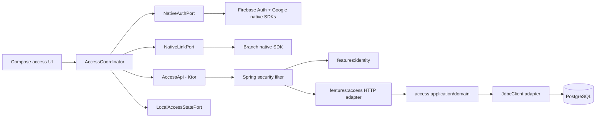
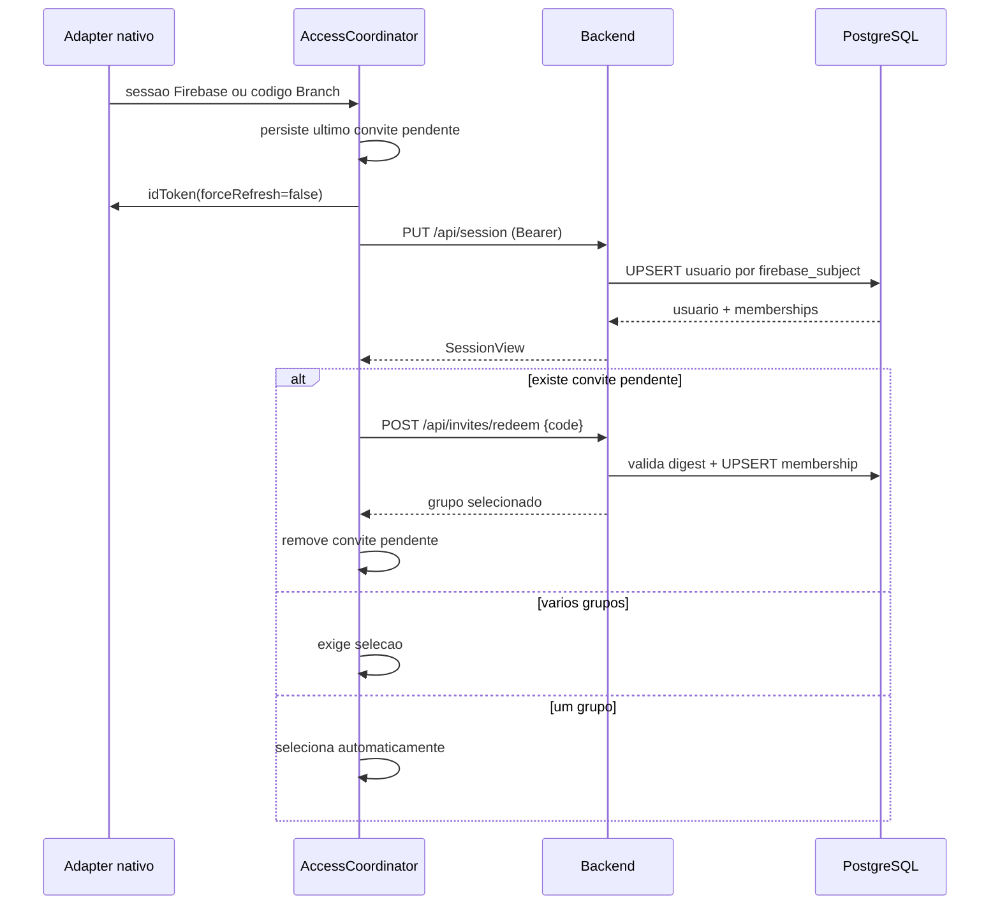

# Design de Autenticacao e Acesso

**Spec**: `.specs/features/authentication-access/spec.md`
**Status**: Aprovado em 2026-07-16; base do `tasks.md`
**Abordagem**: feature KMP compartilhada com adapters nativos; backend `access`
hexagonal separado de `identity`

---

## Visao Arquitetural

O Firebase continua sendo a autoridade de credencial e o backend passa a ser a
autoridade de usuario, grupo, papel e convite. O modulo existente `identity`
somente verifica o bearer token e publica uma identidade de request neutra no
`shared-kernel`; o novo modulo `access` implementa os casos de uso e a
persistencia sem depender de `identity`. O `bootstrap` compoe os dois modulos e
concentra infraestrutura HTTP transversal.

No app, `:features:access` concentra contratos, estado, coordenacao e UI Compose.
`:core:network` concentra o cliente Ktor. Firebase Auth, Google Sign-In, Branch,
Keychain/Keystore e share sheet permanecem em adapters Android/Swift injetados
no framework `SaqzMobile`, conforme `AD-001`, `AD-004`, `AD-013` e `AD-018`.



### Fluxos principais



O estado raiz e uma maquina unica, sem telas protegidas concorrentes:

```text
Starting
  -> SignedOut -> Authenticating -> AwaitingVerification
  -> CompletingName -> Bootstrapping
  -> NoGroup | SelectingGroup | ActiveGroup
  -> BootstrapUnavailable (retry, sem logout e sem conteudo protegido)
```

Um convite e estado ortogonal. O ultimo codigo valido recebido substitui o
anterior, fica cifrado ate o resgate e somente e consumido depois de email
verificado e bootstrap backend concluido. Um segundo `401` apos refresh encerra
a sessao local; `5xx` ou falha de rede nunca fazem logout.

---

## Reuso do Codigo Existente

| Componente | Local | Uso |
| --- | --- | --- |
| Verificacao Firebase | `backend/features/identity/` | Manter verificacao revogada/provider-neutral e estender o principal com `displayName`. |
| Security chain | `backend/bootstrap/.../IdentitySecurityConfiguration.kt` | Manter bearer stateless e compor controllers de `access`. |
| Correlation ID e problem response | `backend/shared-kernel/` e adapters HTTP existentes | Generalizar contrato e remover ownership transversal de `identity`. |
| Bootstrap Firebase Android | `mobile/android-app/.../AndroidFirebaseBootstrap.kt` | Reusar app nomeado/emulator e expor o `FirebaseAuth` ao adapter. |
| Bootstrap Firebase iOS | `mobile/ios-app/SaqzIOS/SaqzIOSApp.swift` | Preservar ordem Firebase -> Compose e injetar adapters no mesmo root. |
| Design system | `mobile/core/design-system/` | Inputs, buttons, dialogs, list items, badges e state hosts das novas telas. |
| Estado comum | `mobile/core/common/.../SaqzUiState.kt` | Estados de loading/empty/error; estados de dominio ficam na feature. |
| Navigation Compose | `mobile/compose-app/.../navigation/` | `compose-app` continua dono das rotas e do back stack. |
| Firebase fixture | `firebase/session-fixture/` | Estender para cadastro/verificacao e identidades de teste. |

### Mudancas de fronteira necessarias

- Mover `AuthenticatedPrincipal` para `shared-kernel` (renomeado
  `RequestIdentity`) para que `access` nao dependa de `identity`.
- Mover correlation filter, problem writer e exception advice para
  `bootstrap/configuration/http`; sao infraestrutura de toda a API, nao dominio
  de identidade.
- Evoluir `/api/session` de prova somente-leitura para `PUT` idempotente. O
  endpoint antigo `GET` e removido junto com seus contratos de teste; nao fica
  uma segunda semantica de sessao.
- Atualizar gates que congelaram o escopo do Epico 01 antes de adicionar banco,
  segunda feature backend ou feature mobile.

---

## Componentes Backend

### Request identity e suporte HTTP

- **Local**: `backend/shared-kernel/` e
  `backend/bootstrap/src/main/kotlin/.../configuration/http/`.
- **Interfaces**: `RequestIdentity(subject, email, emailVerified, displayName)`;
  `ApiProblem(status, code, correlationId, fieldErrors?, retryAfterSeconds?)`.
- **Comportamento**: correlation ID novo por request, devolvido em
  `X-Correlation-ID`; JSON `application/problem+json`; nenhum body/header
  sensivel nos logs. O filtro de identidade continua em `identity` e injeta
  `RequestIdentity` no Spring Security.

### Dominio e aplicacao de acesso

- **Local**: `backend/features/access/src/main/kotlin/br/com/saqz/access/` com
  `domain`, `application`, `api` e `adapter`.
- **Modelos**: `UserAccount`, `Group`, `GroupMembership`, `GroupRole`,
  `InviteToken`, `GroupName` e `IanaTimeZone`.
- **Casos de uso**:
  - `BootstrapSession.execute(identity)`
  - `CreateGroup.execute(actor, requestId, name, timeZone)`
  - `GetGroup.execute(actor, groupId)` e `UpdateGroupSettings.execute(...)`
  - `ListAccessMemberships.execute(owner, groupId)` e
    `ChangeMemberRole.execute(owner, groupId, userId, role)`
  - `RotateInvite.execute(actor, groupId)` e `ExpireInvite.execute(...)`
  - `RedeemInvite.execute(actor, rawCode)`
- **Politica**: `GroupAccessPolicy` deriva papel somente do banco. Nao membro e
  indistinguivel de grupo inexistente (`404`); membro sem papel recebe `403`.
- **Portas**: `AccessRepository`, `TransactionRunner`, `Clock`,
  `SecureTokenGenerator`, `InviteLinkFactory` e `AccessMetrics`.

`SecureTokenGenerator` produz 32 bytes aleatorios e Base64URL sem padding. O
codigo nunca vira ID e somente seu SHA-256 e consultado/persistido. O
`InviteLinkFactory` monta um Branch Long Link HTTPS a partir de dominio
configurado, com `saqz_invite={code}`, rota logica `invite/{code}`,
`$ios_nativelink=true` e somente metadados tecnicos fixos. Parametros sao
percent-encoded por API de URI, nunca por concatenacao ad hoc. O link nao e
persistido nem logado e e devolvido uma unica vez pela rotacao.

### Persistencia SQL

- **Local**: `backend/features/access/.../adapter/output/jdbc/` e migrations em
  `src/main/resources/db/migration/access/`.
- **Tecnologia**: PostgreSQL, Flyway e Spring `JdbcClient`, com SQL explicito.
- **Transacoes**: `READ COMMITTED`, constraints unicas e `SELECT ... FOR UPDATE`
  nas rotacoes, alteracoes de papel e janela de rate limit.
- **Concorrencia**: upserts usam `INSERT ... ON CONFLICT`; criacao/rotacao
  repetidas nao dependem de check-then-insert em memoria.

### Adapters HTTP

Contratos sao JSON camelCase; IDs sao UUID, instantes RFC 3339 UTC e timezone e
IANA. O cliente e escrito a mao com `kotlinx.serialization`; nao ha geracao
OpenAPI nesta fase.

| Metodo e rota | Autorizacao | Resultado |
| --- | --- | --- |
| `PUT /api/session` | Firebase verificado | Upsert e `SessionView` com usuario/memberships. |
| `POST /api/groups` | Usuario sincronizado | Cria por `requestId` UUID; coordinator seleciona o retorno. |
| `GET /api/groups/{groupId}` | Qualquer membro | Grupo, settings, papel e `ETag`. |
| `PUT /api/groups/{groupId}/settings` | OWNER/ADMIN + `If-Match` | Nome/timezone atomicos e nova versao. |
| `GET /api/groups/{groupId}/memberships` | OWNER | Lista minima `userId`, nome e papel. |
| `PUT /api/groups/{groupId}/memberships/{userId}/role` | OWNER | Define `ADMIN` ou `ATHLETE` idempotentemente. |
| `POST /api/groups/{groupId}/invite` | OWNER/ADMIN | Rotaciona e retorna `{inviteUrl}` uma vez. |
| `DELETE /api/groups/{groupId}/invite` | OWNER/ADMIN | Expira idempotentemente (`204`). |
| `POST /api/invites/redeem` | Usuario sincronizado | Resgata `{code}` e retorna grupo/papel. |

`PUT /api/session` nao recebe email/nome autoritativos no body: esses campos vem
do token verificado. Antes dele, o app atualiza o display name no Firebase e
forca refresh. O mesmo `requestId` de criacao sempre devolve o grupo ja criado.
Settings concorrentes com ETag antigo recebem `409 VERSION_CONFLICT` e recarga.

---

## Modelo de Dados

### `access_users`

| Campo | Regra |
| --- | --- |
| `id uuid` | PK gerada no backend. |
| `firebase_subject varchar(128)` | `UNIQUE NOT NULL`; unica chave externa de identidade. |
| `email varchar(320)` | Espelho nullable, nunca usado para merge. |
| `email_verified boolean` | Deve ser true para criar a linha. |
| `display_name varchar(80)` | Trim, 2..80, sem controles. |
| `created_at`, `updated_at` | `timestamptz NOT NULL`. |

### `access_groups`

| Campo | Regra |
| --- | --- |
| `id uuid` | PK. |
| `owner_user_id uuid` | FK `NOT NULL`; fonte unica do papel `OWNER`. |
| `creation_key uuid` | Idempotencia; `UNIQUE(owner_user_id, creation_key)`. |
| `name varchar(80)` | 2..80 depois de trim. |
| `time_zone varchar(64)` | ID IANA validado na aplicacao. |
| `version bigint` | Inicia em 1 e suporta ETag/optimistic locking. |
| `created_at`, `updated_at` | `timestamptz NOT NULL`. |

O owner nao e duplicado em `group_memberships`. As consultas sintetizam seu
membership `OWNER`; assim `owner_user_id NOT NULL` garante exatamente um owner
mesmo se nao houver linhas de membros.

### `group_memberships`

| Campo | Regra |
| --- | --- |
| `group_id`, `user_id` | PK composta e FKs. |
| `role` | `CHECK (role IN ('ADMIN','ATHLETE'))`; `OWNER` e impossivel aqui. |
| `created_at`, `updated_at` | `timestamptz NOT NULL`. |

Insert de convite preserva membership existente: owner continua owner, admin
continua admin e athlete nao duplica.

### `group_invites`

| Campo | Regra |
| --- | --- |
| `group_id uuid` | PK; no maximo um convite ativo por grupo. |
| `token_digest bytea` | `UNIQUE NOT NULL`; SHA-256 do codigo. |
| `created_by_user_id uuid` | Auditoria interna sem entrar em labels/logs. |
| `created_at` | Sem `expires_at`; delete significa expiracao manual. |

Rotacao faz upsert da linha dentro da mesma transacao. Links antigos ainda podem
abrir o app, mas o digest deixa de existir e todos recebem o mesmo erro publico.

### `invite_redemption_limits`

| Campo | Regra |
| --- | --- |
| `user_id uuid` | PK. |
| `window_started_at` | Inicio da janela corrente. |
| `invalid_count` | 0..10. |

A linha e bloqueada durante resgate. As dez primeiras falhas em dez minutos
retornam convite invalido; tentativas adicionais retornam `429` com
`retryAfterSeconds`. Resgate valido nao incrementa nem zera a janela.

---

## Componentes Mobile

### `:core:network`

- **Local**: `mobile/core/network/`; KMP sem Compose.
- **Responsabilidade**: Ktor `HttpClient`, JSON, timeouts, problem mapping e
  bearer auth.
- **Interfaces**: `IdTokenProvider.token(forceRefresh, completion)` e
  `SessionInvalidator.invalidate()`.
- **Regra**: `loadTokens` pede token atual; o primeiro `401` serializa um unico
  refresh para requests concorrentes e repete uma vez. Novo `401` invalida a
  sessao local. Firebase persiste a sessao; o app nunca grava ID/refresh token.
- **Engines**: Android e iOS usam engines Ktor proprios da plataforma, agregados
  no unico framework `SaqzMobile`.

### `:features:access`

- **Local**: `mobile/features/access/`; `commonMain` para contratos,
  presentation e Compose UI.
- **API publica**: `AccessCoordinator`, `AccessState`, `AccessActions`,
  `NativeAuthPort`, `NativeLinkPort`, `LocalAccessStatePort` e telas sem
  dependencia do app shell.
- **Estado**: `StateFlow<AccessState>` e intents single-flight. Senha existe
  somente no estado transiente do formulario e e limpa depois do submit.
- **Reconciliacao**: depois de cada bootstrap, o coordinator restaura o group ID
  local somente se ele ainda estiver nos memberships retornados; caso contrario
  remove-o e aplica a regra zero/um/varios grupos.
- **Rotas/telas**: entrar, cadastrar, recuperar senha, aguardar verificacao,
  completar nome, erro de bootstrap, criar grupo, selecionar grupo, contexto do
  grupo, configuracao geral, papeis e convite.
- **UX**: Compose reutiliza o design system; auth nao mostra shell protegido.
  Um grupo seleciona automaticamente; varios exigem lista com nome/papel e
  acao para criar outro. Ao trocar, o conteudo anterior sai antes da nova carga.

### Adapters nativos

Interfaces Kotlin exportadas usam callbacks pequenos, que Swift implementa como
protocols; coroutines e tipos Firebase/Branch nao atravessam a fronteira.

```kotlin
interface NativeAuthPort {
    fun observe(listener: AuthStateListener): Cancelable
    fun createAccount(name: String, email: String, password: String, done: AuthCallback)
    fun signInWithPassword(email: String, password: String, done: AuthCallback)
    fun signInWithGoogle(done: AuthCallback)
    fun sendVerification(done: ResultCallback)
    fun reloadUser(done: AuthCallback)
    fun sendPasswordReset(email: String, done: ResultCallback)
    fun updateDisplayName(name: String, done: AuthCallback)
    fun idToken(forceRefresh: Boolean, done: TokenCallback)
    fun signOut(done: ResultCallback)
}

interface NativeLinkPort {
    fun start(listener: InviteCodeListener): Cancelable
}

interface LocalAccessStatePort {
    fun readSelectedGroupId(done: ValueCallback)
    fun writeSelectedGroupId(value: String?, done: ResultCallback)
    fun readPendingInvite(done: ValueCallback)
    fun writePendingInvite(value: String?, done: ResultCallback)
}

interface NativeSharePort {
    fun share(text: String, done: ResultCallback)
}
```

Callbacks retornam apenas resultados provider-neutral. Cancelar Google mantem a
tela e nao e erro; conflito de metodo vira `AUTH_METHOD_CONFLICT`; password
reset mostra confirmacao neutra inclusive quando Firebase sinaliza usuario
ausente. Cadastro e login nunca persistem senha, e verificacao usa
`reloadUser` seguido de token forcado antes do bootstrap.

| Adapter | Android | iOS |
| --- | --- | --- |
| `NativeAuthPort` | Firebase Auth; Google via Credential Manager | Firebase Auth; credencial do GoogleSignIn |
| `NativeLinkPort` | Branch session, App Links e `onNewIntent` | Branch session, Universal Links e NativeLink |
| `LocalAccessStatePort` | group ID em preferences; invite cifrado com Android Keystore | group ID em UserDefaults; invite no Keychain |
| `NativeSharePort` | Sharesheet do sistema | `UIActivityViewController` |

O adapter de link aceita apenas o parametro `saqz_invite`, valida Base64URL e
entrega o codigo, sem group ID ou dados analiticos. No iOS, NativeLink pode
mostrar a confirmacao de colar exigida pelo sistema; negar nao cria membership e
o link pode ser aberto novamente. O codigo pendente sobrevive a auth,
verificacao e restart, mas e removido em sucesso, descarte explicito ou logout.

### Composicao e navegacao

`compose-app` passa de dois booleanos soltos para `SaqzAppDependencies`, que
agrupa ports e configuracao, preservando o controller de acessibilidade. Android
constroi adapters depois do Firebase bootstrap; Swift configura Firebase/Branch,
constroi os protocols e os injeta em `MainViewController`. `compose-app` segue
dono do `NavHost`; a feature fornece estado e screen entry points.

---

## Deep Link e Privacidade

- Producao usa dominio HTTPS configuravel, por exemplo `join.saqz.app`,
  cadastrado como dominio Branch e associado a Android/iOS.
- O backend monta um **Branch Long Link**, nao Short Link: long links nao
  expiram por inatividade e podem ser construidos sem chamar a API premium.
- O link carrega somente o codigo opaco, rota tecnica e flags de roteamento. Nao
  carrega group ID, nome, email ou papel.
- Branch e um transporte nao autoritativo. Expirar/rotacionar remove o digest no
  banco; nao e necessario apagar link no provedor.
- O codigo aparece inevitavelmente no link compartilhado e nos dados processados
  pelo provedor. Logs Saqz, crash reports e metricas devem redacta-lo; a avaliacao
  de privacidade/contrato Branch e gate de producao.
- Configurar a maior janela de deferred matching suportada. A validade do
  convite nao tem TTL, mas a recuperacao automatica apos um clique antigo esta
  sujeita a janela e as regras de privacidade do SO; reabrir o link ativo retoma
  o fluxo.

Firebase Dynamic Links e proibido: o servico foi descontinuado em 2025.

---

## Erros e Observabilidade

| Cenario | HTTP/codigo | Comportamento do app |
| --- | --- | --- |
| Token ausente/invalido | `401 AUTHENTICATION_REQUIRED` | Refresh uma vez; segundo 401 faz logout local. |
| Firebase indisponivel no backend | `503 IDENTITY_PROVIDER_UNAVAILABLE` | Retry sem conteudo e sem logout. |
| Email nao verificado | `403 EMAIL_NOT_VERIFIED` | Volta/permanece em verificacao. |
| Campo invalido | `400 VALIDATION_FAILED` + `fieldErrors` | Erro junto ao campo; preserva nao sensiveis. |
| Nao membro/grupo inexistente | `404 GROUP_NOT_FOUND` | Mesmo estado publico. |
| Papel insuficiente | `403 ACCESS_FORBIDDEN` | Remove acao obsoleta e permite refresh. |
| Convite ruim/rotacionado | `404 INVITE_INVALID_OR_EXPIRED` | Mensagem unica, limpa pendencia e segue bootstrap. |
| Limite de convite | `429 INVITE_ATTEMPT_LIMIT` | Desabilita retry pelo `retryAfterSeconds`. |
| ETag antigo | `409 VERSION_CONFLICT` | Recarrega settings antes de editar novamente. |
| Falha de rede/backend | timeout/`5xx` | Retry; nunca renderiza cache protegido. |

Micrometer registra contadores por `operation`, `result` e status: bootstrap,
401/403/404/429, invite generated/expired/redeemed e falha de provedor. Labels
nunca contem user/group ID, email ou codigo. Logs estruturados usam correlation
ID e resultado estavel; bodies de auth/invite e header Authorization sao
excluidos de logging.

---

## Verificacao

| Camada | Evidencia |
| --- | --- |
| Dominio `access` | Unit tests da matriz OWNER/ADMIN/ATHLETE, validadores, idempotencia e role preservation. |
| JDBC | Testcontainers PostgreSQL real para migrations, constraints, upserts e concorrencia de bootstrap/criacao/rotacao/resgate. |
| HTTP/bootstrap | Spring integration tests para todos os status, ETag, correlation ID, redaction e Firebase Auth Emulator. |
| Link builder | Fixtures exatas de URI encoding/decoding, sem rede nem credencial; teste de config de dominio. |
| `core:network` | Ktor MockEngine prova bearer, um refresh concorrente, segundo 401 e problem mapping. |
| Feature KMP | Fakes dos quatro ports provam toda maquina de estados, ultimo link, restart, single-flight e troca sem conteudo anterior. |
| Android | Unit/instrumented tests dos adapters, Credential Manager seam, App Link/Branch fixture, Keystore e Firebase emulator. |
| iOS | XCTest dos protocols Firebase/Google/Branch, Universal Link/NativeLink fixture, Keychain e injecao antes do Compose. |
| UI/acessibilidade | Compose UI + XCUITest/Android para IME, rotacao, font scale/Dynamic Type maximos, foco, erro e back stack unico. |
| Gates | `scripts/check-all`, suites backend/mobile e testes de scripts atualizados para os novos modulos. |

O fluxo Google e testado com provider fake na borda nativa e identidade Firebase
fixture/emulator; nenhum gate depende de credencial Google ou Branch de
producao. Concorrencia usa duas conexoes/threads reais contra PostgreSQL, nao um
repository em memoria.

### Rastreabilidade

| Requisitos | Componentes/evidencia |
| --- | --- |
| `AUTH-01..08` | NativeAuthPort, auth screens/coordinator e adapter tests Android/iOS. |
| `SESSION-01..05` | `PUT /api/session`, user upsert, Ktor bearer e Firebase emulator. |
| `GROUP-01..07` | Group use cases, SQL constraints/policy, HTTP matrix e Compose screens. |
| `INVITE-01..08` | Token/link factory, secure pending store, rate limit e concurrency tests. |
| `SELECT-01..06` | SessionView, coordinator, selected-group store e navigation tests. |
| `SEC-01..04` | Problem/correlation support, transactions, metrics/redaction e disposable gates. |
| `EDGE-01..07` | Name completion, last-link reducer, role preservation e lifecycle/UI tests. |

**Cobertura de Design:** 45/45 requisitos mapeados.

---

## Riscos e Preocupacoes

| Preocupacao | Local | Impacto | Mitigacao |
| --- | --- | --- | --- |
| Principal compartilhavel pertence hoje a `identity`. | `backend/features/identity/src/main/kotlin/br/com/saqz/identity/api/AuthenticatedPrincipal.kt:1` | `access` criaria dependencia entre features. | Mover contrato neutro ao `shared-kernel`; architecture test proibe feature -> feature. |
| Correlation/problem globais estao dentro do adapter de identidade e o writer monta JSON manualmente. | `backend/features/identity/src/main/kotlin/br/com/saqz/identity/adapter/input/http/BearerAuthenticationFilter.kt:56` | Ownership incorreto e risco de escaping/contratos divergentes. | Mover suporte para bootstrap HTTP e serializar `ApiProblem` com Jackson. |
| Teste arquitetural congela `identity` como unica feature e allowlist exata. | `backend/architecture-tests/src/test/kotlin/br/com/saqz/architecture/BackendArchitectureTest.kt:22`, `:101`, `:136` | Novo modulo falha ou limites deixam de escalar. | Generalizar o teste para toda pasta `features/*` e incluir `access` explicitamente onde necessario. |
| Gate de escopo proibe banco, UI auth e novos modulos que agora sao escopo aprovado. | `scripts/check-scope:55`, `:59`, `:81`, `:100` | Implementacao correta sera bloqueada; remocao pura perderia protecoes. | Substituir negativos do Epico 01 por allowlists/contratos do Epico 03 antes de codigo de produto. |
| Fronteira publica Compose aceita exatamente dois booleans. | `mobile/compose-app/src/commonMain/kotlin/br/com/saqz/composeapp/SaqzApp.kt:6` | Nao ha injecao segura para Firebase/link/storage. | Introduzir `SaqzAppDependencies` e manter acessibilidade como parte separada da composicao. |
| Empacotamento de resources lista modulos manualmente. | `mobile/build-logic/src/main/kotlin/br/com/saqz/mobile/buildlogic/KmpComposeLibraryConventionPlugin.kt:15` | Resources de `features:access` podem faltar no APK. | Adicionar feature a lista e um teste de resource sentinel por target. |
| Branch processa o bearer de convite e deferred linking depende de politica/entitlement externo. | N/A - integracao nova Branch | Privacidade, dominio customizado e comportamento pos-instalacao podem variar. | Long Link sem PII, redaction, ambientes test/live separados, checklist de contrato/privacidade e teste real de release antes do rollout. |
| Short links Branch expiram apos inatividade e API server-side e comercial. | N/A - integracao nova Branch | Poderia contradizer convite sem TTL e criar custo oculto. | Usar Long Links deterministas; validar dominio e comportamento em spike antes da implementacao final. |
| Nao existe persistencia nem teste SQL no baseline. | `backend/bootstrap/build.gradle.kts:9` | Migrations/locking podem falhar somente em producao. | Flyway + PostgreSQL Testcontainers desde a primeira migration; proibir banco em memoria para integration tests. |

---

## Decisoes Tecnicas

| Decisao | Escolha | Motivo |
| --- | --- | --- |
| Limite backend | Novo `features:access`, sem dependencia de `identity` | Preserva `AD-003` e separa credencial de autorizacao. |
| Ownership | `access_groups.owner_user_id`; memberships somente ADMIN/ATHLETE | Garante exatamente um owner por schema simples e preserva futura cobranca. |
| Persistencia | PostgreSQL + Flyway + JdbcClient | Constraints/transacoes explicitas sem acoplar dominio a ORM. |
| Concorrencia | Unique constraints, upsert, row locks e ETag | Idempotencia/atomicidade verificaveis em multiplas instancias. |
| Cliente HTTP | Ktor compartilhado em `:core:network` | Um contrato de retry/erro para Android/iOS, com engines nativos. |
| Firebase | Interfaces KMP, SDKs oficiais nos launchers | Cumpre `AD-004`/`AD-018` e mantem tipos nativos fora de common code. |
| Deeplink | Branch Long Link + adapters nativos | Deferred install sem Firebase Dynamic Links, API premium ou TTL de short link. |
| Contrato cliente | DTOs `kotlinx.serialization` escritos a mao | Escopo pequeno; evita gerador e artefato cross-workspace prematuro. |
| Estado local | Firebase guarda sessao; group ID em preferences; invite cifrado | Nao duplica tokens e protege a capability pendente. |

As decisoes de persistencia backend, rede mobile, identidade compartilhada e
transporte de deeplink sao registradas como `AD-019..022` em `.specs/STATE.md`.

---

## Referencias Verificadas

- Firebase Dynamic Links shutdown:
  <https://firebase.google.com/support/dynamic-links-faq>
- Firebase Google Sign-In Android/iOS:
  <https://firebase.google.com/docs/auth/android/google-signin> e
  <https://firebase.google.com/docs/auth/ios/google-signin>
- Ktor client e bearer auth:
  <https://ktor.io/docs/client-create-new-application.html> e
  <https://ktor.io/docs/client-bearer-auth.html>
- Spring `JdbcClient`, Flyway e Testcontainers PostgreSQL:
  <https://docs.spring.io/spring-framework/reference/data-access/jdbc/core.html>,
  <https://docs.spring.io/spring-boot/how-to/data-initialization.html> e
  <https://java.testcontainers.org/modules/databases/postgres/>
- Branch deferred links, NativeLink e expiracao de Long Links:
  <https://help.branch.io/developer-hub/docs/native-sdks-overview>,
  <https://help.branch.io/developer-hub/docs/nativelink-deferred-deep-linking> e
  <https://help.branch.io/marketer-hub/docs/deep-link-reference>
- Interfaces Kotlin implementadas por Swift:
  <https://kotlinlang.org/docs/native-objc-interop.html>
