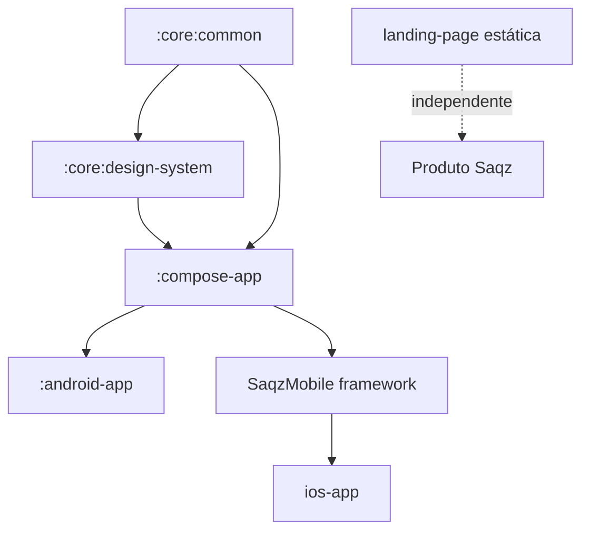

# Design Técnico da Fundação Mobile de Interface e Design System

**Spec:** `.specs/features/frontend-design-system-foundation/spec.md`
**Contexto:** `.specs/features/frontend-design-system-foundation/context.md`
**Status:** Aprovado; tasks detalhadas em tasks.md
**Data:** 2026-07-15
**Baseline:** `main` em `8f54dfc`, após retirada e ajuste final do workspace Angular.

## Abordagem Escolhida

O app compartilha apresentação entre Android e iOS por Compose Multiplatform.
Dois módulos core reais separam estado/formatação e design system;
`:compose-app` possui shell, rotas, Home e catálogo e continua exportando o
único framework iOS. A landing permanece uma superfície estática independente.
Compose é o owner de UI, semantics, tipografia, Dynamic Type, recursos e motion
em ambos os targets. Código Swift/UIKit permanece apenas nos launchers, SDKs
nativos e preferências do sistema sem API Compose comum.

Um target web não é preparado antecipadamente. Se houver demanda, uma nova
feature avalia maturidade de Compose Web, browsers, acessibilidade, navegação e
adaptação responsiva naquele momento.



## Conformidade com Decisões

| Decisão | Aplicação |
| --- | --- |
| `AD-001`, `AD-013` | Módulos KMP entram no único umbrella; `:compose-app` continua dono do framework. |
| `AD-004` | Firebase permanece em SDKs nativos nos launchers; não contamina commonMain. |
| `AD-005` | Backend continua autoritativo; mobile não importa domínio servidor. |
| `AD-009..011` | Gates iOS/API30 preservam versões e hardening existentes. |
| `AD-015` | Visual Saqz Apple-inspired e landing não sincronizada automaticamente. |
| `AD-016` | API 35 moderna só vira bloqueante após probe pinado. |
| `AD-017` | Nenhum workspace/target de UI web faz parte da feature. |
| `AD-018` | UI mobile é Compose-first; adapters nativos cobrem somente lacunas reais de plataforma. |

## Estrutura Planejada

```text
mobile/
|-- core/
|   |-- common/
|   |   `-- src/commonMain/kotlin/br/com/saqz/core/common/
|   |       |-- formatting/
|   |       `-- state/
|   `-- design-system/
|       |-- src/commonMain/composeResources/
|       |   |-- drawable/
|       |   `-- values/
|       |-- src/commonTest/composeResources/files/ui-contract.json
|       |-- src/commonMain/kotlin/br/com/saqz/designsystem/
|       |-- src/androidMain/
|       |   |-- composeResources/font/
|       |   |   |-- inter_light.ttf
|       |   |   |-- inter_regular.ttf
|       |   |   |-- inter_semibold.ttf
|       |   |   `-- inter_bold.ttf
|       |   `-- kotlin/br/com/saqz/designsystem/
|       `-- src/iosMain/kotlin/br/com/saqz/designsystem/
|-- compose-app/src/commonMain/
|   |-- composeResources/values/strings.xml
|   `-- kotlin/br/com/saqz/composeapp/
|       |-- accessibility/
|       |-- catalog/
|       |-- home/
|       |-- navigation/
|       |-- shell/
|       `-- SaqzApp.kt
|-- android-app/src/main/res/
|   |-- drawable/
|   |-- values/
|   `-- values-v31/
`-- ios-app/SaqzIOS/Assets.xcassets/
    |-- LaunchBackground.colorset/
    `-- LaunchSymbol.imageset/
```

## Build e Dependências

| Dependência | Versão | Módulo |
| --- | --- | --- |
| Navigation Compose | `2.9.2` | `:compose-app` |
| `kotlinx-datetime` | `0.8.0` | `:core:common` |
| Compose Resources | `1.11.1` | design system/app |
| AndroidX core splashscreen | `1.2.0` | `:android-app` |
| Inter | `4.1` estática via Compose Resources | `:core:design-system` Android |
| Kotlin serialization plugin | `2.4.10` | `:compose-app` |
| `kotlinx-serialization-json` | `1.11.0` | `:compose-app` |

Material 2 permanece como primitive. `MaterialTheme` recebe apenas o subconjunto
compatível de cores/tipografia/shapes; os tokens Saqz completos ficam em
`CompositionLocal`s tipados. O bottom sheet é uma superfície inferior sobre
`Dialog`, sem API experimental nem drag-to-dismiss.

Pins de execução que não podem variar entre agentes:

- Inter vem somente do release oficial `Inter-4.1.zip` em
  `https://github.com/rsms/inter/releases/download/v4.1/Inter-4.1.zip`,
  SHA-256 `9883fdd4a49d4fb66bd8177ba6625ef9a64aa45899767dde3d36aa425756b11e`.
  São copiados apenas os TTFs estáticos Light/Regular/SemiBold/Bold e a licença
  SIL OFL 1.1; hashes individuais ficam fixados em `tasks.md`.
- Motion normal usa press `0.95 / 120ms`, focus `180ms` e rota/estado
  `220ms / 8dp`. Reduced Motion usa scale `1.0`, translate `0dp` e conserva
  feedback por opacity em `120ms`.
- O SVG baseline da landing tem SHA-256
  `0c732546309e7143f60203472c368a3cebbb3a53721f142898724023aa33a473`.
  Wordmark preserva viewBox `0 0 1200 360`; símbolo é o crop
  `0 0 360 360` dos mesmos paths.

### Preflight bloqueante de recursos

A primeira sequência mobile cria string/drawable sentinels em
`:core:design-system`, consome por `:compose-app` e prova:

1. `:core:design-system:allTests` e `:compose-app:allTests` resolvem os recursos;
2. o APK devDebug contém/renderiza string/drawable em API 30;
3. `SaqzMobile` resolve string/drawable no simulador iOS;
4. imediatamente após a aquisição pinada da Inter e antes de theme/componentes,
   um probe separado prova os quatro weights estáticos no APK API 30.

Se AGP 9.1 perder `composeResources` transitivos no APK/framework, strings,
drawables e fonts de runtime migram para os source sets correspondentes de
`:compose-app`; o design system recebe labels, painters e `FontFamily` por
`SaqzTheme`/parâmetros e não depende de accessor gerado no core. No caminho
preferido, TTFs ficam em `androidMain/composeResources/font`, são carregadas pelo
accessor Compose do próprio source set e verificadas por weight no APK. Não há
`R.font` nem opt-in a resources Android nativos no módulo KMP.

## Módulos e Interfaces

### `:core:common`

- `sealed interface SaqzUiState<out T>` com Loading/Content/Empty/Error.
- `SaqzTimeZoneProvider` injetável.
- `formatDate`, `formatTime`, `formatDateTime` e `formatBrl` com algoritmo
  explícito e limites equivalentes ao safe integer JavaScript.
- Sem Compose, Firebase, Android, UIKit ou backend.

### `:core:design-system`

- Registries imutáveis completos: `SaqzColorTokens`, `SaqzMetrics`,
  `SaqzTypography`, `SaqzMotionPolicy`.
- `SaqzTheme(preferences, content)` fornece `LocalSaqzColors`,
  `LocalSaqzMetrics`, `LocalSaqzTypography` e `LocalSaqzMotion`, além de derivar
  o subconjunto Material 2 do mesmo registry.
- `SaqzTheme.colors/metrics/typography/motion` são os únicos acessores públicos;
  componentes não importam constantes soltas nem hardcode de token.
- `@Composable expect fun saqzFontFamily(): FontFamily`; Android monta Inter
  estática por `Font(Res.font.*)` e iOS retorna `FontFamily.Default`.
- Composables públicos: Button, Input, Card, ListItem, Badge, Dialog,
  BottomSheet, state views/host e BottomNav.

```kotlin
@Immutable
data class SaqzTypography(
    val heroDisplay: TextStyle,
    val displayLarge: TextStyle,
    val displayMedium: TextStyle,
    val lead: TextStyle,
    val body: TextStyle,
    val bodyStrong: TextStyle,
    val caption: TextStyle,
    val navigation: TextStyle,
)

object SaqzTheme {
    val colors: SaqzColorTokens
        @Composable @ReadOnlyComposable get() = LocalSaqzColors.current
    val metrics: SaqzMetrics
        @Composable @ReadOnlyComposable get() = LocalSaqzMetrics.current
    val typography: SaqzTypography
        @Composable @ReadOnlyComposable get() = LocalSaqzTypography.current
    val motion: SaqzMotionPolicy
        @Composable @ReadOnlyComposable get() = LocalSaqzMotion.current
}
```

Cada `TextStyle` contém font size, weight, line height e tracking exatos da spec.
Valores `sp` permanecem bases não pré-escaladas: Compose aplica font scale e
Dynamic Type uma vez. Android associa os accessors Compose das quatro TTFs aos
pesos 300/400/600/700; iOS usa a fonte do sistema. Fonte variável permanece fora
para preservar o contrato estático/determinístico aprovado.

### `:compose-app`

- `@Serializable data object SaqzDestination.Home` e `.Catalog`, com plugin
  Kotlin serialization e runtime JSON declarados separadamente.
- `NavHost` e bottom nav com `launchSingleTop`, state restoration e reselection
  sem nova entrada.
- `SaqzHomeScreen`, `SaqzCatalogScreen`, `SaqzAppShell`.
- `SaqzAppEnvironment` recebe startup status e apenas preferências sem API
  Compose comum; não recebe escala tipográfica nem exporta tipos core para Swift.

## Componentes

| Componente | Contrato principal |
| --- | --- |
| `SaqzButton` | variants primary/secondary/ghost/destructive; loading/disabled/focus/press |
| `SaqzInput` | `TextFieldValue` controlado; text/email/password, label/helper/error; toggle muda só `VisualTransformation` e preserva foco/seleção/valor |
| `SaqzCard` / `SaqzListItem` | variantes estática e interativa |
| `SaqzBadge` | neutral/accent/info/success/warning/error |
| `SaqzDialog` | confirmação modal; flags separadas para back/outside e ação explícita de close |
| `SaqzBottomSheet` | escolhas/ações contextuais; sem drag; conteúdo rolável com ações fixas |
| States/Host | quatro slots e retry único |
| `SaqzBottomNav` | Início/Componentes, inset e selected semantics |

Todos usam semantics nativas, alvo 48dp e feedback no press antes do release.
Overlay non-dismissible ignora back/outside; close explícito continua acessível.
`control-border` identifica controles em repouso/foco; `border`, `hairline` e
`divider-soft` nunca são a única indicação de controle, estado ou agrupamento
essencial. Dialog/sheet isolam a árvore de fundo, anunciam título/ação principal
e mantêm ações visíveis enquanto conteúdo longo rola.

## Shell e Catálogo

Home centraliza wordmark, `Saqz` e `Explorar componentes`. O catálogo demonstra
tokens tipográficos, cores, métricas, cada componente/variante/estado, estados
assíncronos e fixtures de menu owner/atleta não navegáveis. Produção nunca
mostra avatar, logout, login, role selecionável ou conteúdo de negócio.

## Launchers

### Android

- `Theme.Saqz.Starting` com `Theme.SplashScreen`, `#F5F5F7` e símbolo local.
- `values-v31` delega ao sistema; API 23-30 usa core-splashscreen.
- Sem `setKeepOnScreenCondition`, timer ou tela Compose intermediária.
- Edge-to-edge no launcher; insets aplicados pelo shell.

### iOS

- `UILaunchScreen` referencia `LaunchBackground` e `LaunchSymbol` no asset
  catalog incluído explicitamente no target/build phase.
- `SaqzDev` executa UI/unit; `SaqzProd` executa build/unit Release sem
  credenciais de produção.
- O `UILabel` sintético atual é removido; XCUITest usa semantics Compose reais.

## Integrações iOS de Acessibilidade

Compose mantém ownership de semantics, foco, font scale e Dynamic Type. Swift
não observa content size nem calcula multiplicadores por `UIFont.TextStyle`.
Valores `sp` base chegam sem pré-escala ao Compose, que aplica a categoria do
sistema uma única vez e sem clamp.

Um adapter Swift mínimo observa Reduce Motion e Reduce Transparency somente
quando não houver API Compose comum equivalente. Ele publica dois booleans
primitivos em `SaqzAppEnvironment`; não conhece tokens, `TextStyle`, componentes
ou estado de navegação. A árvore XCUITest vem exclusivamente das semantics
Compose, após remoção do `UILabel` sintético.

O boundary runtime é `SaqzAccessibilityController.update(reduceMotion,
reduceTransparency)` em `iosMain`. Swift mantém uma instância, observa as duas
notificações UIKit e atualiza o mesmo controller; não recria o
`UIViewController` nem observa categoria tipográfica.

## Localização e Formatação

Compose resources guardam todos os labels pt-BR. Formatters são determinísticos
e offline. Fixtures incluem day-boundary, timezone inválido, safe integer,
zero, negativo e `-0`. Locale do dispositivo não altera strings/output nesta
fase.

## Estratégia de Testes

| Camada | Comando/evidência |
| --- | --- |
| Core common | `:core:common:allTests` |
| Design system | `:core:design-system:allTests` + Compose UI tests |
| Compose app | `:compose-app:allTests` |
| Android | `testDevDebugUnitTest` + instrumented API30/API35 |
| iOS | XCTest/XCUITest SaqzDev + XCTest Release SaqzProd |
| Arquitetura/scope | mutações de paths/dependências proibidas |
| Landing | gate existente, sem alteração |

Casos automatizados verificam matriz de contraste por pares aprovados, bounds,
semantics, press antes de release, single activation, rotação, back stack,
fontScale 2.0, Dynamic Type sem dupla escala, resources e outputs exatos.

`validation.md` pode registrar checklist manual de TalkBack, VoiceOver, maior
Dynamic Type, Reduce Motion/Transparency, cold start API30/API35/iOS e
landscape+IME. Esse checklist é recomendado e não bloqueante; somente suites
automatizadas e o Verifier determinam `Verified`. Achado manual nunca é omitido:
vira follow-up explícito sem reclassificar retroativamente o gate automatizado.

## Gates e CI

- `scripts/check-gradle` passa a incluir os três `allTests` após criação dos
  módulos e preserva Android unit/instrumented.
- `scripts/check-ios` preserva runtime matching e dois schemes.
- `scripts/check-scope` permite somente os novos módulos/rotas/componentes e
  rejeita qualquer workspace web de produto.
- `scripts/check-all` executa Gradle, iOS e landing; não há gate Angular.
- Aggregate final contém gradle, API35 moderno após probe, iOS e landing.
- O evaluator de CI não lê checklist manual nem `.specs`; exige somente os jobs
  automatizados aprovados. O status `Verified` exige separadamente o relatório
  local PASS do Verifier.

O job API35 inicia como probe fora do aggregate. Três runs independentes com o
mesmo SHA/tuple pinado devem bootar em até 300s; falha reinicia a sequência.
Depois, uma task separada promove o job a bloqueante e atualiza o evaluator.

Workspace isolation:

```text
mobile only: :core:common:allTests -> :core:design-system:allTests -> :compose-app:allTests -> Android dev unit/instrumented -> SaqzDev -> SaqzProd
```

## Rastreabilidade

| Requisitos | Design |
| --- | --- |
| `VIS-01..08` | Módulos, theme, resources, fonts, assets e layout mobile. |
| `CMP-01..08` | Inventário, semantics, states e overlays. |
| `NAV-01..05` | Shell, NavHost, bottom nav e neutralidade. |
| `LAUNCH-01..04` | Recursos Android/iOS e startup state. |
| `STATE-01..05` | Sealed state, slots, retry e transições. |
| `FMT-01..07` | Providers, algoritmo e fixtures. |
| `L10N-01..04` | Compose resources pt-BR. |
| `A11Y-01..07` | Contraste, semantics, preferences e texto ampliado. |
| `GATE-01..04` | Scope, isolation, suites e gate final. |
| `EDGE-01..08` | Defaults, boundaries, rotação, back e overlays. |

### Mecanismos explícitos para critérios de borda

| Requisito | Mecanismo de design e evidência |
| --- | --- |
| `VIS-02`, `VIS-06`, `VIS-08` | Registries completos via `SaqzTheme.*`; contract JSON compara cor, métrica e quatro propriedades de cada `TextStyle`. |
| `CMP-07` | `TextFieldValue` permanece controlado; password toggle altera só transformação visual e o teste preserva foco, seleção e valor. |
| `CMP-08`, `EDGE-07` | Flags de back/outside separadas do close explícito; scroll interno com ações fixas e árvore modal isolada. |
| `A11Y-01`, `A11Y-02` | Matriz inclui `text-muted #707075` em branco/background e `control-border #85858A` contra superfícies aprovadas; linhas decorativas não identificam controles. |
| `A11Y-05`, `STATE-05` | Motion policy Compose remove scale/translate mantendo opacity/feedback; adapter iOS mínimo cobre somente preferência ausente. |
| `A11Y-06` | Bases `sp` não pré-escaladas; teste compara escala Compose e falha se Swift/Kotlin aplicar multiplicador adicional. |
| `GATE-04` | Aggregate CI bloqueia por jobs automatizados; relatório local PASS do Verifier bloqueia `Verified`; checklist manual permanece seção opcional. |
| `EDGE-05`, `EDGE-06` | Estado de destino/overlay usa saveable state; bootstrap Firebase continua fora do recomposition path; reselection usa `launchSingleTop` + restore/save state. |

**Inventário explícito:** `VIS-01`, `VIS-02`, `VIS-03`, `VIS-04`, `VIS-05`,
`VIS-06`, `VIS-07`, `VIS-08`; `CMP-01`, `CMP-02`, `CMP-03`, `CMP-04`,
`CMP-05`, `CMP-06`, `CMP-07`, `CMP-08`; `NAV-01`, `NAV-02`, `NAV-03`,
`NAV-04`, `NAV-05`; `LAUNCH-01`, `LAUNCH-02`, `LAUNCH-03`, `LAUNCH-04`;
`STATE-01`, `STATE-02`, `STATE-03`, `STATE-04`, `STATE-05`; `FMT-01`,
`FMT-02`, `FMT-03`, `FMT-04`, `FMT-05`, `FMT-06`, `FMT-07`; `L10N-01`,
`L10N-02`, `L10N-03`, `L10N-04`; `A11Y-01`, `A11Y-02`, `A11Y-03`,
`A11Y-04`, `A11Y-05`, `A11Y-06`, `A11Y-07`; `GATE-01`, `GATE-02`,
`GATE-03`, `GATE-04`; `EDGE-01`, `EDGE-02`, `EDGE-03`, `EDGE-04`,
`EDGE-05`, `EDGE-06`, `EDGE-07`, `EDGE-08`.

**Cobertura:** 60 de 60 requisitos representados no design.

## Riscos e Preocupações

| Preocupação | Localização atual | Impacto | Mitigação |
| --- | --- | --- | --- |
| Scope bloqueia módulos/Navigation ainda não aprovados | `scripts/check-scope:69`, `scripts/check-scope:72` | Gate falha antes de compilar | Alterar contrato e fixtures no mesmo task; mutações continuam rejeitando paths/dependências fora do inventário. |
| Compose resources transitivos/AGP 9.1 | `mobile/compose-app/build.gradle.kts:1` | Resource compila no core e falta no APK/framework | String/drawable em T03–T06; quatro TTFs pinadas e packaging Android em T15; fallback umbrella somente após falha provada e amendment. |
| Serialização type-safe ainda não configurada | `mobile/gradle/libs.versions.toml:13` | Rotas `@Serializable` não compilam | Declarar plugin Kotlin `2.4.10` e runtime JSON `1.11.0`; sync/probe antes das rotas. |
| UILabel sintético em XCUITest | `mobile/ios-app/SaqzIOS/SaqzIOSApp.swift:115` | Falso positivo de acessibilidade | Remover label e exigir identifiers/names vindos das semantics Compose. |
| `check-ios` executa somente SaqzDev | `scripts/check-ios:17` | Release/SaqzProd pode regredir sem evidência | Acrescentar build/unit Release SaqzProd preservando runtime matching. |
| Dois Android APIs | `.github/workflows/initialization-gate.yml:35` | CI mais lento | API30 completo; API35 somente suite moderna após probe de AD-016. |
| Resource bundle iOS não provado | `mobile/ios-app/SaqzIOS.xcodeproj/project.pbxproj:59` | Runtime sem logo/string | Provar bundle SaqzDev/SaqzProd no preflight antes de componentes. |
| Landing/app divergem | `landing-page/assets/saqz-logo.svg:1` | Visual futuro pode afastar | AD-015 compartilha princípios; cópias mobile têm hash/proveniência e landing muda em feature própria. |

## Decisões Técnicas

| Decisão | Escolha |
| --- | --- |
| Produto | Mobile-only Android/iOS; landing independente |
| Core | `:core:common` + `:core:design-system` |
| Navegação | Navigation Compose 2 type-safe |
| Material | Material 2 como primitive |
| Bottom sheet | Dialog inferior sem drag |
| Estado | Sealed contract com quatro estados |
| Theme API | Registries completos em `CompositionLocal`; Material 2 é apenas primitive |
| Font | Compose Resources Inter estática Android; system iOS; Compose é owner da escala |
| Recursos | Core preferido; umbrella como fallback provado |
| iOS accessibility | Compose-first; adapter Swift mínimo só para preferências sem API comum |
| Verificação manual | Recomendada no `validation.md`, não bloqueante |
| Visual tests | Contracts/computed semantics antes de goldens |

## Pronto para Tasks

Design aprovado em 2026-07-15. O plano detalhado está em
.specs/features/frontend-design-system-foundation/tasks.md, na seguinte ordem:

1. Preflight de resources/fonts.
2. `:core:common` e seus testes.
3. `:core:design-system`, tokens e componentes.
4. Shell, Home, catálogo e navegação.
5. Launchers e adapters nativos mínimos.
6. Probe/promoção API35.
7. Gates completos, Verifier e checklist manual opcional.

As subtasks ClickUp antigas permanecem histórico e devem ser reescritas a
partir do futuro `tasks.md`; nenhuma task Angular/Compose Web/dark/`Ais*` pode
ser executada.

Nenhuma implementação da fundação começou durante Specify/Design/Tasks. A
execução só começa após aprovação explícita do tasks.md e escolha das
ferramentas de execução.
