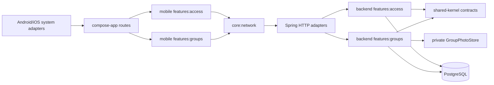

# Group Management Design

**Status:** Approved
**Date:** 2026-07-19
**Spec:** `.specs/features/group-management/spec.md`
**Context:** `.specs/features/group-management/context.md`
**Approved approach:** Dedicated Groups feature in backend and mobile

## Architecture Overview

Create one cohesive Groups feature on each product side. It owns the complete
private-group lifecycle: profile, memberships, invitations, venues, games,
attendance, manual charges, and expenses. Access shrinks to verified identity,
account/session bootstrap, and selected-group reconciliation.

The backend remains the authority for validation, authorization, recurrence,
capacity, waitlist promotion, and finance state. Mobile owns form interaction,
safe draft persistence, native photo selection, and presentation only.



There is no backend feature-to-feature Gradle dependency or Kotlin import. Two
provider-neutral shared-kernel ports bridge the existing session flow:

- `AuthenticatedActorResolver` maps a verified `RequestIdentity` to the stable
  internal user ID. Access implements it; Groups consumes only the contract.
- `GroupMembershipSummaryReader` returns the memberships needed by account
  bootstrap. Groups implements it; Access consumes only the contract.

Spring bootstrap wires implementations to contracts. It contains no domain
logic. Architecture tests explicitly protect both directions.

### Considered approaches

| Approach | Outcome |
| --- | --- |
| Extend Access with all group behavior | Rejected: fastest initially, but it deepens the existing auth/group/game/finance coupling. |
| Dedicated Groups feature | **Selected:** one bounded feature now, with internal packages that can become modules only if scale proves the need. |
| Separate Groups, Games, and Finance features now | Rejected: introduces cross-feature transactions and contracts before the product needs that complexity. |

## Code Reuse

| Existing capability | Reuse / change |
| --- | --- |
| `RequestIdentity` and safe HTTP problem handling | Reuse unchanged from shared-kernel/bootstrap. |
| UUID creation keys and atomic group/owner creation | Move into Groups and extend the same transaction to defaults, venue, and slots. |
| `GroupAccessPolicy`, roles, membership, and invite logic | Move into Groups without changing IDs, role values, invite tokens, or authorization outcomes. |
| `JdbcClient`, transaction runner pattern, PostgreSQL integration fixtures | Recreate Groups-owned adapters using the established explicit-SQL pattern. |
| ETag/`If-Match` settings updates | Extend to every mutable aggregate; keep local drafts on `409`. |
| Ktor authentication and one-refresh behavior | Reuse for JSON and add bounded binary/multipart operations beneath the same authenticated wrapper. |
| Compose resources, controls, responsive shell, and route ViewModel contract | Reuse; every new route follows AD-025. |
| Selected-group local state and session reconciliation | Keep in Access; feed Groups routes with the selected group ID. |
| Existing group/membership/invite endpoint paths | Preserve where practical so migration is behavior-compatible. |

`AccessViewModel` currently coordinates authentication, session, group creation,
selection, settings, membership, and invites. The design extracts group state
machines instead of expanding this class further.

## Integration

### Backend module and package layout

Add `backend/features/groups` with package `br.com.saqz.groups`:

```text
domain/
  group/        profile, defaults, venue, role, membership, invitation
  game/         occurrence, series, recurrence, lifecycle
  attendance/   response, capacity, waitlist
  finance/      charge, status audit, expense
application/
  group/ game/ attendance/ finance/
adapter/input/http/
adapter/output/jdbc/
adapter/output/media/
```

`backend/settings.gradle.kts`, bootstrap dependencies/configuration, and the
feature-inventory architecture tests gain `:features:groups`. Access keeps only
account/session code after compatibility migration.

### Compatibility migration

1. Keep `V1__create_access_schema.sql` in its current resource path and never
   alter its applied checksum.
2. Add Groups-owned Flyway migrations starting at the next globally unused
   version. Flyway continues scanning the single `classpath:db/migration`
   location from bootstrap.
3. Add nullable `modality` and `composition` columns for legacy rows. Derive
   `profileStatus=INCOMPLETE` when either is absent. New writes require both.
4. Move Kotlin ownership of `access_groups`, `group_memberships`, and
   `group_invites` to Groups without renaming tables or IDs in the first pass.
5. Replace old Access implementations only after Groups compatibility tests
   pass against a migrated V1 database. Do not run dual writers.
6. Preserve create idempotency, invite tokens, membership roles, owner
   semantics, group selection, endpoint behavior, and ETags throughout.

Table names may be renamed only in a later feature; doing it here adds risk
without product value.

### HTTP surface

All paths require authentication. Group-scoped probes first resolve actor and
membership; a non-member receives the same `404` shape whether the target
exists or not.

| Area | Representative endpoints |
| --- | --- |
| Group | `POST /api/groups`, `GET /api/groups/{groupId}`, `PUT /api/groups/{groupId}` |
| Photo | `PUT`, `GET`, `DELETE /api/groups/{groupId}/photo` |
| Membership/invite | Existing group membership and invite paths, implemented by Groups |
| Venues/slots | Nested group venue and regular-slot collection endpoints |
| Games | Group game list/create; occurrence read/update; publish/cancel/complete commands |
| Series | Group series create; one-occurrence and this-and-future edit/cancel commands |
| Attendance | Member self-response plus organizer override endpoint |
| Charges | Organizer list/generate/update; athlete self-charge read |
| Expenses | Organizer list/create/update/void |

Mutable resources return quoted version ETags and require `If-Match`. Creation,
monthly generation, and retryable commands accept UUID idempotency keys. Action
endpoints use explicit command DTOs rather than client-authored target state.

### Mobile module and navigation

Add `mobile/features/groups`; `mobile/compose-app` remains the route owner and
sole framework exporter. Groups provides stateless screens, route ViewModels,
state/intent/effect contracts, gateways, serialization DTOs, and presentation
formatters.

Initial route ownership:

| Route ViewModel | Responsibility |
| --- | --- |
| `GroupSetupViewModel` | Registration, profile/default edit, validation, draft recovery, photo retry. |
| `GroupHomeViewModel` | Private group context and organizer/athlete action availability. |
| `GroupPeopleViewModel` | Membership roles and invitation operations moved from Access. |
| `GamesViewModel` | Upcoming/past game list and series entry points. |
| `GameEditorViewModel` | One-time/weekly form and occurrence/future boundary. |
| `GameDetailViewModel` | Game lifecycle, RSVP, waitlist, and organizer overrides. |
| `FinanceViewModel` | Charges, monthly generation, own-charge visibility, and expenses. |

Each route has one typed `onIntent`, immutable `StateFlow` state, explicit
effects, and a stateless composable. Authentication and account/session remain
in `features:access`. The selected group ID is passed through app-shell
navigation; Groups never reads Firebase or Access implementation types.

Non-sensitive forms persist as versioned draft snapshots. Each draft excludes
tokens and photo bytes, stores its group/version/idempotency key, and is cleared
only after a confirmed response. Rotation/restart resumes the same command key.

## Components

### Group registration and profile

`CreateGroup` validates the entire request before opening its transaction. It
then inserts the group, its owner relationship, scalar defaults, optional
venue, and regular slots under `(owner_user_id, creation_key)`. A retry loads
and returns the original aggregate. No game or financial row is touched.

`UpdateGroupProfile` owns conditional cleanup: a non-court modality clears play
style; preset level/style clears custom text. Defaults are read only to prefill
new games and never referenced as live values by an existing game.

### Private photo pipeline

1. Android/iOS offer system camera capture and the system photo-library picker.
   Library selection requests no broad media access; camera capture uses only
   the narrow platform permission and an app-private temporary target.
2. A native selection adapter returns a bounded source handle and metadata to
   shared UI. Shared Compose owns square crop/preview state.
3. A platform image encoder applies the shared crop rectangle and emits a
   non-animated JPEG, PNG, or WebP payload. Photo bytes are not persisted in the
   mobile draft store.
4. Ktor sends a bounded multipart request through a new binary method that
   retains authentication refresh/error mapping and never logs body bytes.
5. Backend streams into a hard size limit, decodes the image, verifies actual
   type/dimensions/non-animation, and writes through `GroupPhotoStore`.
6. The first adapter stores one private photo per group in PostgreSQL `bytea`.
   It updates the group version and photo row atomically. Reads never fetch
   photo bytes in group lists.
7. The API exposes a member-only photo endpoint with `Cache-Control: private,
   no-cache` and an ETag based on photo version. Mobile purges its image cache on
   logout, group removal, or membership loss. No storage key or public URL is
   returned.

`GroupPhotoStore` keeps storage replaceable. A later private object-store
adapter can swap in without changing API fields. The servlet and application
limits both cap requests at 5 MiB plus multipart overhead; decoded dimensions
and animation are checked before replacement.

### Invitations and deep links

Groups reuses the current secure-token, digest-only persistence, Branch
`InviteLinkFactory`, rotation/expiry, redemption lockout, and idempotent
membership behavior. `OWNER`/`ADMIN` may manage the link. The URL and Branch
parameters contain only `saqz_invite=<opaque-code>`; provider parameters are not
domain authority and never contain group/user fields.

Android `AndroidLinkAdapter` and iOS `IOSLinkAdapter` remain native provider
edges behind a Groups-owned `NativeInviteLinkPort`. They normalize cold, warm,
Universal/App Link, and install-deferred events into one opaque code and dedupe
direct/Branch copies. Shared `DeferredInviteStateMachine` persists only that
code, waits for verified session bootstrap, retries temporary failures, clears
terminal/discard/logout state, then selects the redeemed group exactly once.

The compatibility move preserves the existing ten-invalid-attempts-per-user,
ten-minute window. Invalid, expired, and rotated capabilities share one `404`
problem. Attempt exhaustion returns `429` plus `Retry-After`. Neither response
includes an invite digest, group identity, membership, or preview data.

### Games and recurrence

Group defaults are copied into a game draft, then the submitted game persists
its own title, venue snapshot, start, duration, capacity, deadline, fee, and
notes. Later default or venue edits cannot rewrite it.

Game reads derive `confirmedCount`, `availableSpots` (never below zero), and
`waitlistCount` from authoritative attendance; clients do not submit those
values.

Weekly series store local recurrence values (`weekday`, `local_time`, local
start/end dates) and an IANA `zone_id` snapshot. The backend resolves each
occurrence with `ZoneRules`:

- ordinary local time: use its sole valid offset;
- daylight-saving gap: move forward by the transition duration;
- daylight-saving overlap: use the earlier offset;
- every occurrence also stores the resolved UTC instant and local fields.

Materialization is bounded to a rolling 12-week horizon. Series create/edit and
read paths idempotently replenish that horizon under a unique
`(series_id, local_date, slot_key)` occurrence identity, so no scheduler or
unbounded write is required initially.

`ONLY_THIS` writes an occurrence override/detachment. `THIS_AND_FUTURE` closes
the prior series revision immediately before the selected local occurrence and
creates a successor revision. Past and completed games are never rewritten.

### Attendance and waitlist

Confirmation, withdrawal, capacity edit, and promotion are aggregate
transactions:

1. Lock the game row with `SELECT ... FOR UPDATE`.
2. Validate lifecycle, membership, deadline, and requested transition.
3. Count confirmed attendance while holding the aggregate lock.
4. Confirm if below capacity; otherwise allocate the next monotonically
   increasing waitlist sequence.
5. On an opened spot, lock the earliest eligible waitlisted row, promote it,
   and create its charge idempotently.
6. Append an attendance event for organizer overrides and commit all effects
   together.

A capacity decrease updates the capacity but never changes existing confirmed
rows. The same game lock makes later confirmations observe the new effective
availability. Database uniqueness prevents duplicate attendance, waitlist
sequence, and game charge identities.

### Manual finance

Charge creation is a side effect of a successful confirmed transition, never a
client request. A paid game produces at most one immutable-amount charge per
member/game. Withdrawal leaves it pending. Game cancellation cancels pending
charges in the same transaction; paid/waived rows remain and gain a review
flag/event.

Monthly generation receives month, reviewed amount/due date, selected active
member IDs, and an idempotency key. Unique group/member/month identity makes
retries harmless and already-created amounts immutable.

Status changes append `charge_status_events` containing actor, old status, new
status, optional correction note, and server timestamp before updating the
current projection.
Expenses use optimistic versions and append create/edit/void events. No table
contains payment credentials, processor IDs, settlements, partial payments,
refunds, balances, or transfers.

## Data Models

All IDs are UUIDs, money is positive `BIGINT` BRL cents, and audit timestamps
are server-controlled `TIMESTAMPTZ`.

| Table / change | Core data and constraints |
| --- | --- |
| `access_groups` additive columns | Modality, composition, description, city, level/custom level, play style/custom style, privacy=`PRIVATE`, currency=`BRL`, scalar defaults, nullable default venue ID, version. Conditional checks mirror domain validation. |
| `group_venues` | Group, name, address, optional court, version; group-scoped identity. |
| `group_regular_slots` | Group, weekday, local start time, duration, optional venue; unique normalized slot per group. |
| `group_photos` | One row/group, private bytes, actual media type, byte size, dimensions, digest, photo version, updater/time. |
| `game_series` | Group, zone snapshot, local start/end boundary, revision lineage, active-through boundary, version. |
| `game_series_slots` | Series revision, stable slot key, weekday, local time, duration, venue snapshot/source, capacity, confirmation lead, fee. |
| `games` | Group, optional series/revision, occurrence key, local date/time/zone, resolved start/deadline instants, venue snapshot, capacity, fee, lifecycle, review flag, version. |
| `game_attendance` | Game/member unique pair, current status, optional unique waitlist sequence, response/update times, version. |
| `attendance_events` | Append-only actor, source, old/new state, reason, time. |
| `group_charges` | Kind, member, game or billing month, immutable amount, due date, status, creator/changer, review flag, version. Partial unique identities enforce one game/monthly charge. |
| `charge_status_events` | Append-only actor, old/new status, optional correction note, timestamp. |
| `group_expenses` | Group, description, amount, local date, category/custom category, notes, active/voided status, creator/editor, version. |
| `expense_events` | Append-only create/edit/void snapshot metadata, actor, timestamp. |

Foreign keys preserve existing user IDs. Group-owned history uses restrictive
deletion semantics; this feature exposes no delete-group operation. Large photo
bytes are selected only by the photo adapter, never joined into normal group or
game queries.

## Error Handling

Domain/application outcomes map to stable `ApiProblem` codes without leaking
existence or internal storage detail.

| Condition | HTTP | Client behavior |
| --- | --- | --- |
| Invalid field/conditional combination | `400` with field errors | Keep draft, focus first invalid field. |
| Non-member group-scoped probe | `404` | Generic unavailable state. |
| Member lacks organizer permission | `403` | Keep readable state; hide/disable future invalid actions. |
| Missing/stale `If-Match` | `428` / `409` | Preserve draft and offer reload/retry. |
| Closed deadline or invalid lifecycle transition | `409` | Refresh authoritative game state. |
| Replayed idempotent command | Original success representation | Clear the matching local draft once. |
| Corrupt/spoofed/animated/oversized photo | `400`/`413` | Preserve current photo and make retry/remove available. |
| Temporary network failure | Existing normalized network error | Retry with the same command key. |

Expected new codes include `GROUP_PROFILE_INCOMPLETE`, `GAME_NOT_FOUND`,
`GAME_TRANSITION_INVALID`, `ATTENDANCE_DEADLINE_CLOSED`,
`ATTENDANCE_TRANSITION_INVALID`, `PHOTO_INVALID`, `PHOTO_TOO_LARGE`,
`CHARGE_TRANSITION_INVALID`, and `EXPENSE_VERSION_CONFLICT`. Logs contain
correlation IDs, resource IDs where safe, and outcome names—not tokens, invite
secrets, photo bytes, finance notes, or request bodies.

## Verification Design

| Layer | Evidence |
| --- | --- |
| Domain/unit | Every enum, conditional cleanup, amount rule, state transition, permission, recurrence boundary, and idempotent outcome. |
| PostgreSQL integration | Upgrade from V1, legacy incomplete rows, constraints, ETags, row locks, simultaneous confirmations, FIFO promotion, unique charges, append-only audit. |
| Bootstrap HTTP | Exact DTOs/problems, privacy-equivalent `404`, multipart limits/media rejection, selected-group/session compatibility. |
| KMP common | DTOs, timezone/default presentation, draft restoration, same-key retry, route state/effects, role/finance visibility, and deferred-invite dedupe/retry/selection. |
| Compose | Compact/keyboard/large-text registration, venue/slot editors, games, RSVP/waitlist, charges, expenses, semantics, 48 dp targets. |
| Native Android/iOS | Camera/library grant and cancel paths, crop encoding, lifecycle recovery, cold/warm/deferred invite delivery, and no broad library permission. |
| Architecture/scripts | New feature inventory, no feature-to-feature dependency/import, credentials/scope/Gradle/iOS/landing/full aggregate gates. |

Tests trace directly to `GRP-*`, `GAME-*`, `ATTEND-*`, and `FIN-*` acceptance
criteria. Concurrency tests use two real PostgreSQL transactions and deterministic
barriers rather than timing sleeps.

## Risks and Mitigations

| Risk | Mitigation |
| --- | --- |
| Access-to-Groups extraction breaks login/session, roles, or invites | Compatibility-first migration, shared-kernel ports, contract tests, then remove old writers. |
| Moving V1 changes Flyway history | Keep V1 path/content unchanged; only additive globally ordered migrations. |
| Shared ports become a disguised business dumping ground | Allow only provider-neutral actor/membership summaries; architecture tests ban domain models and feature imports. |
| `bytea` photo storage grows the primary database | One photo/group, 5 MiB cap, isolated query path, digest/version metadata, replaceable `GroupPhotoStore`. |
| Compressed image bomb or MIME spoof | Stream size cap, decode before publish, pixel/animation/type checks, atomic replacement. |
| JSON-only network path buffers or logs photos | Separate bounded multipart/binary method; never log bodies; preserve auth/error behavior. |
| DST gap/overlap changes game time | Persist local rule plus zone, explicit deterministic resolution policy, transition fixtures. |
| Recurrence creates unbounded rows | Rolling 12-week idempotent horizon with indexed occurrence identity. |
| Concurrent RSVP overbooks or duplicates charges | One locked game aggregate plus database uniqueness and transaction integration tests. |
| Financial audit is exposed or overwritten | Organizer-scoped queries, athlete self-only projection, append-only event tables, no hard delete. |
| Legacy incomplete group reaches game flow | Read and profile completion remain available; game and operational mutations are gated until the profile is complete. |
| Feature breadth causes unsafe all-at-once delivery | Tasks will stage compatibility/extraction, profile, media, games, attendance, finance, then fresh validation. |

## Technical Decisions

1. **One Groups feature now.** Internal packages separate subdomains; modules
   split only after an actual independent lifecycle or deployment need appears.
2. **Shared-kernel integration contracts.** Access and Groups never depend on
   each other; bootstrap only wires ports.
3. **Additive migration over table renaming.** Existing IDs and Flyway V1 remain
   stable while ownership moves in code.
4. **PostgreSQL private photo first.** `GroupPhotoStore` isolates the choice;
   no raw key or public URL enters the API.
5. **Backend-local recurrence authority.** Store wall-clock rule and zone, plus
   materialized instants; use explicit gap/overlap behavior and a 12-week
   horizon.
6. **Aggregate row locking for attendance.** Locking the game serializes
   capacity and promotion decisions; unique constraints provide a second line
   of defense.
7. **Append-only finance audit.** Current status is a projection; corrections
   add history rather than replacing it.
8. **Compose-first photo experience.** Native code selects/encodes media;
   shared Compose owns crop and preview interaction.

## Research Notes

- Ktor's official client documentation supports multipart bodies and streaming
  providers, which fits a bounded authenticated upload without converting bytes
  to JSON: <https://ktor.io/docs/client-requests.html>.
- Android's official Photo Picker grants access only to user-selected media and
  falls back to `ACTION_OPEN_DOCUMENT` where needed:
  <https://developer.android.com/training/data-storage/shared/photo-picker>.
- Apple's Photos picker is the system privacy-preserving selection edge:
  <https://developer.apple.com/documentation/photosui/phpickerviewcontroller>.
- PostgreSQL row locks provide the transaction primitive used to serialize each
  game's capacity decisions:
  <https://www.postgresql.org/docs/current/explicit-locking.html>.
- PostgreSQL `bytea` is the initial private binary storage type behind the media
  port: <https://www.postgresql.org/docs/current/datatype-binary.html>.
- TwelveMonkeys ImageIO provides JVM WebP read support; the implementation task
  pins the current verified `imageio-webp` 3.13.1 artifact and independently
  rejects animated container chunks before decode:
  <https://haraldk.github.io/TwelveMonkeys/>.
- Kotlin datetime documents that local date-times may map to zero or two
  instants around offset transitions, motivating the explicit server policy:
  <https://kotlinlang.org/api/kotlinx-datetime/kotlinx-datetime/kotlinx.datetime/to-instant.html>.

## Acceptance-Criteria Traceability

| Acceptance criteria | Primary design owner |
| --- | --- |
| `GRP-REG-01..05` | Group registration/profile, compatibility migration, mobile drafts/timezone adapter. |
| `GRP-DEFAULT-01..04` | Group aggregate validation, ETags, authorization/privacy query. |
| `GRP-PHOTO-01..02`, `GRP-PRIVATE-01` | Private photo pipeline, group-scoped authorization, safe errors. |
| `GAME-01..04` | Game snapshots, series revisions, recurrence resolver, lifecycle commands. |
| `ATTEND-01..04` | Locked attendance aggregate and append-only override events. |
| `FIN-01..07` | Charge/expense transactions, unique identities, visibility projections, audit events. |
| `GRP-UI-01..02` | Route ViewModels, accessible Compose flows, safe draft/idempotency persistence. |
| `GRP-REGRESSION-01` | Compatibility sequence and complete repository gates. |
| `INVITE-01..04` | Groups invite use cases, opaque Branch/native link adapters, deferred state machine, idempotent redemption, and selection. |

## Approval

Approved by the user on 2026-07-19. Create atomic, acceptance-criteria-traced
tasks next. Because implementation exceeds eight tasks, offer sequential
task-budgeted agent batches before any delegation.
