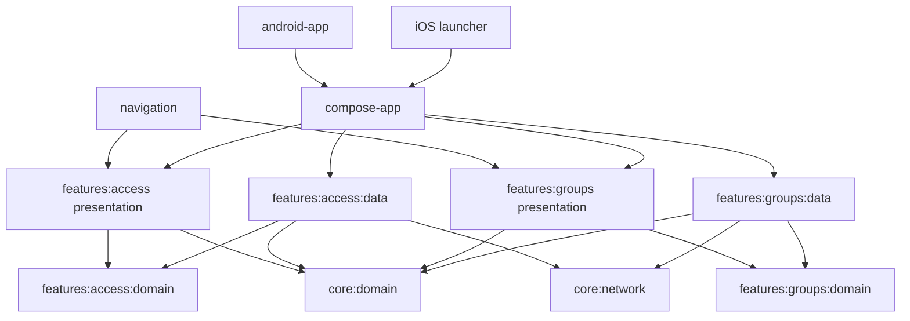
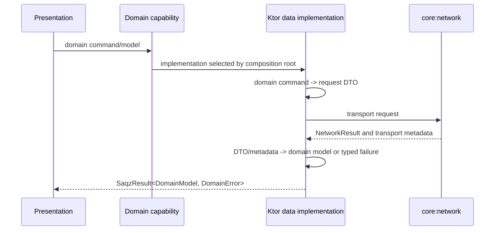

# Mobile Domain and Data Boundaries Design

**Spec:** `.specs/features/mobile-domain-data-boundaries/spec.md`  
**Context:** `.specs/features/mobile-domain-data-boundaries/context.md`  
**Status:** Approved  
**Approved:** 2026-07-22

## Architecture Overview

Access and Groups keep their current public Gradle coordinates as presentation modules so the design conforms to AD-029 and preserves the future `:navigation` integration. Each gains feature-owned `domain` and `data` child modules. A new `:core:domain` module owns only framework-free result, error, validation, and cross-feature identifier primitives.



No arrow exists between Access and Groups. `:compose-app` owns cross-feature translation and implementation wiring. `:core:network` remains a transport foundation and never returns feature DTOs to presentation.

### Approaches considered

| Approach | Outcome | Trade-off | Decision |
|---|---|---|---|
| Keep `:features:access` and `:features:groups` as presentation, add child `domain`/`data` modules | Real compile boundaries with stable public coordinates | Presentation coordinates do not end in `:presentation` | **Selected**; conforms to AD-029 and minimizes integration churn |
| Replace each current module with explicit `domain`/`data`/`presentation` leaves | Uniform names | Requires superseding AD-029 and changing navigation/framework consumers | Rejected |
| Keep monoliths and enforce packages with source scans | Lowest Gradle churn | Forbidden references still compile when the scan is bypassed | Rejected; insufficient for MDB-001–MDB-005 |

## Module Boundaries

| Module | Owns | Allowed production dependencies | Explicitly forbidden |
|---|---|---|---|
| `:core:domain` | `SaqzResult`, `SaqzError`, `EmptyResult`, `DataError`, `ValidationDetails`, shared identifiers | Kotlin standard library only | Compose, navigation, Koin, Ktor, serialization, database, Android/Apple APIs |
| `:features:access:domain` | Session/account models, access capability contracts, native port contracts and access-specific errors | `:core:domain` | Access data/presentation, Groups, network/serialization/platform frameworks |
| `:features:access:data` | Session DTOs, Ktor session API, request/response mappers, transport-to-domain error mapping | Access domain, core domain, core network, Ktor, serialization | Access presentation, Groups |
| `:features:access` | Existing Access ViewModels/state machines/UI/resources and presentation error mapping | Access domain, core domain/common/design-system, Compose, lifecycle/coroutines | Access data, core network, Ktor, serialization, Groups |
| `:features:groups:domain` | Group/profile/membership/invite/photo/game/attendance/finance domain models, capability contracts and errors | `:core:domain` | Groups data/presentation, Access, network/serialization/platform frameworks |
| `:features:groups:data` | Feature DTOs, Ktor APIs, request/response mappers and transport-to-domain error mapping | Groups domain, core domain, core network, Ktor, serialization, datetime where transport requires it | Groups presentation, Access |
| `:features:groups` | Existing Groups ViewModels/state machines/UI/resources and presentation error mapping | Groups domain, core domain/common/design-system, Compose, lifecycle/coroutines/datetime | Groups data, core network, Ktor, serialization, Access |
| `:compose-app` | Koin composition, Access-to-Groups translation, app orchestration | Both presentation and data modules plus approved core modules | Feature DTOs in app state or UI contracts |

The current public feature modules are presentation boundaries, not umbrella modules. They SHALL NOT re-export their data child modules.

## Runtime Data Flow



`NetworkResult`, `NetworkError`, `ApiProblem`, response headers, serialization annotations, DTOs, and transport exceptions stop at the data boundary. ETags, pagination cursors, retry delays, and other metadata cross only through named domain values when current behavior requires them. Feature data implementations invoke the shared transport retry helper explicitly, so retry eligibility remains a data-layer decision.

## Code Reuse Analysis

### Existing components to leverage

| Component | Location | Reuse |
|---|---|---|
| Authenticated transport and single-refresh token flow | `mobile/core/network/.../AuthenticatedNetworkClient.kt` | Retain unchanged as the transport primitive used only by data modules |
| Cancellation-safe network execution | `mobile/core/network/.../NetworkClient.kt:155` | Preserve explicit `CancellationException` rethrow and test the same outcome at each domain-facing data implementation |
| Existing endpoint and payload tests | `mobile/features/groups/src/commonTest/.../data/` and `mobile/core/network/src/commonTest/` | Move/adapt into data-module tests while keeping exact paths, methods, bodies, headers, ETags and safe problem parsing |
| Existing presentation behavior tests | `mobile/features/access/src/commonTest/.../presentation/` and `mobile/features/groups/src/commonTest/.../presentation/` | Convert fakes to domain contracts while preserving asserted state/effect outcomes |
| Current Koin composition root | `mobile/compose-app/src/commonMain/.../di/` | Update constructor/binding types only; DI placement remains governed by the tooling specification |
| Existing pure KMP module pattern | `mobile/core/common/build.gradle.kts` | Use its Android/iOS target shape for domain modules without adding Compose, Ktor or serialization |

### Integration points

| System | Integration method |
|---|---|
| Android/iOS launchers | Continue consuming the single `SaqzMobile` framework through `:compose-app` |
| Future `:navigation` module | Continues depending on the stable `:features:access` and `:features:groups` presentation coordinates from AD-029 |
| Native Firebase/Branch/platform adapters | Implement feature-domain port contracts; platform SDK types remain in launcher adapters |
| Backend APIs | Existing `:core:network` client and endpoint semantics remain unchanged |

## Components and Interfaces

### Shared domain foundation

- **Location:** `mobile/core/domain/`
- **Purpose:** Provide the only cross-feature success/failure vocabulary and framework-free shared values.
- **Primary API:**

```kotlin
interface SaqzError

sealed interface SaqzResult<out T, out E : SaqzError> {
    data class Success<T>(val value: T) : SaqzResult<T, Nothing>
    data class Failure<E : SaqzError>(val error: E) : SaqzResult<Nothing, E>
}

typealias EmptyResult<E> = SaqzResult<Unit, E>
```

Pure helpers such as `map`, `mapError`, `onSuccess`, `onFailure`, and `asEmptyResult` remain exhaustive and do not catch exceptions.

### Access domain

- **Location:** `mobile/features/access/domain/`
- **Purpose:** Own verified identity/session models, selected-group reconciliation contracts, native access ports, and access-specific failures.
- **Representative interfaces:** `SessionGateway.bootstrap(): SaqzResult<AccessSession, AccessError>` and the existing native auth/local-state capabilities expressed without presentation or platform SDK types.
- **Models:** `AccessSession`, `AccessUser`, `AccessMembership`, and domain commands/value types.
- **Dependencies:** `:core:domain` only.

`SessionDto`, `SessionApi`, and serialization move out of `:core:network` into Access data. Email-verification and bootstrap decisions become access-domain errors rather than raw API problem inspection in presentation.

### Access data

- **Location:** `mobile/features/access/data/`
- **Purpose:** Implement Access domain capabilities using `AuthenticatedNetworkClient` and transport DTOs.
- **Representative components:** `KtorSessionGateway`, session request/response DTOs, DTO mappers, `NetworkError`/`ApiProblem` mapping, and explicit bounded retry eligibility.
- **Dependencies:** Access domain, core domain, core network, Ktor and serialization.

### Access presentation

- **Location:** existing `mobile/features/access/`
- **Purpose:** Keep current state machines, ViewModels, Compose screens and resources behaviorally unchanged.
- **Change:** Consume only Access domain ports/models/errors and map them exhaustively to presentation state/UI errors.

### Groups domain

- **Location:** `mobile/features/groups/domain/`
- **Purpose:** Own business-facing models and capability contracts for group profile, memberships, roles, invitations, media, games, attendance, finance, and sharing.
- **Representative capabilities:** the existing `*Gateway` responsibilities, moved and rewritten to accept domain commands and return `SaqzResult<DomainModel, FeatureError>`.
- **Metadata abstractions:** domain-owned version tokens, pagination tokens, retry delays, and not-modified/media results where existing behavior requires them.
- **Dependencies:** `:core:domain` only.

The migration favors stable capability names over broad renames. A gateway is split only when its current interface combines unrelated capabilities or prevents an independently verifiable migration slice.

### Groups data

- **Location:** `mobile/features/groups/data/`
- **Purpose:** Own all current `@Serializable` DTOs, request DTOs, Ktor APIs, endpoint strings, header extraction, and mapping.
- **Representative components:** Ktor implementations of Groups domain gateways, pure request/response mappers, feature error mappers, and explicit bounded retry eligibility per operation.
- **Dependencies:** Groups domain, core domain, core network, Ktor, serialization and transport-only datetime support.

### Groups presentation

- **Location:** existing `mobile/features/groups/`
- **Purpose:** Keep ViewModels, state machines, Compose UI and resources behaviorally unchanged.
- **Change:** Replace data/network imports with Groups domain contracts/models/errors and exhaustive presentation mappings.

### App-level feature coordination

- **Location:** `mobile/compose-app/`
- **Purpose:** Translate Access-owned session/membership context into Groups presentation inputs without either feature importing the other.
- **Rule:** Shared identifiers that genuinely cross features may live in `:core:domain`; feature-specific roles or session models do not.
- **DI boundary:** The composition root may reference data implementations to bind domain interfaces, but those implementations never enter app state or UI contracts.

### Boundary verification gate

- **Location:** repository scripts/tests plus Gradle module declarations.
- **Purpose:** Make dependency drift deterministic.
- **Checks:**
  - Domain build files allow only `:core:domain` and test dependencies.
  - Presentation build files reject their data module, `:core:network`, Ktor and serialization.
  - Data modules reject presentation and every other feature.
  - Source scans reject data/network/serialization imports in presentation and framework imports in domain.
  - A negative script-contract test injects each forbidden dependency/import in scratch state and proves the gate fails.
  - `scripts/check-gradle` invokes the boundary gate before aggregate compilation/tests.

## Data Models

### Shared validation and data errors

```kotlin
data class ValidationDetails(
    val globalMessages: List<String>,
    val fieldMessages: Map<String, List<String>>,
)

sealed interface DataError : SaqzError {
    data object Connectivity : DataError
    data object Timeout : DataError
    data object Unauthenticated : DataError
    data object Forbidden : DataError
    data class Validation(val details: ValidationDetails) : DataError
    data object Conflict : DataError
    data object NotFound : DataError
    data object InvalidResponse : DataError
    data object PayloadTooLarge : DataError
    data object Server : DataError
    data object Unknown : DataError
}
```

Feature errors implement `SaqzError` and may contain a `DataError` or a safe feature outcome. For example, invite/attendance-link attempt limits remain a feature-domain error carrying the safe retry delay because presentation currently renders that delay. Raw status/code/correlation fields never cross.

### Versioned and paginated values

Transport ETags and cursors become opaque domain values rather than header-shaped strings in presentation contracts:

```kotlin
@JvmInline value class VersionToken(val value: String)
@JvmInline value class PageToken(val value: String)

data class Versioned<T>(val value: T, val version: VersionToken)
data class Page<T>(val items: List<T>, val next: PageToken?)
```

These abstractions are feature-owned unless more than one feature genuinely needs the exact semantic type.

### DTO mapping rules

- Response DTO mappers return a complete domain value or `DataError.InvalidResponse`; they never return a partially valid DTO.
- Optional fields remain optional only when the domain explicitly accepts absence; otherwise absence is invalid response.
- Request mappers accept domain commands and construct DTOs without presentation importing serialization.
- Backend strings/enums are decoded and validated in data before domain construction.
- Safe validation messages are copied into `ValidationDetails`; absent global messages remain empty in domain and presentation supplies one generic localized validation message rather than inventing text from transport codes.
- Diagnostics may receive the original cause/correlation identifier through an injected data-layer diagnostic sink, never through `DataError`.
- Every catch-all rethrows `CancellationException` before mapping the remaining exception to `Unknown` or `InvalidResponse`.

### Data-layer retry policy

The reusable transport mechanism lives beside `NetworkResult` in `:core:network`, but every feature data implementation explicitly selects whether an operation is safe to retry. Presentation and domain never initiate or count these automatic retries.

```kotlin
enum class RetrySafety { Never, Read, IdempotentWrite }

data class TransportRetryPolicy(
    val retryDelaysMillis: List<Long> = listOf(500L, 1_000L, 2_000L),
)
```

- One initial call is always made; the three delays precede attempts two, three, and four respectively.
- Success stops the sequence immediately, with no remaining delay or call.
- Only connectivity, timeout, and HTTP 5xx transport outcomes are retryable.
- Reads use `RetrySafety.Read`; a write uses `IdempotentWrite` only when its existing request carries the idempotency key required by the endpoint contract. Every other write uses `Never`.
- 401, 403, validation, conflict, 404, 429, invalid response, payload too large, unknown exceptions, and feature-specific permanent failures are never retried.
- Cancellation during the request or backoff delay propagates immediately and emits no failure value.
- The delay function is injected in tests so virtual time can assert the exact schedule without wall-clock waits.
- Core transport SHALL distinguish known connectivity failures from unknown exceptions; the current broad `Unavailable` mapping cannot decide retry eligibility safely.

## Error Handling Strategy

| Transport/current outcome | Domain-facing outcome | Presentation impact |
|---|---|---|
| DNS/offline/unavailable transport | `DataError.Connectivity` | Preserve existing unavailable/retry state |
| Request/socket timeout | `DataError.Timeout` | Preserve existing unavailable/retry state |
| 401/authentication-required | `DataError.Unauthenticated` or feature auth error | Preserve current sign-out/session handling |
| 403 without a more specific safe feature code | `DataError.Forbidden` | Preserve forbidden/hidden behavior |
| Structured validation | `DataError.Validation(ValidationDetails)` or feature validation wrapper | Preserve global and field correction feedback |
| Version conflict/precondition | `DataError.Conflict` or feature lifecycle conflict | Preserve exact retry/reload operation and version token |
| Missing/hidden resource | `DataError.NotFound` or feature `HiddenResource` | Preserve current not-found/hidden state |
| Malformed body, missing required field/header, unsupported enum | `DataError.InvalidResponse` | Preserve generic unavailable/invalid-data state |
| Payload limit | `DataError.PayloadTooLarge` | Preserve current media failure state |
| 5xx after retry exhaustion | `DataError.Server` | Preserve generic unavailable/manual-retry state |
| 429/rate limit | Feature attempt-limit error when safely structured, otherwise non-retryable `DataError.Server` | Preserve current retry delay/disabled-action behavior without automatic retry |
| Safe feature attempt-limit code with retry seconds | Feature `AttemptLimit(retryAfterSeconds)` | Preserve disabled retry and countdown/message behavior |
| Unknown non-cancellation exception | `DataError.Unknown` plus non-domain diagnostics | Preserve credential-safe generic failure |
| `CancellationException` | Rethrown | No failure state is emitted |

## Migration Strategy

1. **Foundation and gate:** add `:core:domain`, shared contract tests, refine transport connectivity/unknown classification, add the bounded retry helper/tests, declare child modules, and add a failing-on-drift architecture gate.
2. **Access characterization:** freeze current bootstrap, identity, validation, authorization, connectivity and retry outcomes before moving contracts.
3. **Access boundary migration:** move session/native contracts and models to Access domain; introduce the Access-data transport while retaining the existing core session surface unchanged as a time-boxed seam; update presentation and composition; remove the legacy core surface and Access adapters in the closing Access task; pass only the focused Access/domain/data/compose-app gates.
4. **Groups characterization:** freeze current outcomes and exact transport semantics per capability.
5. **Groups capability slices:** migrate profile/membership/invite/photo, games/attendance/sharing, and finance contracts/models/data in dependency order. Each slice maps DTOs and failures before presentation changes.
6. **Groups cleanup:** remove all presentation-to-data/network imports and compatibility adapters; pass only the focused Groups domain/data/presentation gates.
7. **Integration verification:** prove zero forbidden dependencies/imports, then run `rtk scripts/check-all` once as the only full Android/KMP/iOS/repository aggregate before the independent verifier.

For each slice: characterize -> create/move domain contract -> implement data mapping -> switch presentation fakes/consumers -> update composition -> delete the temporary seam -> run its narrow gate -> commit atomically.

## Test Strategy

- **Core domain:** exhaustive result helper, covariance, empty success, validation value and equality tests.
- **Data modules:** successful mapping, every supported shared/feature error, structured validation and generic fallback, missing/malformed/optional/versioned fields, exact request mapping, pagination/ETag semantics, safe diagnostics, and cancellation propagation.
- **Retry contract:** exact four-call maximum and 500 ms/1 s/2 s delays, early success at every attempt, exhaustion returning the final typed error, no retries for every excluded category or unsafe write, and cancellation during execution/backoff.
- **Presentation modules:** existing state/effect tests rewritten against domain fakes; asserted loading/success/empty/error/retry outcomes remain unchanged.
- **Composition:** Koin verification plus Access-to-Groups translation tests that prove no feature dependency.
- **Architecture:** positive allowlist checks and negative scratch mutations for every forbidden edge/import class.
- **Aggregates:** focused module/layer gates only while iterating; do not run `scripts/check-gradle` or `scripts/check-ios` separately; run `rtk scripts/check-all` once after the final implementation task, followed by independent spec-anchored verification.

## Requirement Traceability

| Requirements | Design coverage |
|---|---|
| MDB-001–MDB-006 | Module graph, module allowlists, negative boundary gate, per-feature adapter removal |
| MDB-007–MDB-012 | Runtime data flow, DTO mapper rules, capability interfaces, opaque metadata values |
| MDB-013–MDB-019 | Shared domain foundation, typed errors, validation details, error table, cancellation and diagnostics rules |
| MDB-020–MDB-023 | Characterization-first migration and data/presentation test strategy |
| MDB-024 | Focused and aggregate gate sequence |
| MDB-025 | Final import/dependency scans, negative gate and independent verification |
| MDB-026 | Explicit data-layer eligibility, exact retry schedule, early stop, exclusions and retry contract tests |

All 26 requirements have a concrete design owner and verification path. Task IDs will be assigned in `tasks.md`.

## Risks & Concerns

| Concern | Evidence | Impact | Mitigation |
|---|---|---|---|
| Feature build files currently combine UI, transport and serialization dependencies | `mobile/features/access/build.gradle.kts:22`, `mobile/features/groups/build.gradle.kts:22` | Package moves alone cannot enforce direction | Child modules plus dependency allowlist gate |
| Feature-specific session DTOs and gateway live in core network | `mobile/core/network/.../SessionApi.kt:6` | Core transport owns Access semantics | Move DTO/API to Access data and contract/model to Access domain |
| Access presentation inspects transport result, DTO and API problem code | `mobile/features/access/.../VerifiedSessionCoordinator.kt:13`, `:46`, `:208`, `:231` | Presentation behavior is coupled to HTTP payload semantics | Access-domain session/error contract and data mapper |
| Groups transport models, gateway contracts and Ktor implementation share one file | `mobile/features/groups/.../data/GroupApi.kt:16`, `:151`, `:165` | DTOs are treated as business models and leak broadly | Split domain models/contracts from data DTOs/mappers by capability |
| Groups ViewModels import wildcard data APIs and `NetworkResult` | `mobile/features/groups/.../GameDetailViewModel.kt:5` | Large blast radius and non-exhaustive transport handling | Characterization tests followed by capability-sized migrations |
| Presentation/app sources currently contain forbidden imports across 64 files | Repository scan of Access, Groups and compose-app common sources | One large rewrite would be difficult to verify | Sequential Access then Groups slices; no feature declared complete with remaining adapters |
| Current tests often fake `NetworkResult` and DTOs at presentation level | `mobile/features/access/.../VerifiedSessionCoordinatorTest.kt:18`, `mobile/features/groups/.../GroupAdministrationCoordinatorTest.kt:6` | Tests can preserve transport coupling instead of product behavior | Rewrite fakes from spec outcomes against domain interfaces; retain exact state/effect assertions |
| Cancellation is tested in core transport but not at migrated feature boundaries | `mobile/core/network/.../PrivateMediaNetworkTest.kt:219` | A mapper/repository catch-all could swallow cancellation | Mandatory cancellation test for every migrated domain-facing data capability |
| Core transport currently maps every remaining throwable to `NetworkError.Unavailable` | `mobile/core/network/.../NetworkClient.kt:166` | Unknown failures would be retried as if they were connectivity failures | Add distinct known-connectivity and unknown transport outcomes before enabling retries |
| Gates and README command contracts name the current monolithic feature tasks | `scripts/check-gradle:52`, `tests/scripts/check-gradle.test.sh:137`, `tests/scripts/check-readme.test.sh:163` | New modules may silently fall outside aggregates | Update command contracts atomically with each module introduction and test failures |
| Current Koin wiring binds data contracts defined in data packages | `mobile/compose-app/.../di/GroupsModule.kt:3`, `:44` | Binding changes can accidentally leak implementations upward | Bind data implementations to domain interfaces only; keep binding code in composition root |

## Tech Decisions

| Decision | Choice | Rationale |
|---|---|---|
| Public presentation coordinates | Keep `:features:access` and `:features:groups` | Conforms to AD-029 and keeps future navigation/framework consumers stable |
| Shared foundation | New `:core:domain` | Keeps result/error/shared identifiers framework-free and out of transport/core-common concerns |
| Feature layering | Feature-owned `domain` and `data` child modules | Provides real compile boundaries without cross-feature dependencies |
| Transport result | Keep `NetworkResult` internal to core network/data | Avoids rewriting the proven Ktor client while preventing transport leakage |
| Domain contracts | Capability-shaped gateways with domain models/results | Minimizes unnecessary renames and describes business capabilities rather than HTTP |
| Cross-feature flow | App-level translation with only genuine shared identifiers in core domain | Preserves feature independence and AD-026 ownership |
| Enforcement | Gradle modules plus positive/negative repository gate | Compilation blocks undeclared edges; the gate blocks adding forbidden declarations later |
| Automatic retry | Data-selected safety with a shared core-network mechanism; initial call plus three retries at 500 ms/1 s/2 s | Centralizes deterministic transport behavior without letting domain or presentation control it |
| Build logic | Use current module configuration patterns | Convention-plugin/tooling changes remain out of scope for this feature |
