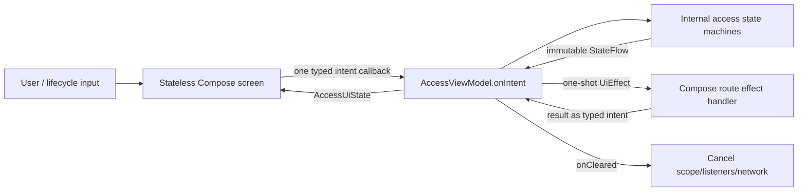

# Mobile MVI ViewModels Design

**Spec:** `.specs/features/mobile-mvi-viewmodels/spec.md`
**Status:** Approved

## Architecture Options

| Approach | Trade-off | Decision |
| --- | --- | --- |
| One KMP `AccessViewModel` for the existing access route, with its destinations represented by sealed state and child state machines accepting typed intents | Preserves state-derived navigation and one shared session/group context; the ViewModel is broader than one visual panel because the current panels are not real navigation routes | **Selected** |
| Replace the access state machine with thirteen Navigation Compose destinations and one ViewModel per panel | Gives every panel an independent store but duplicates or imperatively synchronizes shared auth/session/group state and materially changes navigation behavior | Rejected for this migration |
| Wrap the existing coordinators in a ViewModel without changing their command surfaces | Lowest code movement but leaves many public command entry points and Compose-owned business state | Rejected because it does not meet the requested MVI contract |

## Architecture Overview

The access route retrieves one AndroidX KMP `AccessViewModel`. UI interactions
become typed `AccessIntent` values and enter through `onIntent` only. The
ViewModel owns route-local state, lifecycle, coordination, and a non-replaying
effect channel. Existing feature logic is retained as internal state machines,
each changed to accept one typed intent instead of exposing action-specific
methods. Visual composables render controlled state and emit typed intents.



## Code Reuse Analysis

### Existing Components to Leverage

| Component | Location | How to Use |
| --- | --- | --- |
| Authentication/session/group/invite coordinators | `mobile/features/access/.../presentation/` | Preserve their tested transition logic while replacing public action methods with typed intents. |
| `AccessRuntime` composition | `mobile/compose-app/.../AuthenticatedAccessRoot.kt` | Move lifecycle/state ownership into `AccessViewModel`; retain gateway and native-port wiring. |
| Access screens | `mobile/features/access/.../ui/` | Keep layout and semantics; replace callback bags and business `remember` state with controlled state plus one intent callback. |
| Navigation lifecycle artifacts | Transitive through `navigation-compose:2.9.2` | Declare `lifecycle-viewmodel-compose:2.9.6` directly and retrieve the KMP ViewModel at the route. |
| Existing coordinator/UI/lifecycle tests | `mobile/**/src/*Test/` | Preserve assertions and change their input path to typed intents; add ViewModel/effect/lifecycle contract coverage. |

### Integration Points

| System | Integration Method |
| --- | --- |
| Android launcher | Retains platform composition in `MainActivityModel`; shared screen state moves to the Compose KMP ViewModel. |
| iOS launcher | Existing `ComposeUIViewController` supplies the Compose lifecycle/ViewModel store; no Swift product state is added. |
| Native share UI | ViewModel emits `RequestShare`; route performs the native call and returns `ShareFinished` through `onIntent`. |
| Network/Firebase/Branch/local state | Existing ports and gateways remain unchanged behind the internal state machines. |

## Components

### Feature state machines

- **Purpose:** Preserve domain-facing presentation transitions behind one typed
  input per state machine.
- **Location:** `mobile/features/access/src/commonMain/.../presentation/`
- **Interfaces:**
  - `val state: StateFlow<State>`
  - `fun onIntent(intent: Intent)` — the only UI command entry.
- **Dependencies:** Existing native ports, gateways, and a lifecycle-owned
  coroutine scope supplied by the route ViewModel.
- **Reuses:** All current reducer, guard, error mapping, and stale-invite logic.

### AccessViewModel

- **Purpose:** Own the access route state machine and lifecycle on Android/iOS.
- **Location:** `mobile/compose-app/src/commonMain/.../navigation/AccessViewModel.kt`
- **Interfaces:**
  - `val state: StateFlow<AccessUiState>`
  - `val effects: Flow<AccessUiEffect>`
  - `fun onIntent(intent: AccessIntent)`
- **Dependencies:** `SaqzAppDependencies`, AndroidX `ViewModel`, internal access
  runtime/state machines, platform network client.
- **Reuses:** Current destination derivation, request-ID generation, session and
  selection reconciliation, privilege gating, listener/network cleanup.

### AuthenticatedAccessRoute

- **Purpose:** Retrieve the ViewModel, collect lifecycle-aware state/effects,
  and render the pure access root.
- **Location:** `mobile/compose-app/src/commonMain/.../navigation/AuthenticatedAccessRoot.kt`
- **Interfaces:** `AuthenticatedAccessRoute(dependencies)` and
  `AuthenticatedAccessRoot(state, onIntent)`.
- **Dependencies:** `lifecycle-viewmodel-compose`, existing design system.
- **Reuses:** Existing destination content and semantic test tags.

### Stateless access screens

- **Purpose:** Render fixture state and translate each user interaction into one
  typed screen intent.
- **Location:** `mobile/features/access/src/commonMain/.../ui/`
- **Interfaces:** `Screen(state, onIntent)`.
- **Dependencies:** Existing state models/design components.
- **Reuses:** Existing visuals, accessibility semantics, resources, previews.

## Data Models

```kotlin
sealed interface AccessIntent {
    data class Authentication(val intent: AuthenticationIntent) : AccessIntent
    data class Session(val intent: SessionIntent) : AccessIntent
    data class Selection(val intent: GroupSelectionIntent) : AccessIntent
    data class Administration(val intent: GroupAdministrationIntent) : AccessIntent
    // Route/page/dialog/native-effect intents are declared alongside these.
}

@Immutable
data class AccessUiState(
    val authObserved: Boolean,
    val authentication: AuthenticationState,
    val session: SessionAccessState,
    val selection: GroupSelectionState,
    val administration: GroupAdministrationState,
    val page: AccessPage,
    // Controlled create/settings/invite/dialog fields.
)

sealed interface AccessUiEffect {
    data class RequestShare(val text: String) : AccessUiEffect
}
```

Internal asynchronous completions remain private messages/callbacks inside the
owning state machine. They never add another screen command method.

## Error Handling Strategy

| Error Scenario | Handling | User Impact |
| --- | --- | --- |
| Duplicate submit while loading | State-machine guard ignores the intent | One operation, unchanged loading state |
| Stale async completion | Compare the active request/selection before applying | Newer screen state is never overwritten |
| Network/provider failure | Existing typed error is reduced into `UiState` | Existing actionable error/retry UI remains |
| Native share failure | Route returns `ShareFinished(false)` through `onIntent` | Invite UI exposes the existing unavailable error |
| Route removal | `ViewModel.onCleared` closes listeners/network and cancels `viewModelScope` | No leaked work or duplicate subscription |

## Risks & Concerns

| Concern | Location | Impact | Mitigation |
| --- | --- | --- | --- |
| UI state and commands are split across nine `remember` values and a 37-callback action bag | `AuthenticatedAccessRoot.kt:123-302` | Recomposition/lifecycle behavior is hard to reason about and commands have many paths | Move all business/form state into `AccessViewModel`; root accepts one intent callback. |
| Shared state currently uses a manual application coroutine scope while only Android has a retaining ViewModel | `SaqzApp.kt:13-25`, `MainActivity.kt:47-65` | Android/iOS lifecycle ownership differs | Make the KMP route ViewModel the owner on both targets; keep native composition only for adapters. |
| Current access destinations are not actual Navigation Compose entries | `AuthenticatedAccessRoot.kt:73-104` | Treating each panel as an independent ViewModel would invent lifetimes and duplicate state | Keep them as states in one route ViewModel; document that future real routes get their own ViewModels. |
| Existing selection async completion has no explicit stale-result token | `GroupSelectionCoordinator.kt:68-76` | A slower old request could overwrite a newer choice | Add an active-selection guard and a state-machine test during intent migration. |
| UI tests assert many independent callbacks | `mobile/features/access/src/commonTest/.../ui/` | They do not prove the single-entry contract | Preserve outcome assertions but record and assert exact typed intents. |

## Tech Decisions

| Decision | Choice | Rationale |
| --- | --- | --- |
| Route ownership | One KMP ViewModel for the current access route | Its visual destinations are states sharing one session/group context, not independent back-stack entries. |
| State-machine input | Sealed typed intents and one `onIntent` per screen boundary | Makes every transition discoverable and testable. |
| State output | Immutable `StateFlow` | Repeatable rendering and current KMP conventions. |
| One-shot output | Buffered `Channel` exposed as `Flow` | Delivers each native transient action once without replay on recomposition. |
| Lifecycle version | Explicit `org.jetbrains.androidx.lifecycle:lifecycle-viewmodel-compose:2.9.6` | Already selected transitively by Navigation Compose 2.9.2 and present for Android/iOS targets. |
| Reusable MVI base class | None initially | Concrete typed contracts are clearer; extract only after repeated boilerplate is demonstrated. |

