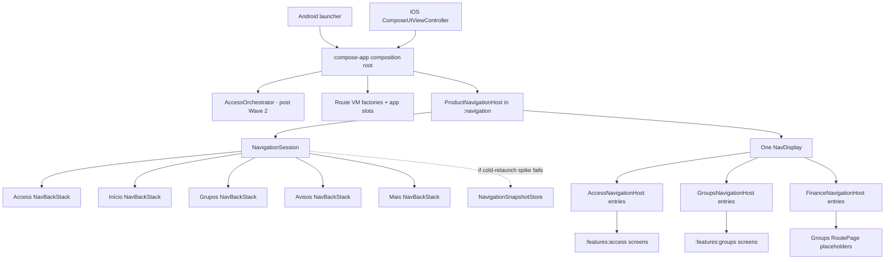

# Mobile Navigation Architecture Design

**Spec**: `.specs/features/mobile-navigation-architecture/spec.md`
**Context**: `.specs/features/mobile-navigation-architecture/context.md`
**Status**: Approved (2026-07-22)

---

## Research Basis

The design follows the official Navigation Compose 3 Multiplatform guidance:

- Compose Multiplatform 1.10+ supports Navigation Compose 3 on Android and iOS; this workspace uses Compose 1.11.1.
- KMP UI artifact: `org.jetbrains.androidx.navigation3:navigation3-ui:1.1.1`.
- Route ViewModel artifact: `org.jetbrains.androidx.lifecycle:lifecycle-viewmodel-navigation3:2.10.0`.
- Navigation state is application-owned through `NavBackStack<NavKey>` and rendered by `NavDisplay`.
- Non-JVM restoration requires `SavedStateConfiguration` with explicit polymorphic serializers.
- The official multiple-stack recipe uses independently decorated stacks and one active `NavDisplay(entries = ...)` rather than nested displays.

Primary source: `https://www.jetbrains.com/help/kotlin-multiplatform-dev/compose-navigation-3.html`.

The exact lifecycle decorator APIs to use are:

```kotlin
rememberSaveableStateHolderNavEntryDecorator<NavKey>()
rememberViewModelStoreNavEntryDecorator<NavKey>()
```

The saveable-state decorator precedes the ViewModel decorator so entry-scoped `SavedStateHandle` support remains valid.

---

## Approaches Considered

### A. One `NavDisplay` + app-owned stacks + `NavigationSession` (selected)

- One access stack and four authenticated tab stacks.
- One active, decorated entry list is rendered at a time.
- Access, Groups, and Finance install entries into one provider.
- A pure navigation session owns stack mutations and reconciliation rules.

**Benefits**: one back handler, deterministic lifecycle, natural predecessor restoration, smallest active composition, strongest unit-test seam.

**Cost**: conceptual domain "hosts" are entry-provider delegates rather than nested visual displays.

### B. Nested `NavDisplay`s by domain

- Access renders Groups; Groups renders Finance.

**Benefits**: visually explicit domain boundaries.

**Cost**: competing back handlers, multiple decorator chains, child-empty-to-parent-pop coordination, harder logout/group cleanup, higher iOS gesture risk.

### C. One `NavDisplay` per bottom tab

- Each tab keeps its display composed independently.

**Benefits**: maximum tab isolation.

**Cost**: more composition, multiple back handlers, duplicated entry-provider/decorator setup, harder ViewModel cleanup.

**Decision**: Approach A, confirmed by the user on 2026-07-22.

---

## Architecture Overview



One `ProductNavigationHost` owns the active `NavDisplay`. `AccessNavigationHost`, `GroupsNavigationHost`, and `FinanceNavigationHost` are cohesive entry installers and policy handlers inside `:navigation`; they do not create nested `NavDisplay`s. When an authenticated non-home tab is active, the displayed entry list is `homeEntries + activeTabEntries`, matching the official multiple-stack recipe and ensuring system back is enabled at the non-home tab root.

---

## Module Dependency Graph

```text
android-app ──────────────┐
ios launcher ─────────────┤
                          v
                     :compose-app
                          |
                          v
                     :navigation
                    /      |       \
       :features:access  :features:groups  :core:design-system
```

### Dependency rules

- `:navigation` depends on feature route contracts, screens, Compose runtime/UI, Navigation Compose 3 UI, lifecycle Navigation Compose 3, serialization, and saved-state APIs.
- Feature route-contract source sets depend only on the lightweight Navigation Compose 3 runtime/key contract required by `NavKey`; they never depend on `:navigation` or `navigation3-ui`.
- `:navigation` does not depend on `:compose-app`, Koin, network, gateways, or platform SDK adapters.
- `:compose-app` supplies route factories, the AppHome slot, platform effects, and persistence adapters.
- `:navigation` remains an `implementation` dependency of `:compose-app`; its types do not leak through the exported `SaqzMobile` framework API.

---

## Runtime State Ownership

### Domain reconciliation versus route reconciliation

The post-Wave-2 `AccessOrchestrator` remains authoritative for domain state:

- authentication and verified-session transitions;
- session bootstrap;
- memberships and selected-group reconciliation;
- group administration/photo/setup coordination;
- deferred invite/attendance flows.

`NavigationSession` is authoritative only for route state:

- active access/authenticated mode;
- selected bottom tab;
- the ordered keys in each back stack;
- replacing transient keys;
- pruning disallowed keys;
- clearing session/group scopes;
- restoring a validated snapshot.

The orchestrator never stores user navigation history. The navigation layer never decides business eligibility; it projects authoritative feature state into allowed keys.

### Composition-root adapter

After Wave 2, `AuthenticatedAccessRoute` becomes a thin adapter:

1. Resolve `AccessOrchestrator` and route ViewModel factories through Koin.
2. Collect the orchestrator state.
3. Map it to feature-owned route inputs and navigation reconciliation inputs.
4. Pass typed bindings and the AppHome slot to `ProductNavigationHost`.
5. Forward native share/platform effects outside `:navigation`.

No `NetworkClient`, API, gateway, coordinator, or Koin lookup occurs inside `:navigation` entries or feature screens.

---

## Data Models

### Feature-owned route keys

```kotlin
@Serializable
sealed interface AccessRoute : NavKey {
    @Serializable data object Starting : AccessRoute
    @Serializable data object Login : AccessRoute
    @Serializable data object Registration : AccessRoute
    @Serializable data object PasswordReset : AccessRoute
    @Serializable data object Verification : AccessRoute
    @Serializable data object NameCompletion : AccessRoute
    @Serializable data object Bootstrap : AccessRoute
}
```

```kotlin
@Serializable
sealed interface GroupsRoute : NavKey {
    @Serializable data object Setup : GroupsRoute
    @Serializable data object Selector : GroupsRoute
    @Serializable data object Loading : GroupsRoute
    @Serializable data object LoadError : GroupsRoute
    @Serializable data object GroupHome : GroupsRoute
    @Serializable data object ProfileCompletion : GroupsRoute
    @Serializable data object People : GroupsRoute
    @Serializable data object Games : GroupsRoute
    @Serializable data class GameDetail(val gameId: String) : GroupsRoute
    @Serializable data object Notices : GroupsRoute
    @Serializable data object More : GroupsRoute
    @Serializable data object Settings : GroupsRoute
    @Serializable data object Memberships : GroupsRoute
    @Serializable data object Invite : GroupsRoute
    @Serializable data object CreateGroup : GroupsRoute
}
```

```kotlin
@Serializable
sealed interface FinanceRoute : NavKey {
    @Serializable data object Finance : FinanceRoute
    @Serializable data object OwnCharges : FinanceRoute
}
```

`AppHome` is host-owned because its screen remains in `:compose-app` and there is no Home feature module:

```kotlin
@Serializable
sealed interface ProductRoute : NavKey {
    @Serializable data object AppHome : ProductRoute
}
```

All identity-bearing keys are immutable data classes and validate nonblank IDs before insertion. Complex entities, ViewModels, gateways, auth tokens, and mutable state are never route arguments.

### Tabs and mode

```kotlin
enum class ProductTab { HOME, GROUPS, NOTICES, MORE }

enum class NavigationMode { ACCESS, AUTHENTICATED }
```

The four tabs preserve the validated MENU-13 order: Início, Grupos, Avisos, Mais. `Games` is a route in the Groups stack, not a fifth tab.

### Navigation snapshot

```kotlin
@Serializable
data class NavigationSnapshotEnvelope(
    val schemaVersion: Int,
    val sessionKey: String,
    val selectedGroupId: String?,
    val selectedTab: ProductTab,
    val homePayload: String,
    val groupsPayload: String,
    val noticesPayload: String,
    val morePayload: String,
)
```

Each payload is encoded and decoded with `ListSerializer(PolymorphicSerializer(NavKey::class))` using a `Json` instance whose `serializersModule` reuses the module defined for `navigationSavedStateConfiguration`. The configuration object does not implicitly configure this envelope serializer. The persisted form contains route identity only, never Firebase tokens or business payloads. Transient keys (`Starting`, `Loading`, `LoadError`) are not persisted.

---

## Components

### `navigationSavedStateConfiguration`

- **Purpose**: serialize every product key on Android and iOS without JVM reflection.
- **Location**: `mobile/navigation/src/commonMain/kotlin/br/com/saqz/navigation/serialization/NavigationSavedStateConfiguration.kt`.
- **Interface**: one internal `SavedStateConfiguration` consumed by every product stack and snapshot serializer.
- **Implementation**: polymorphic `NavKey` registration using `subclassesOfSealed<AccessRoute>()`, `subclassesOfSealed<GroupsRoute>()`, `subclassesOfSealed<FinanceRoute>()`, and `subclassesOfSealed<ProductRoute>()`.
- **Verification**: exhaustive shared round-trip test for every key, including argument-bearing `GameDetail`.

The app-local Home/Catalog display in `:compose-app` owns a separate configuration because `:navigation` cannot import app-local route types.

### `NavigationSession`

- **Purpose**: single owner of product route state and stack mutation rules.
- **Location**: `mobile/navigation/src/commonMain/kotlin/br/com/saqz/navigation/NavigationSession.kt`.
- **Inputs**: access stack, four tab stacks, selected tab state, current session/group scope, and an optional cold-relaunch snapshot store activated only by the compatibility result.
- **Interfaces**:
  - `selectTab(tab)` — changes active stack; selecting the current tab is a no-op.
  - `push(key)` — validates and appends to the active stack if not already its top.
  - `goBack(): Boolean` — pops a nested key; at Grupos/Avisos/Mais root selects Início; at Início root returns false so the platform handles back.
  - `replaceTransient(key)` — removes obsolete transient keys and installs exactly one current transient key.
  - `reconcile(input)` — maps authoritative auth/group state to allowed stack state idempotently.
  - `pruneDisallowed(policy)` — reconciles every retained authenticated stack, scanning backward to allowed prefixes and applying active-stack fallback to GroupHome or Selector/Setup.
  - `clearAuthenticated()` — clears authenticated stacks before logout host disposal.
  - `clearGroupScope(groupId)` — clears group-bound keys/ViewModels before switching groups.
- **Testing**: pure mutation helpers accept `MutableList<NavKey>`; host tests cover integration with actual `NavBackStack`s.

All stacks are created unconditionally in stable composition order with `rememberNavBackStack(configuration, root)` so state slots remain deterministic. The selected tab is saved independently; stack restoration without selected-tab restoration is incomplete:

```kotlin
var selectedTab by rememberSerializable(
    stateSerializer = ProductTab.serializer(),
) {
    mutableStateOf(ProductTab.HOME)
}
```

All user actions, route effects, and external reconciliation inputs become `NavigationCommand`s dispatched through one main-thread serialized command queue. `NavigationSession` is the only writer. One command reads one prior session state and applies one atomic mutation before the next command runs.

### `ProductNavigationHost`

- **Purpose**: create/decorate stacks and render the one active `NavDisplay`.
- **Location**: `mobile/navigation/src/commonMain/kotlin/br/com/saqz/navigation/ProductNavigationHost.kt`.
- **Behavior**:
  - creates `NavigationSession`;
  - builds the shared entry provider once from the Access, Groups, Finance, and host-owned installers;
  - creates a stack-scoped provider wrapper whose content-key factory prefixes every entry identity with its owning stack ID;
  - decorates every stack independently through `rememberDecoratedNavEntries(backStack, decorators, scopedEntryProvider)` with saveable-state before ViewModel decorators;
  - displays access entries in ACCESS mode, home entries for Início, and `homeEntries + activeTabEntries` for Grupos/Avisos/Mais;
  - renders one `NavDisplay(entries = displayedEntries, onBack = { session.goBack() })`; the `entries` overload receives already-created `NavEntry` objects and does not receive an entry provider;
  - installs Access, Groups, Finance, and host-owned entries into one provider.
- **Back**: `NavDisplay` owns system/predictive-back integration. Because non-home roots are displayed after the retained Home entry, its internal handler remains enabled there. No second generic `BackHandler` is installed for the same stack. TopBars receive the same `session::goBack` lambda.

### `AccessNavigationHost`

- **Purpose**: install Access entries and reconcile authentication/session state.
- **Location**: `mobile/navigation/src/commonMain/kotlin/br/com/saqz/navigation/access/AccessNavigationHost.kt`.
- **Shape**: cohesive `EntryProviderScope<NavKey>` installer plus reconciliation policy; it does not create another display.
- **Entries**: Starting, Login, Registration, PasswordReset, Verification, NameCompletion, Bootstrap.
- **State transitions**: replace the access stack root/top idempotently. Registration/PasswordReset back resolves to Login. Ready switches `NavigationMode` to AUTHENTICATED instead of pushing Groups onto the access stack.

### `GroupsNavigationHost`

- **Purpose**: install group entries, preserve chrome, and reconcile selection/access policy.
- **Location**: `mobile/navigation/src/commonMain/kotlin/br/com/saqz/navigation/groups/GroupsNavigationHost.kt`.
- **Entries**: host-owned AppHome slot plus feature-owned Setup, Selector, Loading, LoadError, GroupHome, ProfileCompletion, People, Games, GameDetail, Notices, More, Settings, Memberships, Invite, CreateGroup. AppHome is the explicit shell-route exception to feature-owned route contracts because no Home feature module exists.
- **Chrome**:
  - AppHome and Selector use the existing four-item selector chrome.
  - Group-scoped entries use the existing top bar and omit the bottom menu (MENU-08).
  - Loading/error/setup preserve current chrome-free behavior.
- **Reconciliation**: `GroupSelectionState` remains authoritative. `Starting`, `Loading`, and `LoadError` are transient keys and are replaced, not pushed; Setup and Selector are stable state roots. Same-group refresh preserves each retained stack and prunes only disallowed suffixes. Group change clears every group-bound stack before adding the new initial key.
- **Single membership**: selected single-membership GroupHome canonicalizes the Groups stack to `[GroupHome]`, making `session.canGoBack` false and hiding TopBar back. Multiple memberships retain `[Selector, GroupHome]`, so back returns to Selector.
- **Deep links**: the existing `AccessUiEffect.OpenAttendanceGame` path is preserved. Its handler canonicalizes the Groups stack to include `Games` before pushing `GameDetail(gameId)`, so back returns to Games without adding a new deep-link capability.

### `FinanceNavigationHost`

- **Purpose**: install Finance/OwnCharges structural entries while preserving placeholders.
- **Location**: `mobile/navigation/src/commonMain/kotlin/br/com/saqz/navigation/finance/FinanceNavigationHost.kt`.
- **Shape**: entry installer and route resolver, not a nested display.
- **Behavior**: pushes the resolved finance key onto whichever authenticated stack launched it, so back reveals the actual predecessor (GroupHome or More).
- **Out of scope**: no `FinanceViewModel`, `ExpenseViewModel`, `FinanceScreen`, or `ExpenseScreen` production wiring.

### Navigation effect handlers

- **Purpose**: translate feature-owned typed effects to `NavigationSession` mutations.
- **Location**: domain packages under `mobile/navigation/src/commonMain/kotlin/br/com/saqz/navigation/`.
- **Rule**: handlers are exhaustive and idempotent; ViewModels never import `:navigation` or Navigation Compose 3 UI.
- **Reuse**: existing typed effects such as `AccessUiEffect.OpenAttendanceGame` and `GameDetailEffect` provide the pattern. The dead `GroupsNavigationEffect.DestinationChanged` is removed rather than translated.

### Route ViewModel bindings

- **Purpose**: satisfy AD-025 without moving business machines into navigation.
- **Ownership**:
  - feature modules own route ViewModel/state/intent/effect contracts;
  - compose-app/Koin supplies factories and adapters to the post-Wave-2 orchestrator;
  - Navigation entries call normal `viewModel(factory = ...)` under the entry-provided `ViewModelStoreOwner`.
- **Existing route VMs**: `GameDetailViewModel` and `GroupSetupViewModel` move from the root owner to their entry owners.
- **Routes without VMs**: thin feature-owned route adapter ViewModels delegate to shared feature/orchestrator ports. They do not duplicate authentication, selection, or administration state machines.
- **Placeholders**: use thin route-specific adapter VMs with immutable state and typed intent/effect contracts; the displayed content remains unchanged.

The decorator clears a route ViewModel only after its last content key is removed and its pop animation leaves composition. Inactive retained tab stacks keep their route ViewModels alive.

#### Route ownership inventory

| Route family | ViewModel strategy | Constraint |
| --- | --- | --- |
| Starting, Login, Registration, PasswordReset | Thin Access route adapters delegate to the shared authentication/session source | No new auth state machine |
| Verification, NameCompletion, Bootstrap | Thin Access route adapters delegate to verified-session state/intents | No bootstrap duplication |
| AppHome | App-local route ViewModel supplied through the AppHome binding | Remains in `:compose-app` |
| Setup, Selector, Loading, LoadError | Thin Groups route adapters project `GroupSelectionState` | Selection machine remains authoritative |
| GroupHome | Thin adapter projects administration, access, photo, and group state | No business coordination in navigation |
| ProfileCompletion, People, Games, Notices, More | Route-specific thin adapters; placeholder routes keep immutable placeholder state | Do not activate disconnected Games implementation |
| GameDetail | Existing `GameDetailViewModel` | Move ownership to the entry |
| Settings, Memberships, Invite | Thin adapters delegate existing orchestrator/group intents and state | Remove `AccessPage`, preserve behavior |
| CreateGroup | Existing `GroupSetupViewModel` | Move ownership to the entry |
| Finance, OwnCharges | Inert route-specific placeholder adapters | Do not construct finance/expense gateways or activate real screens |
| Home/Catalog | App-local thin ViewModels | Preserve two-route behavior while satisfying AD-025 |

Every adapter lives with its owning feature (except app-local routes), exposes immutable `StateFlow`, one typed `onIntent`, and explicit effects, and contains no authentication, selection, administration, finance, or network state machine. Cohesive routes backed by the same state source may use one reusable adapter type, but every navigation entry receives its own lifecycle-scoped instance and typed route contract. Shared coordinators remain singletons behind feature-owned ports supplied by the composition root.

### Legacy navigation removal

- **Purpose**: make ACCESSNAV-05, GROUPNAV-05, and MODNAV-04 explicit migration outcomes.
- **Removals**: `AccessPage`, `AccessDestination`, `AccessDestinationStack`, `showAppHome`, `handleGroupsIntent`, `GroupsNavigationState.destination/gameId/requestedGroupId`, dead `GroupsNavigationEffect`, and legacy `navigation-compose:2.9.2` wiring.
- **Replacements**: route keys, `NavigationSession`, typed effect handlers, one `NavDisplay`, and entry-scoped ViewModels.
- **Verification**: structural absence checks plus migrated behavior tests; old tests are rewritten around outcomes rather than deleted.

### `NavigationSnapshotStore`

- **Purpose**: conditional Phase B that guarantees session-scoped cold-relaunch restoration only if the Phase A iOS compatibility test proves library saved state insufficient.
- **Location**: port in `:navigation`; Android/iOS Kotlin adapters in the composition/platform layer.
- **Interfaces**:
  - `read(sessionKey): NavigationSnapshotEnvelope?`
  - `write(snapshot: NavigationSnapshotEnvelope)`
  - `clear(sessionKey)`
- **Activation**: Phase A implements `rememberNavBackStack` and runs the cold-relaunch test. Phase B adds this port, envelope, adapters, and persistence tests only when that test fails.
- **Ordering when activated**:
  - writes only stable, authorized, non-transient stacks;
  - restores only after auth/session/membership state is known;
  - validates schema, session key, selected group, route arguments, and access policy;
  - clears before logout or group-switch stack disposal.
- **Security**: stores route identifiers only; no tokens, credentials, forms, or business entities.

### App-local Home/Catalog migration

- **Purpose**: remove legacy `navigation-compose:2.9.2` from the workspace without moving app-local screens.
- **Location**: existing `compose-app/.../navigation/SaqzNavHost.kt` (rename at implementation discretion).
- **Behavior to preserve**: Home start, Catalog navigation, back to Home, idempotent reselection, retained Catalog state, exactly two routes.
- **Implementation**: app-owned Home/Catalog stacks and local `NavDisplay`; separate serializer configuration because routes remain in `:compose-app`.

---

## Back-Stack Algorithms

### Forward navigation

1. Validate route arguments and access policy.
2. Select the owning tab when the command is a top-level tab action.
3. If the target is already the active top key, do nothing.
4. Otherwise append the key to the active stack.

### Back

1. If the active stack is deeper than its root, remove the last key.
2. Otherwise, if the active tab is Grupos, Avisos, or Mais, select Início.
3. Otherwise return `false`; `NavDisplay`/platform may exit or navigate to the previous application.

TopBar and system back call this same algorithm.

### Transient reconciliation

1. Remove trailing Loading/LoadError keys; Setup and Selector are stable state roots, not transient keys.
2. Reconcile transitions away from Setup/Selector explicitly from authoritative `GroupSelectionState`.
3. Install exactly the key matching authoritative `GroupSelectionState`.
4. On Selected, replace transient keys with GroupHome or ProfileCompletion without retaining Loading/Error.
5. Skip mutation if the resulting stack equals the current stack.

### Authorization pruning

1. Reconcile every retained authenticated stack before any tab can be selected or rendered.
2. Walk each stack backward and remove its disallowed suffix while preserving its nearest allowed prefix.
3. For the active stack, stop at the first allowed predecessor.
4. If the active stack has no allowed predecessor and membership remains, install GroupHome.
5. If membership is lost, clear all group-bound stacks, switch to Grupos, and install Selector or Setup.

---

## Serialization and Entry Identity

- Every route hierarchy is sealed, serializable, immutable, and registered explicitly under `NavKey`.
- Route equality/hash code comes from data objects/classes; mutable identity fields are prohibited.
- Entry content keys must be stable and namespaced by domain and owning stack to avoid ViewModel/saveable-state collisions across retained stacks.
- `ScopedEntryProviderFactory` creates one provider wrapper per stack and supplies a saveable content identity equivalent to `NavigationEntryId(stackId, stableRouteIdentity(key))`. Equal singleton route keys in two stacks therefore receive different ViewModels and saved state.
- An early compatibility task verifies the exact Navigation Compose 3 content-key factory API and lifecycle 2.10 behavior by composing the same singleton route in two retained stacks and asserting distinct ViewModels/saveable state.
- Every tab stack is created and decorated unconditionally in a stable order.
- `NavDisplay` never receives an empty entry list; host switching installs a valid root before clearing the prior visible stack.

---

## Error Handling Strategy

| Scenario | Handling | User impact |
| --- | --- | --- |
| Blank/invalid route argument | Reject before insertion; preserve current stack | No invalid screen or crash |
| Serializer missing on iOS | Exhaustive round-trip test fails before release | No runtime fallback |
| Restored route no longer authorized | Prune to previous allowed route; then GroupHome/Selector/Setup | User lands on valid content |
| Loading/LoadError races | Atomic transient replacement and idempotent equality check | No duplicate/error history |
| Logout during nested route | Clear snapshots/stacks before switching to Login | Protected route cannot flash or return |
| Group switch during nested route | Clear group-scoped stacks/ViewModels before installing new group root | No stale group identity |
| Navigation Compose 3 iOS cold restoration unavailable | Activate Phase B and restore a validated persisted snapshot envelope | Session route continuity preserved |
| Snapshot corrupt/unknown schema | Delete snapshot and reconcile from authoritative state | Safe start, no crash |

---

## Code Reuse Analysis

| Existing component | Location | Reuse |
| --- | --- | --- |
| Access/selection state machines | `features/access/presentation`, `features/groups/presentation` | Remain authoritative; navigation only projects state |
| `GroupRoutePolicy` | `features/groups/.../GroupRoutePolicy.kt` | Route authorization and pruning |
| Stateless Access/Groups screens | feature `ui/` packages | Rendered unchanged from entries |
| `SaqzTopBar` | `core/design-system/.../SaqzTopBar.kt` | Receives `canGoBack` and shared back lambda |
| `SaqzBottomNav` | `core/design-system/.../SaqzBottomNav.kt` | Four validated tabs, visual behavior unchanged |
| `GameDetailViewModel` | `features/groups/.../games/detail/` | Entry-scoped instead of root-scoped |
| `GroupSetupViewModel` | `features/groups/.../setup/` | Entry-scoped instead of root-scoped |
| Typed effects | `AccessUiEffect`, game effects | Exhaustive navigation handler inputs |
| `SaqzNavHostTest` behavior | `compose-app/src/commonTest/...` | Regression contract for Home/Catalog migration |
| Wave-2 `AccessOrchestrator` | expected `compose-app/.../AccessOrchestrator.kt` | Domain state source; never navigation-history owner |

---

## Testing Strategy

### Feature route contracts

- Exhaustive route inventory and serializer round trips in `:features:access` and `:features:groups`.
- Equality and argument validation for data-class keys.

### Navigation module

- Pure `NavigationSession` tests: serialized command ordering, push, duplicate suppression, four-tab retention, back-at-root, transient replacement, all-stack policy pruning, logout/group clearing, and single-vs-multiple-membership GroupHome shape.
- Aggregated serializer tests for every key under the exact `SavedStateConfiguration`.
- Host Compose tests: Access transitions, Groups back chain, finance predecessor, chrome preservation, TopBar/system shared handler.
- Entry lifecycle tests: one ViewModel per entry, same singleton key in two stacks gets distinct owners, retained while inactive, cleared after pop, cleared on logout/group switch.
- Phase B snapshot tests (only if activated by the iOS spike): polymorphic payload encoding, schema/session validation, transient exclusion, corruption fallback, logout/group clearing.

### Compose-app integration

- Rewrite `SaqzNavHostTest` against Nav3 while preserving all current outcomes.
- Reduce `AuthenticatedAccessRootTest` to composition-root/orchestrator bindings and host integration.
- Preserve current four-tab MENU-10..13 evidence and group chrome expectations.

### Platform validation

- Android recreation test proves retained stacks and entry ViewModels.
- iOS test/spike proves saved-state behavior on cold relaunch; persistent snapshot fallback is enabled if required.
- Intermediate tasks run focused changed-module suites only.
- Final integration task runs `rtk scripts/check-all`, fixes feature-attributable failures, and repeats until green.

---

## Risks & Concerns

| Concern | Location / evidence | Impact | Mitigation |
| --- | --- | --- | --- |
| Wave 2 is not complete in the current worktree | Wave-2 T21–T23 pending | Design targets APIs that do not yet exist | Execute only after Wave-2 PASS; first task re-baselines exact seams |
| Orchestrator and navigation both reconcile state | current root/VM split | User history can be overwritten repeatedly | Explicit domain-vs-route ownership split; one serialized NavigationCommand writer |
| Existing Access routes share one root ViewModel | `AccessViewModel`, auth/session machines | AD-025 noncompliance; duplicate machines if naively copied | Thin route adapter VMs delegate to shared orchestrator/feature ports |
| AppHome screen lives in `:compose-app` | `AuthenticatedHomeScreen.kt` | `:navigation -> :compose-app` cycle | AppHome composable slot supplied by composition root |
| Lifecycle 2.10 content-key collision across stacks | retained multiple stacks | Wrong ViewModel/saveable state shared | Stack-scoped provider/content-key identity; compatibility test before host rollout |
| iOS reflection unavailable | official KMP docs | Restore crash/missing keys | Explicit aggregated serializers and exhaustive round-trip tests |
| iOS cold relaunch guarantee unclear | official docs do not explicitly guarantee it | RESTORE-01 gap | Phase A compatibility test; activate persistent KMP snapshot Phase B only on demonstrated failure |
| Host removal is not necessarily a pop | Nav3 decorator lifecycle | Old ViewModels survive logout/group switch | Clear stacks while decorators are active, before host/mode disposal |
| Empty display stack | NavDisplay requires entries | Blank/crash during mode change | Install next root before clearing prior visible entries |
| Finance key can be launched from different predecessors | GroupHome/More shortcuts | Back or entry identity ambiguity | Push into active source stack; stack-scoped content identity |
| Existing tests encode manual intent routing | `GroupsRouteHostTest`, `GroupsNavigationViewModelTest` | Mechanical migration can weaken behavior assertions | Re-anchor tests to spec outcomes; no test deletion; final discrimination sensor |

---

## Tech Decisions

| Decision | Choice | Rationale |
| --- | --- | --- |
| Navigation runtime | Navigation Compose 3 Multiplatform 1.1.1 | Official Android/iOS support; app-owned stacks fit required behavior |
| Display topology | One active `NavDisplay` | One system-back owner and one lifecycle surface |
| Tab model | Four retained stacks: Início, Grupos, Avisos, Mais | Preserves validated MENU-13; Games remains group-scoped |
| Domain hosts | Delegated entry providers/policies, not nested displays | Maintains module cohesion without nested back/lifecycle complexity |
| Route ownership | Feature-owned sealed `NavKey` hierarchies | Avoids feature → navigation-module dependency |
| Serialization | Aggregated polymorphic `SavedStateConfiguration` | Required for iOS/non-JVM |
| ViewModel scope | Entry decorators + route factories | Satisfies AD-025 and deterministic cleanup |
| Navigation requests | Feature-owned typed effects handled in `:navigation` | Avoids legacy `NavController` and Navigation Compose 3 UI imports in ViewModels |
| Cold restoration | Navigation Compose 3 saved state first; persistent snapshot Phase B only if iOS cold-relaunch test fails | Meets RESTORE-01 without unconditional persistence scope |
| Verification cadence | Focused tests per task; `check-all` only final | User-confirmed execution policy |

---

## Requirement Coverage

| Requirements | Design components |
| --- | --- |
| MODNAV-01..06 | Module graph, dependency baseline, route contracts, serializer configuration |
| ACCESSNAV-01..05 | AccessNavigationHost, access stack reconciliation |
| GROUPNAV-01..06 | GroupsNavigationHost, selection reconciliation, chrome |
| FINNAV-01..03 | FinanceNavigationHost entry installer |
| BACK-01..04 | NavigationSession.goBack, one NavDisplay, shared TopBar lambda |
| TAB-01..03 | Four app-owned stacks and selected-tab state |
| STATE-01..03 | Transient reconciliation algorithm |
| AUTHZ-01..03 | Policy pruning and route validation |
| LIFE-01..05 | Entry decorators, route VM factories, typed effects |
| RESTORE-01..05 | SavedStateConfiguration, snapshot store, lifecycle clearing |
| REG-01..05 | Reused screens/chrome/tests and verification cadence |

**Coverage:** 48/48 requirements mapped to design components.

---

## Design Approval Gate

Before Tasks:

- [x] User selected one-`NavDisplay` + `NavigationSession` architecture.
- [x] User confirmed four tabs: Início, Grupos, Avisos, Mais.
- [x] User confirmed root-back behavior and conditional iOS persistence fallback.
- [x] Wave-2 dependency remains explicit; Execute cannot start before Wave-2 PASS.
- [x] Navigation Compose 3 exact APIs/versions were checked against the cited official KMP documentation.
- [x] User approved this detailed design on 2026-07-22.
