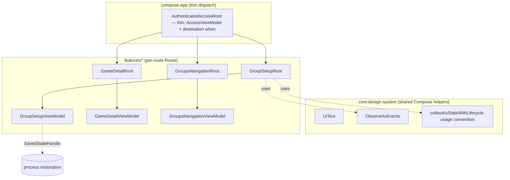

# Mobile Presentation and Compose MVI — Design

**Spec**: `.specs/features/mobile-presentation-compose-mvi/spec.md`
**Status**: Draft
**Approach**: B — full delivery now, including god-Root split over the current enum navigation (user-confirmed; accepted rework risk vs. AD-029/Nav3 documented in Risks)

---

## Architecture Overview

The audit showed the 8 existing ViewModels already follow the MVI shape by convention (immutable `StateFlow` + single `onIntent` + `Channel<Effect>`), leaf screens are stateless `(state, onIntent)`, CompositionLocals are theme-only, and the single lazy list is keyed. Two structural gaps remain, however: nothing enforces the MVI shape (each VM re-implements the boilerplate), and two god-ViewModels violate PMVI-001's per-route contract — `AccessViewModel` serves 10+ destinations and `GroupsNavigationViewModel` serves 3. The design closes eight concrete gaps:

Eight workstreams:

1. **Remove test-scope hooks** (PMVI-007/008): delete `testScope: CoroutineScope? = null` from all 7 ViewModels; ViewModels use `viewModelScope` only. Tests migrate to `Dispatchers.setMain(UnconfinedTestDispatcher())` + `runTest` (kotlinx-coroutines-test, multiplatform).
2. **Lifecycle-aware collection** (PMVI-016/017): add `lifecycle-runtime-compose` (org.jetbrains.androidx, existing `lifecycle = 2.9.6`); every Root collects with `collectAsStateWithLifecycle()`.
3. **`UiText` + error mapping** (PMVI-005): one sealed type in `:core:design-system`; feature error mappers return `UiText` instead of raw `StringResource` per-call-site `when`s.
4. **`ObserveAsEvents` helper** (PMVI-006/021): one shared effect-collection composable, lifecycle-aware, replacing hand-written `LaunchedEffect { vm.effects.collect }` blocks.
5. **Form state into ViewModels + restoration** (PMVI-002/018–020): the five form screens (GroupSetup, Expense, Finance, GameDetail, GameEditor) hold input in `remember` today; input that affects validation/submission moves into ViewModel state via typed intents. **Correction (found during T12 implementation):** `DraftsModule` backs durable draft stores for four of the five forms — GroupSetup (`GroupDraftStorePort`), Expense (`ExpenseDraftStorePort`), Finance (`MonthlyChargeDraftStorePort`), and GameEditor (`GameDraftStorePort`), all committed via `AndroidGroupDraftStore`/equivalents (survives process death). Only **GameDetail has no durable draft**. So the PMVI-020 rule applies to four forms, not one: for GroupSetup/Expense/Finance/GameEditor, the durable draft stays the source of truth and `SavedStateHandle` carries only the reload identifiers (or nothing new, where the draft key already derives from restorable nav args, as in GroupSetup). Only **GameDetail** gets a full authoritative `saved()` form snapshot (add `lifecycle-viewmodel-savedstate`, org.jetbrains.androidx).
6. **God-Root split** (PMVI-009–011): extract per-ViewModel Root composables into their feature modules; `AuthenticatedAccessRoot` shrinks to AccessViewModel acquisition + the destination `when`. Destination enums move out of the 749-line file into their own files.
7. **`MviViewModel<S, I, E>` base contract** (PMVI-001/003/006): abstract base in `:core:common` owning the `StateFlow`/`Channel`/`onIntent` scaffolding; all ViewModels (existing and split-off) migrate onto it, making the MVI shape enforced by construction instead of by convention.
8. **God-ViewModel split** (PMVI-001): `AccessViewModel` splits into per-route ViewModels (Login, Registration, PasswordReset, Verification, NameCompletion, Settings, Memberships, Invite) living in `:features:access` and wrapping the existing coordinators; `AccessViewModel` retains only session/bootstrap/group-selection/destination orchestration. `GroupsNavigationViewModel` splits likewise into GroupsList, GroupDetail, and GroupMore ViewModels, retaining only groups-destination orchestration.

Out of design (confirmed by audit): CompositionLocal migration (already theme-only; PMVI-027/028 satisfied by documentation), lazy-list keys (done), wiring the 4 built-but-unrouted screens (Games/GameEditor/Finance/Expense stay behind `RoutePage` stubs — routing them is new product behavior, out of scope per spec).

---

## Code Reuse Analysis

### Existing Components to Leverage

| Component | Location | How to Use |
| --- | --- | --- |
| 8 MVI ViewModels | `features/groups/.../presentation/**`, `compose-app/.../navigation/` | Keep as-is; only remove `testScope`, add `SavedStateHandle` where forms exist |
| Stateless `(state, onIntent)` screens | `features/*/ui/**` | Unchanged rendering; form screens gain state/intent params replacing local `remember` |
| `AuthUiErrorMapper` | `features/access/.../presentation/AuthUiErrorMapper.kt` | Convert return type `StringResource` → `UiText`; pattern replicated for groups mappers |
| Drafts mechanism | `DraftsModule` (Group/Expense/Finance/GameEditor draft ports) | Source of truth for restoration on 4 of 5 forms (PMVI-020); SavedStateHandle stores only reload keys there. GameDetail (no draft) gets the authoritative snapshot instead. |
| `RegistrationScreen` manual snapshot | `features/access/.../RegistrationScreen.kt:85` | Replace app-managed `restore()`/snapshot with the standard SavedStateHandle path |
| Existing previews + `SaqzTheme` wrapper | design-system, feature screens | Extend with loading/empty/error fixtures where missing (PMVI-012) |
| `testTag`/semantics infra (`FinanceTags`, etc.) | feature UI files | Reused by accessibility audit tasks (PMVI-023–026) |
| Koin `ComposePresentationModule` | `compose-app/.../di/ComposePresentationModule.kt` | Bindings updated in place: drop `testScope` params, add SavedStateHandle-aware `viewModel {}` |

### Integration Points

| System | Integration Method |
| --- | --- |
| Enum navigation (`AccessDestination`/`GroupsDestination`) | Roots are extracted per-ViewModel and invoked from the existing `when` dispatch; no route-key changes |
| Future Nav3 (`:navigation`, AD-029) | Roots live in feature modules so `NavDisplay` entries can consume them directly when AD-029 executes |
| Version catalog | Two new library entries under existing `lifecycle = 2.9.6`: `lifecycle-runtime-compose`, `lifecycle-viewmodel-savedstate` |
| `scripts/check-mobile-boundaries` | Unchanged — Roots stay inside feature presentation boundaries per AD-030 |

---

## Components

### MviViewModel base

- **Purpose**: Enforce the MVI contract by construction — immutable state, atomic updates, single intent entry, buffered one-shot effects.
- **Location**: `core/common/src/commonMain/kotlin/br/com/saqz/core/common/mvi/MviViewModel.kt` (adds `lifecycle-viewmodel` to `:core:common` — not a Compose dependency, module stays UI-free)
- **Interfaces**:
  - `abstract class MviViewModel<S, I, E>(initialState: S) : ViewModel()`
  - `val state: StateFlow<S>` / `val effects: Flow<E>` (backed by private `MutableStateFlow` + `Channel(BUFFERED).receiveAsFlow()`)
  - `abstract fun onIntent(intent: I)`
  - `protected fun update(transform: (S) -> S)` (atomic `MutableStateFlow.update`, PMVI-003) / `protected fun emit(effect: E)`
- **Dependencies**: `lifecycle-viewmodel` (already in catalog), kotlinx-coroutines
- **Reuses**: extracts the identical scaffolding currently duplicated across all 8 ViewModels; every VM (existing + split-off) migrates onto it

### Per-route ViewModels (god-VM split)

- **Purpose**: Give each navigable destination its own State/Intent/Effect contract (PMVI-001) instead of sharing a god-ViewModel.
- **Location**: access VMs in `features/access/src/commonMain/.../presentation/` (LoginViewModel, RegistrationViewModel, PasswordResetViewModel, VerificationViewModel, NameCompletionViewModel, SettingsViewModel, MembershipAdministrationViewModel, InviteManagementViewModel); groups VMs beside their screens (GroupsListViewModel, GroupDetailViewModel, GroupMoreViewModel)
- **Interfaces**: each extends `MviViewModel<S, I, E>`; screen composables keep their `(state, onIntent)` signatures, with state/intent types narrowed from the shared Access/Groups types to per-route types
- **Dependencies**: existing coordinators (`AuthenticationCoordinator`, `VerifiedSessionCoordinator`, `AccessValidators`) become the business dependencies of the access VMs — logic moves out of `AccessViewModel`, not rewritten
- **Reuses**: existing per-screen state slices already present inside `AccessState`/`GroupsNavigationState` become the per-route `State` types; existing intents partition by screen
- **Residual orchestrators**: `AccessViewModel` keeps session/bootstrap/selection/destination state only; `GroupsNavigationViewModel` keeps groups-destination/selection state only. Cross-route outcomes (e.g. login success → destination change) flow through Root callbacks into the orchestrator — same mechanism as the existing `GroupSetupEffect.SelectGroup` rerouting, now explicit.

### UiText

- **Purpose**: One presentation-text abstraction so state/effects never expose raw transport errors or per-site `StringResource` `when`s.
- **Location**: `core/design-system/src/commonMain/kotlin/br/com/saqz/designsystem/text/UiText.kt`
- **Interfaces**:
  - `sealed interface UiText` with `data class Res(val res: StringResource, val args: List<Any> = emptyList())` and `data class Raw(val value: String)`
  - `@Composable fun UiText.asString(): String`
- **Dependencies**: `compose.components.resources` (already in design-system)
- **Reuses**: replaces the return type of `AuthUiErrorMapper.messageRes()` and inline `stringResource(when(error){…})` blocks

### ObserveAsEvents

- **Purpose**: Single lifecycle-aware effect collector guaranteeing one documented owner per effect flow and no duplicate delivery on recomposition/re-collection.
- **Location**: `core/design-system/src/commonMain/kotlin/br/com/saqz/designsystem/effects/ObserveAsEvents.kt`
- **Interfaces**:
  - `@Composable fun <T> ObserveAsEvents(flow: Flow<T>, key1: Any? = null, onEvent: (T) -> Unit)` — collects in `repeatOnLifecycle(STARTED)`, captures `onEvent` via `rememberUpdatedState`
- **Dependencies**: `lifecycle-runtime-compose`
- **Reuses**: replaces the raw `LaunchedEffect { effects.collect }` blocks currently at `AuthenticatedAccessRoot.kt:283/290/315`

### Per-route Root composables

- **Purpose**: Own DI acquisition, lifecycle-aware state collection, effect observation, and semantic callbacks for one ViewModel each (PMVI-009).
- **Location**: feature modules, beside their screens — `features/groups/.../ui/GroupSetupRoot.kt`, `GameDetailRoot.kt`, `GroupsNavigationRoot.kt` (hosting GroupsList/GroupDetail/GroupMore dispatch)
- **Interfaces** (pattern): `@Composable fun GroupSetupRoot(onGroupSelected: (…) -> Unit, onClose: () -> Unit)` — cross-feature outcomes leave as callbacks; internals use `koinViewModel`, `collectAsStateWithLifecycle`, `ObserveAsEvents`
- **Dependencies**: koin-compose, lifecycle-runtime-compose (added to feature modules)
- **Reuses**: existing screens and ViewModels unchanged; existing cross-VM effect rerouting (`GroupSetupEffect.SelectGroup` → `AccessIntent.Selection`) becomes an explicit Root callback wired by the thin dispatcher — the Root is the single documented effect owner (PMVI-006)

### Thin AuthenticatedAccessRoot

- **Purpose**: Reduced to AccessViewModel acquisition, its own state collection/effects, and the `AccessDestination` `when` delegating to feature Roots.
- **Location**: `compose-app/.../navigation/AuthenticatedAccessRoot.kt` (shrinks from 749 lines; `AccessDestination`/`GroupsDestination` enums move to their own files)
- **Dependencies**: unchanged
- **Reuses**: existing dispatch structure; behavior-preserving

### Form-state migration (5 screens)

- **Purpose**: Move validation/submission-affecting input from composable `remember` into ViewModel state with per-field intents; restore essentials after process death (PMVI-002/018/019).
- **Location**: `GroupSetupScreen/ViewModel`, `ExpenseScreen/ViewModel`, `FinanceScreen/ViewModel`, `GameDetailScreen/ViewModel`, `GameEditorScreen/ViewModel`
- **Interfaces**: each VM `State` gains the field values; each `Intent` gains field-change intents; screens become fully state-driven. Purely visual state (sheet expansion, focus, scroll) stays local per spec assumption.
- **Dependencies**: `SavedStateHandle` injected via Koin `viewModel {}`; persistence through the `saved()` delegate with a `@Serializable` snapshot per VM (org.jetbrains.androidx lifecycle-viewmodel-savedstate 2.9, multiplatform). On iOS the handle exists but process-restoration triggers are platform-limited — the contract is common; Android gets full restoration.
- **Reuses**: GroupSetup, Expense, Finance, and GameEditor reconcile with their `DraftsModule`-backed durable draft (draft wins, PMVI-020); only GameDetail uses an authoritative `saved()` snapshot (no competing draft exists). Restored input re-validates through the existing validation path, never auto-submits (PMVI-019)

### ViewModel test-scope removal

- **Purpose**: Production ViewModels expose no test scope (PMVI-007/008).
- **Location**: 7 ViewModels + `GroupSetupViewModelParameters` (drop `testScope`) + Koin bindings + all VM tests
- **Interfaces**: constructors keep only business dependencies; tests use `Dispatchers.setMain(UnconfinedTestDispatcher())` around `viewModelScope`
- **Reuses**: existing test suites migrate mechanically; assertions unchanged

---

## Data Models

No new data models. `UiText` is the only new shared type (above). Restoration uses one private `@Serializable` form-snapshot data class per form ViewModel, persisted via the multiplatform `SavedStateHandle.saved()` property delegate (Lifecycle 2.9, kotlinx.serialization-based — no manual keys, no per-field `getStateFlow`).

---

## Error Handling Strategy

| Error Scenario | Handling | User Impact |
| --- | --- | --- |
| Restored input fails current validation | Normal validation-error state renders; no auto-submit (PMVI-019) | Sees the usual inline error, corrects and resubmits |
| Restored identifier no longer accessible | Existing load-failure path (`LOAD_ERROR` / retryable state) renders | Standard retry/denied screen |
| Effect emitted while route backgrounded | `ObserveAsEvents` collects only in STARTED; Channel buffers until re-collection; route removal cancels the ViewModel and its channel (PMVI-021) | No lost or duplicated navigation/share actions |
| Transport/backend error text | Mapper → `UiText`; raw exceptions never reach state | Localized message only |

---

## Risks & Concerns

| Concern | Location | Impact | Mitigation |
| --- | --- | --- | --- |
| Nav3 rework (accepted) | Roots + thin dispatcher vs. AD-029 | The enum `when` dispatch and thin `AuthenticatedAccessRoot` are replaced by `NavDisplay` entries when AD-029 executes | Roots live in feature modules with callback-only surfaces — exactly what Nav3 entries consume; only the thin dispatcher (~small file) is throwaway |
| Cross-VM effect rerouting | `AuthenticatedAccessRoot.kt:315` (`GroupSetupEffect` → `AccessIntent`) | Hidden coupling; effect ownership ambiguous (PMVI-006) | Becomes an explicit Root callback param wired by the dispatcher; ownership documented at the Root |
| `GroupsRouteScreens.kt` (1163 lines) | `features/groups/.../ui/GroupsRouteScreens.kt` | Fragile mixed file; hard to preview/test per state | Split by screen when touched for the Groups Root work; no visual change |
| iOS restoration is contract-only | SavedStateHandle on iOS | Process-death restoration is effectively Android-first | Spec allows "approved KMP-equivalent restoration contract"; common contract + Android behavior verified by tests; documented as platform note |
| `Channel(BUFFERED)` vs lifecycle collection | all ViewModels | Effects emitted while STOPPED are delivered on restart — correct, but a burst could replay stale navigation | `ObserveAsEvents` + route-removal cancellation (PMVI-021) covers it; edge-case test for backgrounded emission |
| Zero `rememberSaveable` for remaining local visual state | form screens | Sheet/scroll state lost on config change | Acceptable per spec (transient UI detail); not turned into durable state |
| AccessViewModel split blast radius | `AccessViewModel.kt` + 10 screens + `AuthenticatedAccessRootTest` suite | Largest single refactor in the feature; auth flows are business-critical | Logic already lives in coordinators (moved, not rewritten); split lands route-by-route with tests migrating per route, orchestrator kept green throughout |

---

## Tech Decisions (only non-obvious ones)

| Decision | Choice | Rationale |
| --- | --- | --- |
| MVI base class | `MviViewModel<S,I,E>` in `:core:common` | User-confirmed: the shape must be enforced by construction, not convention; also removes the boilerplate duplicated 8× (supersedes the earlier no-base draft decision) |
| God-VM split granularity | Per navigable destination, orchestrators retained | PMVI-001 reads per-route; AD-025's "panels share the route ViewModel" exception applies only until destinations are real navigation entries — these are destinations today |
| Test determinism mechanism | `Dispatchers.setMain` + `runTest`, not injected dispatchers | Zero production constructor surface; VM work is scope-launch only — no VM currently selects dispatchers |
| Compose helper home | `:core:design-system` | Only shared Compose module; `:core:common` is Compose-free and stays that way |
| Roots live in feature modules | `features/*/ui/*Root.kt` | AD-030 presentation boundary + direct consumption by future Nav3 entries (AD-029) |
| Unrouted screens stay stubbed | Games/GameEditor/Finance/Expense not wired | Routing them is new product behavior — out of scope; their VMs still get the testScope/SavedState work since they're shipped code |
| CompositionLocals untouched | Document PMVI-027/028 as already-satisfied | All 5 locals are theme-only (`SaqzTheme.kt:17-22`); migration would be churn without benefit |
