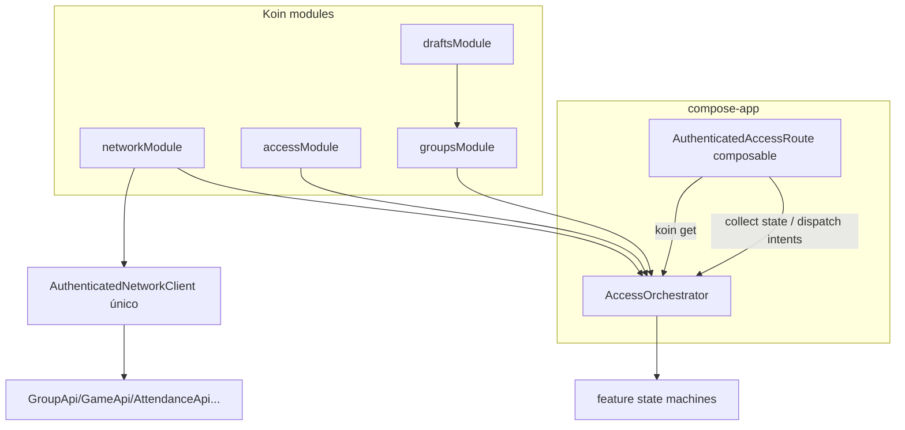

# Mobile SOLID Refactor Wave 2 Design

**Spec**: `.specs/features/mobile-solid-refactor-wave-2/spec.md`
**Context**: `.specs/features/mobile-solid-refactor-wave-2/context.md`
**Status**: Approved (strategy: bottom-up, confirmed 2026-07-21)

---

## Architecture Overview

Sequenciamento bottom-up em 6 fases (F0–F5). Fundações antes dos consumidores;
o hub de navegação consolida tudo via Koin por último entre as estruturais.

```
F0 fixes ──> F1 fundações (core/common, mappers, validators)
                │
                v
          F2 NetworkClient (pipeline único)
                │
                v
          F3 Koin modules + AccessOrchestrator (hub decomposto)
                │
                v
          F4 state machines genéricos (deferred link, draft-mutation)
                │
                v
          F5 GroupSetupScreen decomposta
```



Decisões de contexto travadas: Koin (AD-028), bugs isolados primeiro, BRL
canônico `R$ 1.234,56`, verificação unitária + gates existentes, regra de nome
restrita uniforme, ETag permanece nos ViewModels.

Conformidade com ADs ativas: AD-001 (umbrella framework — tipos Koin não vazam
para a API exportada a iOS), AD-013 (compose-app continua dono do shell),
AD-018 (Compose-first; orchestrator é Kotlin puro, sem UI nativa), AD-020
(Ktor/AuthenticatedNetworkClient preservados), AD-025 (MVI por rota intacto —
orchestrator não vira ViewModel de tela), AD-026 (fronteiras access/groups
respeitadas pelos módulos Koin).

---

## Fase F0 — Fixes comportamentais (design inline por fix)

| Fix | Mudança | Teste de regressão |
| --- | --- | --- |
| FIX-01 | `AndroidGroupDraftStore.ExpenseAdapter.clear` propaga `expenseId` como `resourceId` no `AndroidDraftRef(EXPENSE, groupId, expenseId)` (mecanismo já existe para GAME) | `AndroidGroupDraftStoreTest`: dois drafts de despesa no mesmo grupo; clear de um preserva o outro |
| FIX-02 | `AndroidGroupStateAdapter` (fake) removido ou substituído por delegação ao store real (`AndroidLocalGroupStateAdapter` já cobre a porta); write→read de attendance link round-trip | adapter test: write seguido de read retorna o valor |
| FIX-03 | `BranchSdkSessionClient.branchCallback` extrai também `saqz_attendance` e emite o mesmo evento do caminho de URL direta | teste unitário com params Branch contendo attendance → evento emitido |
| FIX-04 | O grafo de rede do composable deixa de existir (F3 remove); fix imediato: o invalidator do grafo secundário passa a delegar ao real. **Nota**: F3 torna o fix estrutural — F0 aplica o fix mínimo no invalidator; F3 remove o grafo | teste: 401 no client do game-detail chama `invalidate()` |

---

## Fase F1 — Fundações compartilhadas (SHR)

### `SaqzCurrencyFormatter` (extensão) — `core/common`
- **Purpose**: fonte única de formatação/parse BRL.
- **Location**: `mobile/core/common/src/commonMain/kotlin/br/com/saqz/core/common/formatting/SaqzCurrencyFormatter.kt`
- **Interfaces** (adicionar às existentes):
  - `formatBrl(cents: Long): String` — canônico `R$ 1.234,56` (já existe; promover a único formato)
  - `parseBrlToCents(input: String): Long?` — sanitiza e parseia input de teclado
  - `sanitizeBrlInput(input: String): String` — dígitos + um separador
- **Replaces**: `GroupSetupScreen.kt:980-1009`, `ExpenseRules.kt:58-68`,
  `FinanceChargeRules.kt:42-50`, `FinanceScreen.kt:82`, `ExpenseScreen.kt:72`.

### `SaqzDateTimeFormatter` (extensão) — `core/common`
- Adicionar `formatLocalDatePtBr(iso: String): String` e `formatMonthPtBr(yearMonth): String`.
- **Replaces**: `localDate()`/`monthPtBr()` duplicados nas telas de finanças.

### Mapeadores HTTP→domínio por contexto — `features/groups/data`
- **Purpose**: generalizar `FinanceApi.kt:47-62` para os demais contextos.
- **Location**: `mobile/features/groups/src/commonMain/kotlin/br/com/saqz/groups/data/`
- **Interfaces**: `NetworkError.toSetupFailure()`, `toAdministrationFailure()`,
  `toPhotoFailure()`, `toDeferredLinkFailure()` (conforme consumidores atuais);
  `isProblem` sobe para `core/network` como extensão pública única.
- **Consumers**: `GroupSetupViewModel`, `GroupAdministrationCoordinator`,
  `GroupPhotoCoordinator`, deferred-link machines — presentation deixa de
  inspecionar `ApiProblemError` (SHR-02).

### `AuthUiErrorMapper` + `toUiError` — `features/access/presentation`
- `fun AuthUiError.messageRes(): StringResource` — `when` exaustivo sem `else`.
- `fun NativeFailureCode.toUiError(): AuthUiError` — fonte única.
- **Replaces**: `LoginScreen.kt:402-410`, `RegistrationScreen.kt:257-263`,
  `IdentityCompletionScreens.kt:270-275`, mappers duplicados nos coordinators.

### `AccessValidators` — `features/access/presentation`
- `fun isValidEmail(input: String): Boolean`
- `fun isValidDisplayName(input: String): Boolean` — 2..80 chars, sem ISO
  control (regra restrita uniforme, confirmada).
- Consumidos pelos coordinators e derivados nos estados expostos à UI.

---

## Fase F2 — NetworkClient decomposto (NET)

### `HttpTransport`
- **Purpose**: pipeline único de transporte (request builder, catches, corpo
  de erro limitado).
- **Location**: `core/network/src/commonMain/kotlin/br/com/saqz/network/HttpTransport.kt`
- **Interfaces**: `suspend fun execute(block: HttpRequestBuilder.() -> Unit): RawResponse`
- `RawResponse(status, body, headers)` — tipo interno do módulo.

### `NetworkErrorMapper` (injetável)
- `fun map(response: RawResponse): NetworkError` — default `ApiProblemErrorMapper`
  decodifica `ApiProblem`; `Json` injetado por construtor.

### `MultipartBodyBuilder` — arquivo próprio
- Extrai `BoundedMultipartContent` de `NetworkClient.kt:341-390`.

### `NetworkCallLogger` (interface)
- Logging/duração injetável; hoje embutido em `:212-214, 289-303`.

### `NetworkClient` (fachada preservada)
- Mantém a API pública atual (`get/post/put/...`, `executeMediaRequest`)
  delegando ao `HttpTransport`; semântica de erro e limites idênticos (NET-02).

### `Environment` tipado
- `enum class Environment { Dev, Prod }` em `NetworkConfig`; factories de
  plataforma decidem logging pelo enum (fim da string `"prod"` — NET-03).

---

## Fase F3 — Koin + decomposição do hub (NAV)

### Módulos Koin (`compose-app`, commonMain)
| Módulo | Conteúdo |
| --- | --- |
| `networkModule` | `NetworkConfig`, `NetworkClient`/`HttpTransport`, `AuthenticatedNetworkClient` (single), `SessionInvalidator` real |
| `accessModule` | state machines de auth/session + ports nativas (bindings das implementações Android/iOS) |
| `groupsModule` | `GroupApi`, `GroupPhotoApi`, `RolesInvitesApi`, `AttendanceShareApi`, `GameApi`, gateways, state machines de selection/administration/deferred links |
| `draftsModule` | stores/adapters de drafts (bindings de plataforma) |

- App composition (`SaqzApplication`, iOS entry) chama `startKoin` com os
  módulos; `SaqzAppDependencies` é eliminado (NAV-04); stubs migram para
  `commonTest` como módulo de teste.
- `koin-test` `verify()` no commonTest/androidTest garante o grafo (mitiga o
  trade-off de erros em runtime — AD-028).

### `AccessOrchestrator` (não-composable, Kotlin puro)
- **Purpose**: dono único da construção e reconciliação das state machines e
  da lógica cross-feature hoje espalhada em `AccessRuntime` + 8 `LaunchedEffect`.
- **Location**: `compose-app/.../navigation/AccessOrchestrator.kt`
- **Interfaces**:
  - `val state: StateFlow<AccessSceneState>` — estado combinado
  - `fun onIntent(intent: AccessRuntimeIntent)` — funil único (preserva contrato atual)
  - `fun start()` / `fun close()` — lifecycle
- **Dependencies**: todas via construtor (resolvidas por Koin).
- **Absorve de `AccessRuntime`**: máquinas + auth observer + reconciliação.
- **Extrai para `groups`**: `rotateInvite`/`expireInvite`/`shareFinished` →
  `InviteToolStateMachine` na feature groups (dona de `InviteToolState`/
  `InviteUiError`) — remove lógica de negócio da camada de navegação.
- **Extrai**: geração de UUID v4 → `RequestIdGenerator` injetável.
- **Um único grafo de rede** (NAV-02): o fluxo de game-detail consome o mesmo
  `AuthenticatedNetworkClient`; o segundo grafo do composable (:203-219) é
  removido — FIX-04 vira propriedade estrutural.
- Composable `AuthenticatedAccessRoute` passa a: obter orchestrator via Koin,
  coletar estado, renderizar destinos, despachar intents (NAV-01, NAV-03).

---

## Fase F4 — State machines genéricos (DUP)

### `DeferredLinkStateMachine<T, E>` — `features/groups/presentation`
- **Purpose**: state machine único para links diferidos.
- **Interfaces** (configuração por construtor):
  - `eventFilter: (GroupLinkEvent) -> String?` — extrai o código do link
  - `readPending: (GroupValueCallback) -> Unit` / `writePending: (String?, GroupResultCallback) -> Unit`
  - `resolve: suspend (String) -> NetworkResult<T>`
  - `mapError: (NetworkError) -> E` + `retryAfter: (NetworkError) -> Int?`
  - `onResolved: (T) -> Unit`
- `DeferredInviteStateMachine` e `DeferredAttendanceLinkStateMachine` viram
  wrappers finos (~30-40 linhas) que mantêm API pública e estados atuais
  (`InviteState`, destino de attendance) delegando ao genérico — testes
  existentes passam sem alteração de expectativas (DUP-01).

### Executor de mutação com draft — `features/groups/presentation/finance`
- Composição (não herança): `DraftMutationSupport` encapsula
  restore/persist/retry/execute + mapeamento de erro parametrizado.
- Capacidade tipada: `sealed interface FinanceCapability { data object Athlete; data class Organizer(val gateway: OrganizerFinanceGateway) }` —
  fim do gateway nullable como flag (DUP-02); `failed(Forbidden)` preservado
  para Athlete.
- `FinanceViewModel` e `ExpenseViewModel` delegam; ETag permanece nos VMs
  (assumption confirmada).

---

## Fase F5 — GroupSetupScreen decomposta (UI)

| Extração | Destino |
| --- | --- |
| BRL parse/format | delega a `SaqzCurrencyFormatter` (F1) — UI-01 |
| `formatHours`/`parseHours` | `ui/setup/SetupFieldFormat.kt` (ou core/common se reusado) |
| Label mappers (5 enums) | `ui/setup/SetupEnumLabels.kt` |
| Componentes (SetupInput, SegmentedChoice, SelectorField, Stepper, FeeEditor, MonthlyToggle, SelectionSheet, MaterialIcon) | `ui/setup/components/` |
| Regras (capacidade 2..100, dia default, editabilidade) | fonte única em `GroupSetupSupport` — tela consome (UI-03) |
| Tela | compõe seções + hoisting de estado/intents |

---

## Error Handling Strategy

| Cenário | Handling | Impacto |
| --- | --- | --- |
| Falha de wiring Koin em runtime | `koin-test verify()` no gate de testes | falha no CI, não no usuário |
| 401 em qualquer fluxo autenticado | único `AuthenticatedNetworkClient` + invalidator real | logout consistente (FIX-04) |
| Erro HTTP em groups | mapeadores na data layer (F1) | presentation recebe falha de domínio pronta |
| Fix de draft com `expenseId` inexistente | clear completa sem erro, sem afetar outros drafts | sem perda de dados (edge case da spec) |

---

## Risks & Concerns

| Concern | Location | Impact | Mitigation |
| --- | --- | --- | --- |
| Versão Koin × Kotlin/Compose atuais não verificada | `mobile/gradle/libs.versions.toml` | incompatibilidade de toolchain | Tasks: T de pesquisa/pin da versão antes do bootstrap (Knowledge Verification Chain: catalog → docs oficiais); incerteza explicitada |
| Tipos Koin vazando para o umbrella framework iOS | `compose-app` exports | quebra AD-001 / build iOS | módulos Koin `internal`; verificação via `:compose-app` framework build no gate |
| `koin-test verify()` em KMP native | commonTest | API de verify pode não cobrir todos os targets | fallback: teste de resolução por módulo em androidUnitTest + iosTest |
| Reconciliação hoje dividida entre Runtime/VM/composable | `AuthenticatedAccessRoot.kt:221-365` | mover para orchestrator pode reordenar efeitos | NAV-05: suites existentes como contrato; migração por sub-componentes com gate por task |
| Segundo grafo de rede tem consumidores ocultos | `AuthenticatedAccessRoot.kt:203-219` | remoção quebra game-detail | FIX-04 primeiro; F3 migra consumidores para o grafo primário com testes |
| Regra de nome restrita rejeita nomes hoje aceitos no registro | `RegistrationScreen.kt:93` | mudança comportamental aprovada | AC SHR-04 + teste cobrindo ambos os fluxos |

---

## Tech Decisions (only non-obvious ones)

| Decision | Choice | Rationale |
| --- | --- | --- |
| Executor de mutação financeira | Composição (`DraftMutationSupport`), não herança de ViewModel | ViewModels KMP com lifecycle próprios; herança acopla ao framework |
| Capacidade de papel | `sealed FinanceCapability` | Substitui gateway-null sem mudar contrato do gateway (ISP deferida) |
| Deferred-link genérico | Wrapper fino mantendo API atual | Testes existentes viram contrato; zero mudança comportamental |
| Integração Compose↔Koin | Recuperação no root + `remember`; sem koin-compose-viewmodel | ViewModels já têm factories próprias (AD-025); menor superfície nova |
| Versão Koin | 4.x, pin no catalog após checagem de compatibilidade (task de pesquisa) | Não fabricar versão sem verificar toolchain |
