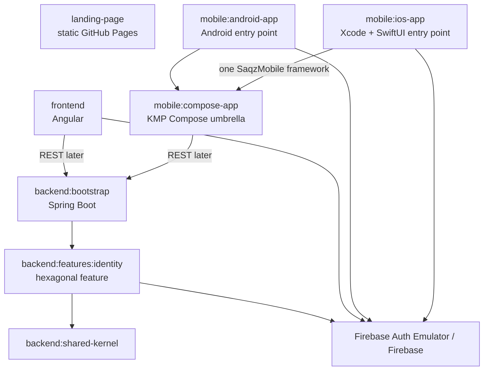
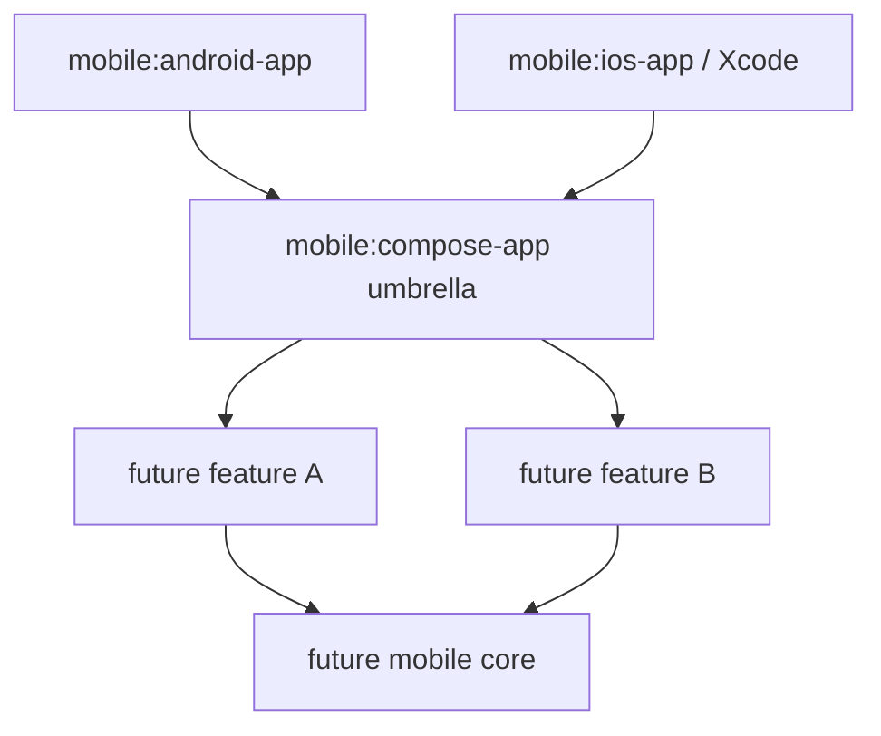

# Project Initialization Design

**Spec**: `.specs/features/project-initialization/spec.md`
**Status**: Approved

---

## Architecture Overview

Saqz uses a hybrid monorepo with three independent product workspaces. The
`backend/` and `mobile/` workspaces each own a Gradle wrapper, settings, version
catalog, and build logic. Angular CLI and npm own `frontend/`. Xcode owns the
iOS launcher inside `mobile/` and invokes only the mobile Gradle build to embed
the single KMP umbrella framework.

The backend is a feature-oriented modular monolith. The mobile application
shares Compose UI and presentation code between Android and iOS. Mobile feature
modules are added only when they contain behavior and are aggregated into one
umbrella framework for iOS. Angular has no build or runtime dependency on KMP.



### Physical Structure At Initialization

```text
saqz/
|-- backend/                         # Independent Gradle build
|   |-- gradlew
|   |-- settings.gradle.kts
|   |-- build-logic/
|   |-- bootstrap/
|   |-- shared-kernel/
|   `-- features/
|       `-- identity/
|-- frontend/                        # Independent Angular/npm workspace
|-- mobile/                          # Independent Gradle + Xcode workspace
|   |-- gradlew
|   |-- settings.gradle.kts
|   |-- build-logic/
|   |-- compose-app/                 # KMP Compose umbrella
|   |-- android-app/                 # Android entry point
|   `-- ios-app/                     # Xcode + SwiftUI entry point
|-- firebase/                        # Emulator-only configuration
|-- scripts/
|   |-- check-all
|   `-- check-landing
|-- landing-page/                    # Existing content unchanged
`-- .github/workflows/
```

No `mobile/core` or `mobile/features/*` module is created during initialization.
The first real mobile feature introduces those boundaries and is aggregated by
`mobile:compose-app` without changing the iOS integration surface.

### Target Mobile Structure

```text
mobile/
|-- compose-app/                     # app composition + umbrella framework
|-- android-app/                     # Android launcher
|-- ios-app/                         # Xcode launcher
|-- core/
|   |-- common/                      # stable technical primitives only
|   |-- network/                     # Ktor and generated API client later
|   `-- design-system/               # shared Compose design system later
`-- features/
    |-- identity/
    |-- groups/
    |-- athletes/
    |-- games/
    `-- finance/
```

Each future feature is a KMP library. `mobile:compose-app` depends on the feature
modules and generates a single static `SaqzMobile` framework for iOS. The Swift
entry point sees only the Compose root controller; feature internals are not
exported as separate frameworks.

---

## Research Findings

The design follows current official guidance available on 2026-07-14:

- JetBrains recommends separate application entry-point modules and shared KMP
  modules. Separate Android entry points are mandatory for AGP 9 and newer.
- One shared module is simplest initially; feature modules improve scalability
  as the codebase grows.
- Multiple KMP modules consumed by iOS should be aggregated into one umbrella
  framework. Multiple independent Kotlin frameworks can duplicate runtimes and
  shared dependencies and produce incompatible types.
- Direct local iOS integration is the recommended monorepo workflow when the
  team edits shared Kotlin and iOS together.
- Compose Multiplatform officially supports common ViewModels, lifecycle, and
  navigation. These dependencies are deferred until the first feature because
  the initialization scope allows only a placeholder.
- Kotlin recommends ordinary interfaces and injected platform implementations
  before `expect`/`actual`; expected/actual classes remain a less flexible
  choice.
- Firebase publishes native Android, Apple, web, and Admin SDKs, not an official
  KMP client SDK. The design uses those official SDKs at platform edges.
- Firebase Android KTX artifacts are no longer released; Android uses the main
  Firebase modules through the Firebase BoM.
- Firebase recommends one project per environment, with Android, iOS, and web
  variants of the same application registered in that environment's project.

### Official Sources

- [Recommended KMP project structure](https://www.jetbrains.com/help/kotlin-multiplatform-dev/multiplatform-project-recommended-structure.html)
- [Choosing a KMP configuration](https://www.jetbrains.com/help/kotlin-multiplatform-dev/multiplatform-project-configuration.html)
- [Platform-specific APIs](https://www.jetbrains.com/help/kotlin-multiplatform-dev/multiplatform-connect-to-apis.html)
- [Multiplatform ViewModel](https://www.jetbrains.com/help/kotlin-multiplatform-dev/compose-viewmodel.html)
- [iOS integration methods](https://www.jetbrains.com/help/kotlin-multiplatform-dev/multiplatform-ios-integration-overview.html)
- [Compose and SwiftUI integration](https://www.jetbrains.com/help/kotlin-multiplatform-dev/compose-swiftui-integration.html)
- [KMP compatibility guide](https://www.jetbrains.com/help/kotlin-multiplatform-dev/multiplatform-compatibility-guide.html)
- [Compose compatibility](https://www.jetbrains.com/help/kotlin-multiplatform-dev/compose-compatibility-and-versioning.html)
- [Firebase Android setup](https://firebase.google.com/docs/android/setup)
- [Firebase Apple setup](https://firebase.google.com/docs/ios/setup)
- [Firebase project best practices](https://firebase.google.com/docs/projects/dev-workflows/general-best-practices)

---

## Toolchain Baseline

| Tool | Pinned baseline | Rationale |
| --- | --- | --- |
| JDK | 21 | Spec baseline and LTS; supported by Spring Boot and Gradle. |
| Kotlin | 2.4.10 | Current stable Kotlin and compatible with current Gradle, AGP, and Xcode ranges. |
| Compose Multiplatform | 1.11.1 | Current stable release; supports shared Android/iOS UI. |
| Gradle wrapper | 9.5.0 | Highest version inside Kotlin 2.4.10's documented range; Gradle 9.6.1 is newer but outside that range. |
| Android Gradle Plugin | 9.1.0 | Highest version explicitly listed as compatible with Kotlin 2.4.10. |
| Spring Boot | 4.1.0 | Current stable release; supports Java 17 through 26 and Gradle 9.x. |
| Node | 26.5.0 | Current Node release and supported by Angular 22 (`>=26.0.0`). |
| npm | 12.0.1 | Current npm release, pinned in `packageManager` for lockfile reproducibility. |
| Angular / CLI | 22.0.6 | Current active Angular release and compatible with Node 26. |
| TypeScript | 6.0.3 | Newest compatible TypeScript version inside Angular 22's `>=6.0 <6.1` range; TypeScript 7 is newer but outside Angular's peer range. |
| RxJS | 7.8.2 | Current RxJS 7 release inside Angular 22's supported range. |
| angular-eslint | 22.1.0 | Current Angular 22-compatible lint tooling. |
| Xcode | 26.4 | Kotlin 2.4 compatibility baseline; also satisfies Firebase Apple requirements. |
| Android minimum | API 23 | Firebase Android requirement, stricter than Compose's API 21 minimum. |
| iOS minimum | iOS 15 | Firebase Apple requirement, stricter than Compose's iOS 14 minimum. |
| Firebase Android BoM | 34.15.0 | Current official Android BoM; use main modules, not retired KTX artifacts. |
| Firebase Apple SDK | 12.16.0 | Current official Apple release, pinned by SwiftPM and `Package.resolved`. |
| Firebase JavaScript SDK | 12.16.0 | Current npm release, pinned by `package-lock.json`. |
| Firebase Admin Java | 9.10.0 | Current official Admin Java release. |
| Firebase CLI | 15.23.0 | Current CLI release used to run the Auth Emulator. |
| ArchUnit JUnit 5 | 1.4.2 | Current Maven Central release for backend architecture tests. |
| Gitleaks | 8.30.1 | Current stable release used by the credential scan gate. |

All versions are pinned in the Gradle wrapper, version catalog, npm lockfile,
`packageManager`, SwiftPM requirement, `Package.resolved`, or CI action input.
Spring Boot owns versions of its managed test libraries. Compose UI tests use
the same `1.11.1` release as Compose Multiplatform. No preview, RC, beta, or EAP
dependency is allowed without a spec amendment.

---

## Code Reuse Analysis

### Existing Components To Preserve

| Component | Location | How To Use |
| --- | --- | --- |
| Static landing | `landing-page/` | Leave content unchanged and validate local asset URLs. |
| Pages deployment | `.github/workflows/deploy-pages.yml` | Preserve the existing trigger, artifact path, environment, and deployment action. |
| Saqz logo | `landing-page/assets/saqz-logo.svg` | Do not move during initialization; mobile/web branding is deferred. |
| Repository README | `README.md` | Expand with prerequisites and native gate commands while retaining landing instructions. |

### New Integration Points

| System | Integration Method |
| --- | --- |
| Android launcher -> shared UI | Mobile-build dependency on `:compose-app`. |
| iOS launcher -> shared UI | Xcode build phase invokes `:compose-app:embedAndSignAppleFrameworkForXcode` in the mobile build; SwiftUI hosts `ComposeUIViewController`. |
| Android -> Firebase | Official Firebase Android main module through Firebase BoM; programmatic emulator-safe local options. |
| iOS -> Firebase | Official Firebase Apple SDK through Swift Package Manager; initialization in Swift app delegate. |
| Angular -> Firebase | Official modular Firebase JavaScript SDK and Angular environment configuration. |
| Backend -> Firebase | Firebase Admin Java SDK isolated in the identity output adapter. |
| Local/CI -> Firebase | Firebase Auth Emulator on port 9099 with an ephemeral project ID and exported data disabled. |

### Checked-In Local Firebase Contract

Local configuration contains explicitly fake, non-production identifiers. It
is code/configuration committed with each client, not a `.env`,
`google-services.json`, or `GoogleService-Info.plist` file.

| Field | Local value |
| --- | --- |
| Project ID | `saqz-local` |
| API key | `fake-saqz-local-api-key` |
| Messaging sender ID | `123456789000` |
| Android app ID | `1:123456789000:android:saqzlocal` |
| Android application ID | `br.com.saqz.local` |
| Apple app ID | `1:123456789000:ios:5a61717a6c6f6361` |
| Apple bundle ID | `br.com.saqz.local` |
| Web app ID | `1:123456789000:web:saqzlocal` |
| Auth emulator port | `9099` |

- Android reads typed local constants from the launcher module, creates
  `FirebaseOptions`, initializes `FirebaseApp`, obtains `FirebaseAuth`, and
  applies `useEmulator("10.0.2.2", 9099)` before exposing that instance.
- iOS defines equivalent values in a Swift `LocalFirebaseConfiguration`,
  creates `FirebaseOptions`, calls `FirebaseApp.configure(options:)`, obtains
  `Auth.auth()`, and applies `useEmulator(withHost:"127.0.0.1", port:9099)`
  before the Compose root is created.
- Angular exports a typed `localFirebaseOptions` constant from source, calls
  `initializeApp`, obtains Auth, and calls `connectAuthEmulator` before Angular
  bootstrap completes.
- Each platform bootstrap receives a small recorder/factory seam in tests so
  the effective host, port, and call ordering are asserted without adding a
  shared session or token abstraction.

---

## Components

### Gradle Build Foundation

- **Purpose**: Coordinate Kotlin modules without owning Angular or Xcode builds.
- **Location**: independent Gradle roots under `backend/` and `mobile/`.
- **Interfaces**: `backend/gradlew -p backend` and `mobile/gradlew -p mobile` focused build/test tasks.
- **Dependencies**: JDK 21, pinned Gradle wrapper, version catalog.
- **Design**: Convention plugins separate JVM backend, KMP Compose library, and
  Android application conventions. Spring Boot is never applied to a KMP
  module.

### Backend Composition Root

- **Purpose**: Start Spring Boot and wire feature ports to adapters.
- **Location**: `backend/bootstrap`.
- **Interfaces**: application `main`, Actuator health endpoint, Spring bean
  configuration.
- **Dependencies**: identity feature and shared kernel.
- **Constraints**: No domain, application, use-case, port, or adapter packages.

### Identity Feature

- **Purpose**: Convert a bearer credential into a provider-neutral authenticated
  principal.
- **Location**: `backend/features/identity`.
- **Internal packages**:
  - `api`: `AuthenticatedPrincipal` and session response contract.
  - `application`: token-verification port and session query.
  - `domain`: identity values only if an invariant is required.
  - `adapter.input.http`: security filter and `/api/session` controller.
  - `adapter.output.firebase`: Firebase Admin verifier and exception mapping.
- **Dependencies**: shared kernel; Firebase and Spring only in adapters.

Provider-neutral application contracts:

```kotlin
@JvmInline
value class RawIdentityToken(val value: String)

fun interface IdentityTokenVerifier {
    fun verify(token: RawIdentityToken): TokenVerification
}

sealed interface TokenVerification {
    data class Verified(val principal: AuthenticatedPrincipal) : TokenVerification
    data object Rejected : TokenVerification
    data object ProviderUnavailable : TokenVerification
}

fun interface VerifyRequestIdentity {
    fun execute(token: RawIdentityToken): TokenVerification
}
```

Ownership and translation:

- The HTTP security filter owns Authorization-header parsing. Missing,
  malformed, or non-Bearer input becomes the public `401` contract without
  invoking the output port.
- `VerifyRequestIdentity` is application code and delegates only to
  `IdentityTokenVerifier`.
- The Firebase output adapter owns all Firebase exception inspection. Invalid
  signature, expiry, and revocation become `Rejected`; timeout, connection, and
  provider service failures become `ProviderUnavailable`.
- The security filter maps `Rejected` to `AUTHENTICATION_REQUIRED`, maps
  `ProviderUnavailable` to `IDENTITY_PROVIDER_UNAVAILABLE`, and places only a
  provider-neutral principal in Spring Security context for `Verified`.
- The session controller reads the principal from the security context and maps
  it to `SessionResponse`; it never calls Firebase.
- The global HTTP exception handler owns `ProblemDetail` serialization and
  correlation fields. Firebase exceptions never cross the output adapter.

### Shared Kernel

- **Purpose**: Hold stable cross-feature technical primitives.
- **Location**: `backend/shared-kernel`.
- **Initial contents**: correlation-ID value and error code primitives only if
  used by more than identity and bootstrap.
- **Constraint**: No Firebase, HTTP, persistence, or business-domain types.

### Mobile Umbrella App

- **Purpose**: Own the shared Compose root and produce the only iOS Kotlin
  framework.
- **Location**: `mobile/compose-app`.
- **Targets**: Android library, `iosArm64`, and `iosSimulatorArm64` using the
  default hierarchy template.
- **Interfaces**: common `SaqzApp()` composable; iOS `MainViewController()` that
  returns `ComposeUIViewController`.
- **Dependencies**: Compose runtime, foundation, UI, and Material only.
- **Framework**: static `SaqzMobile`; no feature framework export.
- **Constraints**: No navigation, ViewModel, network, domain, use-case, or
  Firebase dependency during initialization.

### Android Launcher

- **Purpose**: Own Android lifecycle, application ID, Firebase initialization,
  and the Android UI entry point.
- **Location**: `mobile/android-app`.
- **Interfaces**: `Application`, `MainActivity`, and `SaqzApp()` host.
- **Dependencies**: `:compose-app`, AndroidX Activity Compose, Firebase Android
  main modules through the BoM.
- **Local Firebase**: programmatic emulator-safe options and
  `10.0.2.2:9099`; no tracked `google-services.json`.

### iOS Launcher

- **Purpose**: Own the Apple lifecycle, Firebase Apple SDK, and Compose host.
- **Location**: `mobile/ios-app`.
- **Interfaces**: SwiftUI `App`, app delegate, and
  `UIViewControllerRepresentable` around `MainViewController()`.
- **Dependencies**: local `SaqzMobile` framework and Firebase packages resolved
  by SwiftPM.
- **Local Firebase**: programmatic emulator-safe options and
  `127.0.0.1:9099`; no tracked `GoogleService-Info.plist`.
- **Build**: Xcode invokes the KMP embed/sign task; simulator checks disable code
  signing.
- **Tests**: Shared scheme `SaqzIOS` includes `SaqzIOSTests`. The `ios-gate`
  resolves Swift packages from committed `Package.resolved`. `scripts/check-ios`
  selects the first available iOS Simulator UDID reported by `xcrun simctl`
  and runs `xcodebuild -project mobile/ios-app/SaqzIOS.xcodeproj -scheme SaqzIOS
  -destination id=$SIMULATOR_UDID CODE_SIGNING_ALLOWED=NO test`. It fails with a
  prerequisite message if no simulator is installed. The scheme's build phase invokes
  `:compose-app:embedAndSignAppleFrameworkForXcode`, so this one command proves
  framework integration, assembly, and the Firebase endpoint initialization
  test.

### Angular Shell

- **Purpose**: Establish an independent TypeScript web application.
- **Location**: `frontend`.
- **Interfaces**: one standalone root component displaying `Saqz`.
- **Dependencies**: Angular 22, Firebase modular web SDK, Angular ESLint, test
  runner generated/supported by Angular CLI.
- **Local Firebase**: environment-provided emulator-safe options and
  `127.0.0.1:9099`.
- **Constraints**: No routes, navigation, login UI, auth service, or generated
  API client during initialization.

### Authentication Emulator Fixture

- **Purpose**: Prove a real local token is accepted without production
  credentials.
- **Location**: `firebase/` and backend integration-test support.
- **Flow**: Start emulator, create a unique email/password user through the
  emulator REST API, call `/api/session`, delete/reset fixture state, stop child
  processes, and verify port cleanup.
- **Constraints**: Local/test profiles only; non-local startup fails closed if
  emulator configuration is present.
- **Lifecycle**: A shell trap handles normal exit, test failure, `SIGINT`, and
  `SIGTERM`. It records every child PID, deletes the run-specific account,
  terminates and waits for child processes, then verifies port 9099 is bindable.
  Account emails include a UUID so a failed previous run cannot collide.
- **Repeat proof**: The same fixture token calls `/api/session` twice and asserts
  equal response fields. A fake verifier test asserts the application path has
  no persistence port and performs no state-changing call.

### Error And Correlation Boundary

- **Purpose**: Produce stable `ProblemDetail` responses and safe diagnostics.
- **Location**: backend HTTP adapter and bootstrap filter configuration.
- **Interfaces**: `AUTHENTICATION_REQUIRED`,
  `IDENTITY_PROVIDER_UNAVAILABLE`, and correlation ID response field/log MDC.
- **Constraints**: Never log bearer tokens, service-account content, private
  keys, or Firebase credential payloads.

### Native Gates And CI

- **Purpose**: Make local and pull-request verification equivalent.
- **Location**: `scripts/` and `.github/workflows/`.
- **Local gate order**: Gradle, Angular, Xcode, landing; fail fast.
- **CI jobs**: `gradle-gate`, `angular-gate`, `ios-gate`, `landing-gate`, and
  aggregate `initialization-gate`.
- **Runners**: Linux for Gradle, Angular, and landing; macOS for iOS.
- **Android CI boot**: API 30 `google_atd` x86 Automated Test Device with the
  `pixel_2` profile and 2048 MB RAM on emulator build `13823996`; start ADB
  before AVD launch, directly grant and verify runner access to `/dev/kvm`,
  allow at most 300 seconds for boot, and cap the complete Gradle job at 45
  minutes.
- **iOS CI runtime**: pin Xcode 26.4 and select an available simulator only from
  the runtime matching its active iOS Simulator SDK; cap the job at 45 minutes.
- **Constraints**: No production Firebase, signing, database, or deployment
  credentials.
- **Signal handling**: `scripts/check-all` records PIDs for any child server or
  emulator it starts and traps `SIGINT`/`SIGTERM`. Its cleanup waits for every
  PID to exit and verifies owned ports are bindable before returning non-zero.

### Credential Scan Gate

- **Purpose**: Enforce the finite secret and config-file exclusions in
  `AUTH-08`.
- **Location**: `scripts/check-credentials` and the Gradle/CI aggregate gates.
- **Command**: Run Gitleaks `8.30.1` against tracked content, enumerate tracked
  files through `git ls-files`, reject exact names `google-services.json`,
  `GoogleService-Info.plist`, and non-example `.env`, and reject literal
  private-key boundaries and JSON service-account type markers.
- **Ownership**: `gradle-gate` invokes it before backend tests;
  `scripts/check-all` reaches it through the Gradle gate.
- **Fixture**: Tests place each forbidden filename/pattern in scratch Git state
  and require the gate to fail, then discard the scratch state.

### Repository Guide

- **Purpose**: Make native commands and architecture boundaries reproducible.
- **Location**: `README.md` so the guide remains tracked under the repository's
  current ignore policy.
- **Required content**: JDK/Node/Xcode prerequisites; Gradle, Angular, Xcode,
  landing, emulator, and aggregate commands; dependency-direction diagram;
  package rules; steps to add a backend feature module; steps to add a KMP
  feature and aggregate it into `SaqzMobile`; local Firebase values; production
  config exclusions; platform limitations from `EDGE-04`.

---

## Mobile Dependency Rules



- Launchers depend inward on the umbrella app; shared code never depends on a
  launcher.
- Feature modules do not depend on one another. Cross-feature coordination is
  assembled in `mobile:compose-app`.
- Shared UI and ViewModels live in feature `commonMain` once features exist.
- `StateFlow` is the default read-only UI state surface; UI sends explicit
  events to a ViewModel rather than mutating state.
- Common ViewModels use explicit initializers/factories because non-JVM targets
  cannot rely on reflection.
- Platform services are common interfaces with injected Android/iOS
  implementations. `expect`/`actual` is reserved for small functions or
  properties where construction at the entry point is disproportionate.
- The iOS app consumes only `SaqzMobile`, even after feature modules are added.
- Navigation is not added in initialization. When the first navigable feature
  starts, Navigation 3 is revalidated and route serializers are aggregated in
  `mobile:compose-app` rather than coupling feature modules.

---

## Data Models

### AuthenticatedPrincipal

```kotlin
data class AuthenticatedPrincipal(
    val subject: String,
    val email: String?,
    val emailVerified: Boolean?,
)
```

This is declared in the identity feature and contains no Firebase type.

### SessionResponse

```kotlin
data class SessionResponse(
    val subject: String,
    val email: String?,
    val emailVerified: Boolean?,
)
```

The HTTP adapter maps from `AuthenticatedPrincipal`; domain and HTTP models are
not the same type even when their initial fields match.

### Problem Response Extension

Spring `ProblemDetail` carries the RFC fields plus:

```json
{
  "status": 401,
  "code": "AUTHENTICATION_REQUIRED",
  "correlationId": "non-empty-value"
}
```

No persistent data model is introduced.

---

## Error Handling Strategy

| Error scenario | Adapter mapping | Public outcome |
| --- | --- | --- |
| Missing, malformed, invalid, expired, or revoked token | HTTP/security adapter maps verifier rejection | `401` + `AUTHENTICATION_REQUIRED` |
| Firebase timeout, connection failure, or service failure | Firebase output adapter maps provider availability failure | `503` + `IDENTITY_PROVIDER_UNAVAILABLE` |
| Unexpected backend exception | Global HTTP exception handler | Generic `500` ProblemDetail |
| Emulator enabled outside local/test | Bootstrap configuration validation | Startup fails before binding HTTP |
| Native gate failure | Gate returns non-zero | Local script stops; CI aggregate fails |

Every error response receives one correlation ID. The same value is written to
structured logs through MDC. Tests capture logs and scan for fixture secrets.

---

## Testing Strategy

| Layer | Evidence |
| --- | --- |
| Backend domain/application | Kotlin unit tests with fake verifier; no Spring context. |
| Backend architecture | ArchUnit rules plus a discrimination mutation for forbidden dependencies. |
| Backend HTTP/security | Spring integration tests for health, session, `401`, `503`, and synthetic `500`. |
| Firebase adapter | Emulator-backed valid-token test; rejected/unavailable exception mapping; repeated-token equality and no-state-change assertions. |
| Shared Compose root | `commonTest` assertion where stable plus Android/iOS launch smoke checks for visible `Saqz`. |
| Android Firebase | Initialization test verifies effective `10.0.2.2:9099` endpoint without config file. |
| iOS Firebase | `SaqzIOSTests` under the shared Xcode scheme verifies effective `127.0.0.1:9099` endpoint and initialization order without plist. |
| Angular | Unit test verifies placeholder and emulator endpoint; lint and production build. |
| Landing | Local server and asset-link checker; baseline diff check. |
| CI | Workflow structure test evaluates all failed/cancelled aggregate cases. |
| Credential safety | Gitleaks plus tracked-file/name/pattern checks; scratch mutations prove each forbidden class is detected. |
| Process cleanup | Fixture and aggregate-script tests send `SIGINT` and `SIGTERM`, then assert child PIDs are dead, fixture account is absent, and owned ports are bindable. |
| Documentation | README contract test checks every native gate and both backend/mobile feature-addition procedures are present. |

Compose Multiplatform's common UI test API is currently experimental. It may be
used for the root placeholder but is not the sole acceptance evidence; platform
launch smoke checks remain authoritative.

---

## Requirement Mapping

| Design area | Requirements |
| --- | --- |
| Native workspace and toolchains | `INIT-01` through `INIT-06` |
| Backend module boundaries | `ARCH-01` through `ARCH-08` |
| Firebase and protected session | `AUTH-01` through `AUTH-10`, `EDGE-01` through `EDGE-03` |
| Landing preservation | `LAND-01` through `LAND-03` |
| CI and process cleanup | `CI-01` through `CI-10`, `EDGE-04`, `EDGE-05` |
| Safe diagnostics | `OBS-01` through `OBS-03` |
| Scope exclusions | `SCOPE-01` through `SCOPE-07` |

All 47 requirements are represented. Task-level traceability is added in
`tasks.md` after design approval.

---

## Risks & Concerns

| Concern | Location | Impact | Mitigation |
| --- | --- | --- | --- |
| Local JDK is 17 while the spec requires 21 | Developer environment | Gradle gate cannot satisfy `INIT-01`. | Install/pin JDK 21 and document `JAVA_HOME`; gate prints detected version. |
| Full Xcode is not currently selected; `xcodebuild` resolves only Command Line Tools | Developer environment | iOS build and simulator gate are blocked. | Install/select Xcode 26.4 with `xcode-select`, launch once, and install simulator runtime before implementation. |
| Local Node drifts from the pinned Node 26 baseline | Developer environment | Local results may differ from CI and `INIT-02`. | Pin Node 26.5.0 in `.nvmrc`/tool-version documentation and enforce it in the Angular gate. |
| Multi-module KMP can over-modularize early | Future mobile structure | Slow configuration and cognitive overhead. | Create only `mobile:compose-app` now; add a feature module only with behavior. |
| Multiple Kotlin frameworks on iOS duplicate dependencies | Future iOS integration | Binary bloat and incompatible shared types. | AD-001 mandates one umbrella `SaqzMobile` framework. |
| Firebase has no official KMP client SDK | Mobile auth boundary | A third-party wrapper could couple common code to unsupported APIs. | Use official native SDKs and inject common interfaces only when a real auth flow requires them. |
| Compose common UI testing is experimental | `mobile/compose-app` tests | API churn or weak platform confidence. | Keep platform smoke tests and common state tests as primary evidence. |
| Spec requires no tracked Firebase platform files | Client launchers | Standard Firebase setup documentation assumes config files. | Use programmatic emulator-safe local options; production configuration remains deferred and untracked. |
| Kotlin/Compose/AGP/Xcode compatibility is tightly coupled | Version catalog and CI | Independent upgrades can break all mobile targets. | Pin a verified compatibility set and update it as one reviewed task. |

---

## Tech Decisions

| Decision | Choice | Rationale |
| --- | --- | --- |
| Mobile modularization | Progressive KMP feature modules | Scales by feature without empty scaffolding. |
| iOS KMP consumption | One static `SaqzMobile` umbrella framework | Official recommendation avoids duplicated dependencies and types. |
| iOS local integration | Direct Xcode integration | Best fit for one monorepo and immediate shared-code iteration. |
| Shared UI | Compose Multiplatform in `commonMain` | Explicit product decision to share Android/iOS screens. |
| Platform services | Interfaces plus entry-point injection | More testable and flexible than broad `expect`/`actual` classes. |
| Firebase mobile | Official Android and Apple SDKs | Avoids relying on a non-official KMP Firebase wrapper. |
| Android Firebase artifacts | Main modules through Firebase BoM | KTX modules stopped receiving releases in 2025. |
| iOS Firebase dependency | Swift Package Manager | Firebase's recommended Apple installation path. |
| Mobile navigation | Deferred | Initialization permits one placeholder and prohibits navigation dependencies. |
| Dependency injection framework | Deferred | Manual composition is sufficient for the initialization graph. |
