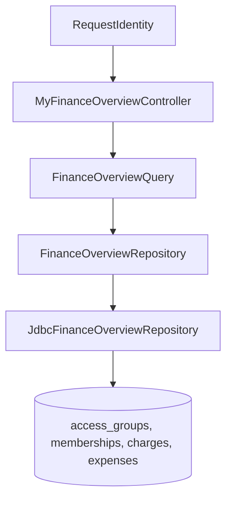

# VUL-177 Design

**Spec:** `.specs/features/vul-177-finance-overview/spec.md`
**Status:** Approved for implementation

## Architecture Overview

O endpoint será uma leitura vertical isolada dentro do módulo `features:groups`:



`FinanceOverviewQuery` resolve o período e delega a leitura. O repositório recebe o `UUID` do ator e
faz a autorização na CTE `administered_groups`, evitando carregar grupos de atleta para depois
filtrar em memória. O saldo é calculado em SQL com subconsultas separadas para não multiplicar
linhas de charges e despesas em joins.

## Code Reuse Analysis

| Existing Component | Location | How to Use |
| --- | --- | --- |
| Actor resolution | `features/groups/.../VerifiedGroupActorResolver.kt` | Resolver `RequestIdentity` para user id logado. |
| Request error contract | `features/groups/.../AccessGroupController.kt` | Usar `InvalidGroupRequestException` e `fieldErrors`. |
| Finance schema | `features/groups/src/main/resources/db/migration/V5__add_group_finance.sql` | Ler charges, eventos, despesas e eventos append-only. |
| Direction/payment contract | `.../V32__add_finance_direction_and_paid_method.sql` | Usar `direction` e `paid_method` sem reimplementar migração. |
| Finance services | `application/finance/charge/ChargeManagement.kt`, `expense/ExpenseService.kt` | Preservar semântica de `PAID`, `ACTIVE`, `IN` e `OUT`; não alterar serviços. |
| JDBC conventions | `adapter/output/jdbc/finance/JdbcChargeManagementRepository.kt`, `JdbcExpenseRepository.kt` | `JdbcClient`, soft-delete join e mapeamento explícito. |
| Spring wiring | `bootstrap/.../AccessSessionConfiguration.kt` | Registrar apenas os novos beans. |

## Components

### `FinanceOverviewPeriod` and `FinanceOverviewQuery`

- **Purpose:** Validar `month`/`year`, resolver o mês corrente no fuso do produto e retornar o modelo
  de consulta.
- **Location:** `features/groups/src/main/kotlin/.../application/finance/overview/FinanceOverview.kt`
- **Interfaces:** `execute(actorId, month, year): FinanceOverviewQueryResult`.
- **Dependencies:** `Clock`, `ZoneId`, `FinanceOverviewRepository`.
- **Reuses:** Tipos `UUID`, `YearMonth`, padrão de resultados da camada de aplicação.

### `JdbcFinanceOverviewRepository`

- **Purpose:** Consultar somente grupos administrados e projetar saldo, totais, saúde e lançamentos.
- **Location:** `.../adapter/output/jdbc/finance/JdbcFinanceOverviewRepository.kt`
- **Interfaces:** Implementa `FinanceOverviewRepository.find(actorId, period)`.
- **Dependencies:** `DataSource`, `JdbcClient`, fuso para converter datas de despesas em `Instant`.
- **Reuses:** Schema V5/V9/V22/V25/V32 e a fórmula oficial de saldo.

### `MyFinanceOverviewController`

- **Purpose:** Expor `GET /api/me/finance/overview`, autenticar o ator, validar query e serializar a
  resposta estruturada.
- **Location:** `.../adapter/input/http/MyFinanceOverviewController.kt`
- **Interfaces:** `overview(identity, month, year): FinanceOverviewResponse`.
- **Dependencies:** `VerifiedGroupActorResolver`, `FinanceOverviewQuery`.
- **Reuses:** `@AuthenticationPrincipal`, `ResponseEntity`/Jackson e mensagens de validação existentes.

## Data Models

```kotlin
data class FinanceOverviewTotals(
    val balanceCents: Long,
    val inCents: Long,
    val outCents: Long,
    val pendingCents: Long,
)

data class FinanceOverviewGroup(
    val id: UUID,
    val name: String,
    val balanceCents: Long,
    val pendingMonthlyCount: Int,
    val hasBillingConfigured: Boolean,
)
```

Recent transactions use `kind` (`MONTHLY`/`LAUNCH`), nullable `direction` for monthly charges,
nullable `memberName`/`description`, amount, group identity and `occurredAt`. The controller maps
enums to their stable names for JSON.

## Query Strategy

1. `administered_groups` selects active groups where the actor owns the group or has role `ADMIN`.
2. Group projection computes:
   - accumulated balance from all `PAID` charges plus active `IN` minus active `OUT`;
   - period `inCents` from paid charge events plus active `IN` expenses;
   - period `outCents` from active `OUT` expenses;
   - period `pendingCents` from `PENDING` charges by `due_date`;
   - pending monthly count through the period end;
   - billing configuration from group default or effective active mensalista.
3. Two bounded recent queries fetch paid monthly charge events and active expenses for the period;
   the repository merges, orders descending by instant/id and keeps five.

## Error Handling Strategy

| Error Scenario | Handling | User Impact |
| --- | --- | --- |
| Missing filters | Use current month in `America/Sao_Paulo`. | Transparent default. |
| Invalid month/year or both filters | `InvalidGroupRequestException` (HTTP 400) with Portuguese field errors. | Client can correct the selected period. |
| Unknown/athlete/soft-deleted groups | Excluded in SQL. | No 403 or data leakage; empty result remains 200. |

## Risks & Concerns

| Concern | Location | Impact | Mitigation |
| --- | --- | --- | --- |
| Aggregating charges and expenses with direct joins can multiply amounts. | New repository queries | Inflated totals. | Use independent correlated aggregates and integration fixtures with mixed rows. |
| Paid charge has no direct `paid_at` column. | `group_charge_events` | Wrong period totals/recent ordering if charge row date is used. | Use the append-only event where `new_status='PAID'`. |
| Existing finance repositories are being used by VUL-176. | `adapter/output/jdbc/finance/` | Merge conflicts or accidental contract changes. | Add `JdbcFinanceOverviewRepository`; do not edit statement files. |
| Spring configuration is explicit. | `AccessSessionConfiguration.kt` | Endpoint may compile but not boot without bean wiring. | Add a small import and two bean declarations; integration gate boots the application. |

## Tech Decisions

| Decision | Choice | Rationale |
| --- | --- | --- |
| Query authorization | SQL CTE | Enforces OWNER/ADMIN boundary at the data source. |
| Recent limit | 5 | Satisfies the requested 3–5 range without fabrication. |
| Date zone | Configured monthly-charge zone | Aligns current-period selection and product billing behavior. |
