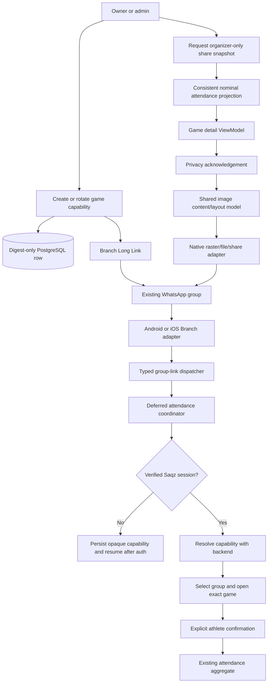

# WhatsApp Attendance Sharing Design

**Spec:** `.specs/features/whatsapp-attendance-sharing/spec.md`
**Context:** `.specs/features/whatsapp-attendance-sharing/context.md`
**Status:** Approved

---

## Architecture Decision

Use one persisted opaque attendance-link capability per game. The backend stores
only its SHA-256 digest, replaces it atomically on rotation, and derives runtime
validity from the authoritative game state and confirmation deadline. Branch
transports the raw capability but is never authoritative.

This is preferred over a self-contained signed token because immediate rotation
is simple and already proven by group invitations. It is preferred over a
generic action-link refactor because invitations and attendance links have
different authorization and resolution semantics, and no broader abstraction
is required for this feature.

The nominal attendance snapshot remains a separate authenticated organizer API.
An attendance capability never grants access to other members' names. Shared
mobile code owns the interaction, content model, dimensions, and visual rules;
native adapters own raster encoding, temporary files, and the operating-system
share sheet.

---

## Architecture Overview



### Boundary Rules

- Backend `features:groups` owns capabilities, authorization, nominal projection,
  attendance resolution, and every business rule.
- Mobile `features:groups` owns DTOs, deferred state, route state/intents/effects,
  image content/layout rules, and Compose UI.
- Android/iOS own Branch SDK dispatch, raster encoding, protected temporary
  files, and native share-sheet presentation only.
- The existing attendance mutation endpoint remains the only confirmation path.
- No WhatsApp SDK, package name, phone number, username, or group identifier is
  introduced into the domain.
- No authenticated browser surface is added.

---

## Code Reuse Analysis

### Existing Components to Leverage

| Component | Location | How to Use |
| --- | --- | --- |
| Invite capability value objects and crypto | `backend/features/groups/src/main/kotlin/br/com/saqz/groups/application/invite/InviteTokenPorts.kt`, `adapter/output/crypto/JcaSecureTokenGenerator.kt` | Follow the same 32-byte random token, 43-character Base64URL code, SHA-256 digest, defensive-copy, and redacted-string contracts with attendance-specific types. |
| Invite rotation repository | `backend/features/groups/src/main/kotlin/br/com/saqz/groups/adapter/output/jdbc/invite/JdbcInviteManagementRepository.kt` | Reuse the group/game lock, digest-only upsert, unique digest, and atomic replacement pattern. |
| Branch invite factory | `backend/features/groups/src/main/kotlin/br/com/saqz/groups/adapter/output/link/BranchInviteLinkFactory.kt` | Reuse strict HTTPS domain validation and deterministic Branch Long Link construction with a distinct path/parameter. |
| Group authorization | `backend/features/groups/src/main/kotlin/br/com/saqz/groups/domain/GroupAccessPolicy.kt` | Add a narrow organizer action available to `OWNER` and `ADMIN`; keep athletes/non-members denied. |
| Attendance aggregate | `backend/features/groups/src/main/kotlin/br/com/saqz/groups/application/attendance/RespondAttendance.kt` | Reuse unchanged after link resolution; capability opening never bypasses it. |
| Membership name query | `backend/features/groups/src/main/kotlin/br/com/saqz/groups/adapter/output/jdbc/membership/JdbcMembershipRepository.kt` | Follow validated `AccessName`, owner synthesis, and deterministic duplicate-name tie-breaking patterns. |
| Deferred invite coordinator | `mobile/features/groups/src/commonMain/kotlin/br/com/saqz/groups/presentation/DeferredInviteCoordinator.kt` | Reuse pending-code persistence, auth wait, replacement, retry, terminal clear, logout clear, and dedup behavior in an attendance-specific coordinator. |
| Native Branch adapters | `mobile/android-app/src/main/kotlin/br/com/saqz/androidapp/access/AndroidLinkAdapter.kt`, `mobile/ios-app/SaqzIOS/IOSLinkAdapter.swift` | Refactor one Branch lifecycle consumer to dispatch typed invite or attendance events; do not initialize Branch twice. |
| Game detail state machine | `mobile/features/groups/src/commonMain/kotlin/br/com/saqz/groups/presentation/games/detail/GameDetailViewModel.kt` | Own link/share state, typed intents, and one-shot effects for the existing game route. |
| Native share adapters | `mobile/android-app/src/main/kotlin/br/com/saqz/androidapp/access/AndroidLocalAccessAdapters.kt`, `mobile/ios-app/SaqzIOS/IOSLocalAccessAdapters.swift` | Follow system-sheet presentation patterns, but add a Groups-owned image payload port rather than extending Access ownership. |
| Photo temporary-file safety | `mobile/android-app/src/main/kotlin/br/com/saqz/androidapp/groups/photo/AndroidPhotoFiles.kt`, `mobile/ios-app/SaqzIOS/GroupsPhoto/IOSGroupPhotoAdapters.swift` | Reuse cache containment, atomic write, file protection, bounded encode, and deterministic cleanup techniques. |

### Integration Points

| System | Integration Method |
| --- | --- |
| PostgreSQL | Add one Flyway table keyed by game with globally unique digest, creator, and timestamps. |
| Branch | New Long Link parameter `saqz_attendance` and path `attendance/<opaque-code>`; no business fields. |
| Authenticated API | Organizer management/snapshot routes and member capability resolution use the existing Firebase-backed principal and privacy problem mapping. |
| Ktor mobile network | Add attendance-link DTOs/gateway in `mobile/features/groups`; no backend domain imports. |
| App navigation | Deferred resolution returns authenticated group/game IDs, selects the group, invalidates old private state, and opens the existing game-detail route. |
| Native sharing | Android uses a narrow `FileProvider` cache path and `ACTION_SEND`; iOS uses a protected cache file with `UIActivityViewController`. |

---

## Backend Components

### Attendance Link Domain and Ports

- **Purpose:** Represent validated raw codes and redacted digests and define
  generation, Branch link creation, persistence, and resolution ports.
- **Location:** `backend/features/groups/src/main/kotlin/br/com/saqz/groups/application/attendance/share/`
- **Interfaces:**
  - `AttendanceLinkCode.from(raw: String): AttendanceLinkCode`
  - `AttendanceLinkTokenGenerator.generate(): AttendanceLinkToken`
  - `AttendanceLinkFactory.create(code: AttendanceLinkCode): URI`
  - `AttendanceLinkRepository.rotate(actorId, groupId, gameId, digest): AttendanceLinkTarget`
  - `AttendanceLinkRepository.resolve(actorId, digest, now): AttendanceLinkResolution?`
- **Dependencies:** Existing group/game models, role policy, secure random and
  digest primitives through adapters.
- **Rules:** Code format exactly matches the proven 32-byte Base64URL contract;
  raw codes never persist or appear in logs/errors.

### Manage Attendance Link

- **Purpose:** Create/rotate a game's sole active capability and return its
  Branch URL to an authorized organizer.
- **Location:** `.../application/attendance/share/RotateAttendanceLink.kt`
- **Flow:** Load and lock game, privacy-check group, require `OWNER`/`ADMIN`,
  require `PUBLISHED` and `now <= confirmationDeadline`, build the Branch URL,
  atomically replace the digest, and return only the URL.
- **Concurrency:** Two simultaneous rotations serialize on the game row; exactly
  one persisted digest remains valid.
- **Failure:** Branch creation happens before persistence. Provider failure
  leaves the prior active link unchanged.

### Resolve Attendance Link

- **Purpose:** Convert an opaque capability into the exact private destination
  for an authenticated current member without mutating attendance.
- **Location:** `.../application/attendance/share/ResolveAttendanceLink.kt`
- **Flow:** Validate syntax, apply invalid-attempt rate limiting, digest and look
  up capability, verify current membership, `PUBLISHED` lifecycle and deadline,
  then return group/game IDs.
- **Privacy:** Malformed, unknown, rotated, expired, non-member and inaccessible
  targets share one terminal not-found outcome with no target metadata.
- **Retry:** Provider/database unavailability maps to retryable infrastructure
  failure; rate limit returns `Retry-After`.

### Nominal Attendance Share Projection

- **Purpose:** Return one consistent organizer-only projection for image content.
- **Location:** `.../application/attendance/share/AttendanceShareSnapshot.kt`
- **Output:** Game title, local start/date, venue display, capacity, and three
  lists of validated display names. Waitlisted rows also contain stable position.
- **Authorization:** `OWNER`/`ADMIN` only; athlete is `403`, inaccessible group or
  game is privacy-preserving `404`.
- **Query:** One JDBC read joins the target game, current attendance,
  `access_users`, and persisted/synthesized group role context. It excludes
  members with no attendance row.
- **Ordering:** Confirmed and declined sort by normalized display name then user
  ID internally; waitlisted sorts by sequence then user ID. Internal IDs are
  discarded before the application response.
- **Consistency:** Run in one read-only transaction at one PostgreSQL snapshot;
  no timestamp is exposed to mobile.

### HTTP Adapter

- **Purpose:** Expose minimal authenticated contracts.
- **Location:** `backend/features/groups/src/main/kotlin/br/com/saqz/groups/adapter/input/http/AttendanceShareController.kt`
- **Routes:**
  - `POST /api/groups/{groupId}/games/{gameId}/attendance-link` rotates and returns `{ "url": "https://..." }`.
  - `POST /api/attendance-links/resolve` accepts `{ "code": "..." }` and returns `{ "groupId": "...", "gameId": "..." }` only after successful authorization.
  - `GET /api/groups/{groupId}/games/{gameId}/attendance-share` returns the nominal organizer snapshot.
- **Errors:** Reuse stable API problems/correlation IDs. Capability strings and
  nominal lists are redacted from diagnostics.

### JDBC and Branch Adapters

- **Persistence table:** `game_attendance_links(game_id PK, group_id,
  token_digest UNIQUE, created_by_user_id, created_at, updated_at)` with FKs to
  game/group/user and digest-length checks.
- **No `expires_at`:** Runtime expiry derives from game lifecycle/deadline; this
  avoids duplicated clocks and stale denormalized validity.
- **Branch:** `BranchAttendanceLinkFactory` shares domain validation behavior but
  emits only `$deeplink_path=attendance/<code>`, `saqz_attendance=<code>`, and
  required provider flags.
- **Rate limit:** Reuse the existing ten-invalid-attempts-per-user/ten-minute
  policy through an attendance-specific repository row or a capability-kind key;
  do not couple attendance to invite application types.

---

## Mobile Components

### Typed Group Link Dispatcher

- **Purpose:** Ensure Android/iOS initialize Branch once while delivering
  distinct invite and attendance capabilities.
- **Location:** `mobile/features/groups/src/commonMain/kotlin/br/com/saqz/groups/port/NativeGroupPorts.kt` plus native adapters.
- **Model:** `GroupLinkEvent.Invite(code)` or
  `GroupLinkEvent.Attendance(code)`; unknown/mixed/invalid payloads are ignored.
- **Deduplication:** Same event from direct and Branch delivery emits once;
  different capability kinds/values remain distinct.
- **Compatibility:** Existing invitation behavior and persisted invite state are
  preserved while their listener consumes only invite events.

### Deferred Attendance Link Coordinator

- **Purpose:** Preserve and resolve an attendance capability through cold/warm
  launch, installation and authentication.
- **Location:** `mobile/features/groups/src/commonMain/kotlin/br/com/saqz/groups/presentation/attendance/share/DeferredAttendanceLinkCoordinator.kt`
- **State:** One opaque pending code, resolution-in-flight flag, retryable error,
  and resolved destination effect; no group/game/private data persists before
  successful authenticated resolution.
- **Behavior:** Newer capability replaces older pending value; terminal result,
  discard or logout clears it; temporary/rate-limited failure retains it.
- **Output:** Select-group command followed by an open-game-detail effect after
  selection reconciliation.

### Attendance Sharing Gateway

- **Purpose:** Carry link management, resolution and snapshot contracts over the
  existing authenticated Ktor client.
- **Location:** `mobile/features/groups/src/commonMain/kotlin/br/com/saqz/groups/data/attendance/share/AttendanceShareApi.kt`
- **Interfaces:** `rotateLink`, `resolveLink`, and `readSnapshot` with existing
  `NetworkResult` and stable problem mapping.

### Game Detail Share State

- **Purpose:** Add organizer actions without introducing a second route or
  state owner.
- **Location:** existing `GameDetailViewModel.kt` and stateless game detail UI.
- **Intents:** Request/share attendance link, request image snapshot, acknowledge
  privacy, cancel privacy, retry snapshot, and report native share result.
- **Link retry:** Route state retains the last successfully rotated URL until a
  new rotation replaces it or the route is disposed, regardless of native share
  outcome. `RetryAttendanceLinkShare` emits that exact URL without a network
  request or digest rotation.
- **Effects:** Text-link share and attendance-image share are one-shot effects;
  route state stores no platform file/URI.
- **Visibility:** Link and image actions render for `OWNER`/`ADMIN` only when the
  route's bound group matches selected private state. Link management additionally
  requires open published attendance; historical snapshot export remains allowed
  for existing game attendance visible to an organizer.

### Shared Image Content and Layout Model

- **Purpose:** Define one deterministic Saqz-branded image independent of
  platform file APIs.
- **Location:** `mobile/features/groups/src/commonMain/kotlin/br/com/saqz/groups/presentation/attendance/share/AttendanceShareImage.kt`
- **Content:** Group-independent game header, local schedule, venue, capacity,
  `Confirmados`, `Lista de espera`, and `Fora`, counts, names, and waitlist positions.
- **Layout:** Fixed logical width and typography/spacing tokens; height is checked
  arithmetic over header, section headers, empty labels, and every wrapped row.
  No timestamp, no-response section, pagination, IDs, phone numbers, or usernames.
- **Overflow:** Never clip, omit, paginate, or silently reduce typography. A
  platform allocation/encoding limit returns a retryable generation failure.

### Native Attendance Share Port

- **Purpose:** Share the exact cached attendance URL or rasterize/share the
  nominal image through one Groups-owned system edge.
- **Common interface:** `shareAttendanceLink(url, callback)` and
  `shareAttendanceImage(model, callback)`; platform paths, URIs and image objects
  never enter common state.
- **Android:** Draw one PNG, store under a dedicated cache subdirectory exposed
  by a narrow `FileProvider` path, send `image/png` with `EXTRA_STREAM` and read
  permission through an Activity Result-backed launcher. Report launch failure,
  chooser return/cancellation, or presentation completion to common code; delete
  the current file on terminal callback and purge bounded stale files on startup
  as fallback when Android does not return a reliable recipient result.
- **iOS:** Draw one PNG, atomically write it with complete file protection,
  provide the URL to `UIActivityViewController`, use popover-safe presentation,
  and delete it after completion/cancellation or bounded stale-file cleanup.
- **Outcome semantics:** Normalize `Presented`, `Cancelled`, `Failed`, and
  `Unknown`. Cancellation/completion is asserted only where the platform offers
  reliable evidence; missing/unreliable callbacks become `Unknown`. Every
  outcome preserves link retry state, and none claims WhatsApp selection or
  delivery.

---

## Data Models

### Persisted Capability

```text
game_attendance_links
  game_id UUID PRIMARY KEY
  group_id UUID NOT NULL
  token_digest BYTEA UNIQUE NOT NULL  -- exactly 32 bytes
  created_by_user_id UUID NOT NULL
  created_at TIMESTAMPTZ NOT NULL
  updated_at TIMESTAMPTZ NOT NULL
```

The raw capability exists only during generation, URL creation, incoming request
validation, and hashing. Rotation replaces the single row; deadline/lifecycle
checks make stale rows non-actionable without a cleanup dependency.

### Organizer Snapshot DTO

```kotlin
data class AttendanceShareSnapshotDto(
    val title: String,
    val startsAt: String,
    val timeZone: String,
    val venue: String,
    val capacity: Int,
    val confirmed: List<AttendanceSharePersonDto>,
    val waitlisted: List<AttendanceSharePersonDto>,
    val declined: List<AttendanceSharePersonDto>,
)

data class AttendanceSharePersonDto(
    val displayName: String,
    val waitlistPosition: Long? = null,
)
```

No internal user ID, group ID, game ID, email, phone or username appears in a
person row. Group/game IDs remain route parameters or authenticated resolution
metadata, not image content.

### Deferred Local State

```kotlin
data class PendingAttendanceLink(
    val code: String,
)
```

Only the opaque capability persists locally. A resolved destination is consumed
through navigation and is not persisted as capability-derived private preview.

---

## Error Handling Strategy

| Error Scenario | Handling | User Impact |
| --- | --- | --- |
| Branch cannot create link | Do not replace persisted digest | Existing link remains usable; organizer can retry. |
| Simultaneous rotations | Serialize on game row | Last completed rotation is the only valid link. |
| Unknown/rotated/expired/non-member capability | Same terminal privacy-preserving not-found | Pending link clears; no group/game preview. |
| Invalid-attempt limit reached | `429` plus `Retry-After` | Pending code remains until retry window or discard. |
| No session | Persist opaque code only | Auth flow runs, then destination resumes. |
| Temporary resolve failure | Preserve pending code | Retry is offered without duplicate navigation. |
| Snapshot authorization failure | Stable `403`/privacy `404` | No names reach mobile. |
| Snapshot changes after read | Image uses the single returned snapshot | No claim that the static image remains live. |
| Raster size/allocation/encoding failure | Abort, clean temporary state, report retryable generation failure | No clipped or partial image is shared. |
| Share cancelled/fails | Delete temporary image and preserve attendance | Organizer may regenerate/retry. |

---

## Security, Privacy, and Observability

- Store only token digests and redact capability value-object `toString` output.
- Never put business IDs, names, attendance or finance data in Branch URLs or
  provider metadata.
- Resolve only after authentication and current group-membership verification.
- Return nominal lists only to current `OWNER`/`ADMIN` through a separate route.
- Require explicit in-app privacy acknowledgement immediately before nominal
  image sharing; acknowledgement is not persisted as blanket consent.
- Restrict Android `FileProvider` to the generated-image cache directory and use
  one-time read grants. Apply iOS complete file protection and bounded cleanup.
- Log/measure only operation name, coarse outcome/error category, correlation
  ID, duration, and platform where relevant. Never log role, lifecycle, counts,
  target identifiers, raw capabilities, names, image bytes, contact data or
  private game fields.
- Invalid attempts 1 through 10 remain counted for the complete ten-minute
  window. Attempt 11 is rejected with exact `Retry-After`; a successful
  resolution does not reset the count, and only window expiry starts a new one.
- Secret/config additions, if any, use existing Branch configuration and are
  covered by `scripts/check-credentials`.

---

## Risks & Concerns

| Concern | Location | Impact | Mitigation |
| --- | --- | --- | --- |
| Existing member attendance read intentionally hides other identities | `backend/features/groups/.../AttendanceController.kt` | Widening it would leak private names to athletes. | Add a separate organizer-only snapshot query/route; leave existing endpoint unchanged. |
| Branch adapters currently accept only `saqz_invite` | `AndroidLinkAdapter.kt`, `IOSLinkAdapter.swift` | A second independent Branch consumer could lose or duplicate cold/warm events. | Refactor to one typed dispatcher and regression-test invitation flows. |
| Existing share ports support text only and live under Access | `NativeAccessPorts.kt`, native local adapters | Extending them deepens feature ownership leakage and cannot attach images safely. | Add a Groups-owned image share port; reuse native implementation patterns only. |
| One image has content-dependent memory/dimension cost | New native image adapters | Very large response sets may exceed platform raster limits. | Checked dimensions, no clipping/pagination, deterministic cleanup, stress tests with the maximum practical fixture, and explicit retryable failure instead of corrupted output. |
| Static image cannot be revoked or updated | External WhatsApp destination | Shared names may remain after Saqz data changes. | Explicit privacy acknowledgement and static language; do not claim live status or attempt impossible retraction. |
| No timestamp is displayed by product decision | New image content | Recipients cannot assess exact snapshot age. | Keep image generation explicit/manual and avoid copy claiming real-time freshness. |
| Owner is synthesized in membership reads while attendance FK uses persisted memberships | Membership/attendance JDBC schemas | Owner attendance/name projection could be inconsistent if owner can respond. | Snapshot query follows actual attendance rows and joins users directly; tests cover owner/admin/athlete records and no-response omission. |
| Current native share adapters report presentation, not delivery | Native adapters | Product could incorrectly claim WhatsApp delivery. | Copy/effects report only sheet opened/completed/cancelled; never “sent to WhatsApp.” |

---

## Requirement Mapping

| Requirement | Design Components |
| --- | --- |
| WA-01 | Attendance link domain/ports, manage use case, Branch adapter, HTTP route |
| WA-02 | JDBC capability table/repository, authorization, game lock and lifecycle checks |
| WA-03 | Game detail share state and Groups-owned native attendance share port |
| WA-04 | Typed link dispatcher, local pending state, deferred attendance coordinator |
| WA-05 | Resolve use case/route, membership check, private navigation effect |
| WA-06 | Existing `RespondAttendance` path and game detail explicit action |
| WA-07 | Dispatcher dedup, pending lifecycle, invalid-attempt limiter and error mapping |
| WA-08 | Organizer snapshot use case, JDBC projection and authenticated route |
| WA-09 | Shared image content/layout model and native raster adapters |
| WA-10 | Compose privacy acknowledgement, image share effect and cleanup |
| WA-11 | Digest/redaction, narrow APIs/files, logs/metrics and safety gates |

All 11 requirements are mapped; none remain without a design component.

---

## Tech Decisions

| Decision | Choice | Rationale |
| --- | --- | --- |
| Capability model | One persisted digest per game | Immediate rotation and proven invite pattern. |
| Runtime expiry | Authoritative game status and confirmation deadline | Avoid duplicated validity state and cleanup dependency. |
| Link provider | Existing Branch Long Links | Preserves install-deferred Android/iOS behavior under AD-021. |
| Link dispatch | One typed native Branch dispatcher | Prevents duplicate SDK lifecycle ownership. |
| Confirmation | Existing authenticated attendance mutation | Capability never becomes business authorization. |
| Nominal data | Separate organizer-only projection | Does not weaken existing athlete privacy. |
| Image composition | Shared content/layout rules, native raster/file edge | Keeps product behavior shared while isolating platform image/file APIs. |
| Sharing destination | Generic native share sheet | No WhatsApp package coupling and graceful platform fallback. |

These choices conform to active AD-003, AD-005, AD-017 through AD-021, AD-025,
and AD-026. No project-level decision must be added or superseded.
