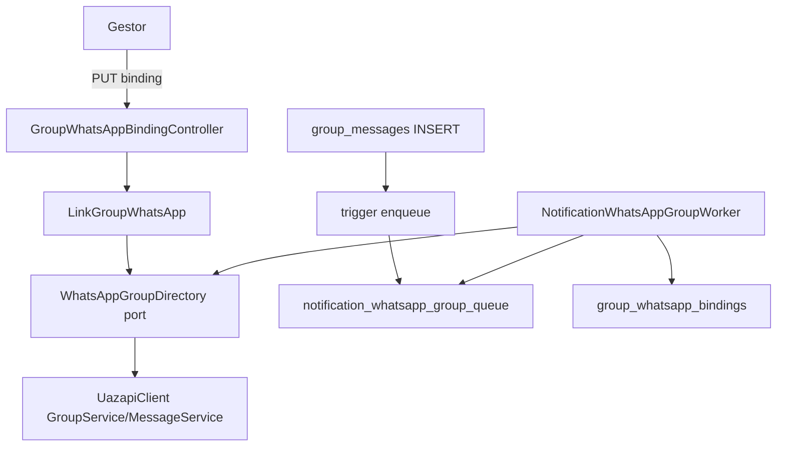

# Canal de grupo de WhatsApp — Design

**Spec**: `.specs/features/whatsapp-group-channel/spec.md`
**Status**: Approved

## Arquitetura



## Modelos de dados (migrações atribuídas — não renumerar)

### V73__group_whatsapp_bindings.sql
```sql
CREATE TABLE group_whatsapp_bindings (
    group_id uuid PRIMARY KEY REFERENCES access_groups(id),
    whatsapp_jid varchar(64) NOT NULL UNIQUE,
    invite_code varchar(64) NOT NULL,
    group_name varchar(200) NOT NULL,
    instance_jid varchar(64) NOT NULL,
    enabled boolean NOT NULL DEFAULT true,
    broken_at timestamptz,
    created_by uuid NOT NULL REFERENCES access_users(id),
    created_at timestamptz NOT NULL DEFAULT now(),
    updated_at timestamptz NOT NULL DEFAULT now()
);
```

### V76__notification_whatsapp_group_queue.sql

> **Numeração corrigida:** V73 (T1) e V75 (T4) já foram integradas e aplicadas no dev. Flyway aqui roda
> com `outOfOrder=false` (default), então a V74 nunca pode existir depois disso — a fila usa **V76**.
> V74 fica permanentemente vago.
```sql
CREATE TABLE notification_whatsapp_group_queue (
    message_id uuid PRIMARY KEY REFERENCES group_messages(id),
    attempts integer NOT NULL DEFAULT 0,
    next_attempt_at timestamptz NOT NULL DEFAULT now(),
    status varchar(12) NOT NULL DEFAULT 'PENDING'
        CHECK (status IN ('PENDING','ACCEPTED','FAILED','CANCELLED')),
    completed_at timestamptz
);
CREATE INDEX ix_whatsapp_group_pending
    ON notification_whatsapp_group_queue(next_attempt_at) WHERE status = 'PENDING';

CREATE FUNCTION enqueue_notification_whatsapp_group() RETURNS trigger LANGUAGE plpgsql AS $$
BEGIN
    INSERT INTO notification_whatsapp_group_queue(message_id)
    SELECT NEW.id FROM group_whatsapp_bindings b
    JOIN access_groups g ON g.id = b.group_id AND g.deleted_at IS NULL
    WHERE b.group_id = NEW.group_id AND b.enabled AND b.broken_at IS NULL
      AND NEW.channel IN ('NOTICE','REMINDER')
    ON CONFLICT (message_id) DO NOTHING;
    RETURN NEW;
END;
$$;
CREATE TRIGGER notification_whatsapp_group AFTER INSERT ON group_messages
    FOR EACH ROW EXECUTE FUNCTION enqueue_notification_whatsapp_group();
```

### V75__whatsapp_dm_charge_only.sql
`CREATE OR REPLACE VIEW notification_delivery_context` — única mudança: o CASE de
`whatsapp_enabled` passa a `WHEN 'CHARGE' THEN coalesce(p.whatsapp_charges, false) ELSE false END`.
Nada mais muda na view nem no trigger `notification_channels`.

## Componentes backend

| Componente | Local | Papel |
|---|---|---|
| `GroupWhatsAppBinding` (modelo) | `features/groups/.../application/whatsapp/GroupWhatsAppBinding.kt` | groupId, whatsappJid, inviteCode, groupName, instanceJid, enabled, brokenAt; `status()` = ACTIVE/DISABLED/BROKEN |
| `GroupWhatsAppBindingRepository` (port + Jdbc) | `application/.../GroupWhatsAppBindingRepository.kt`, `adapter/output/jdbc/whatsapp/JdbcGroupWhatsAppBindingRepository.kt` | find/upsert/setEnabled/markBroken/cancelPendingByGroup |
| `WhatsAppGroupDirectory` (port + adapter SDK) | `application/whatsapp/WhatsAppGroupDirectory.kt`, `adapter/output/whatsapp/UazapiGroupDirectory.kt` | **único ponto de parse do JsonNode do SDK** (U1) |
| `LinkGroupWhatsApp` (use case) | `application/whatsapp/LinkGroupWhatsApp.kt` | fluxo AC1 completo |
| `ManageGroupWhatsAppBinding` (use case) | `application/whatsapp/ManageGroupWhatsAppBinding.kt` | get + setEnabled (AC2) |
| `GroupWhatsAppBindingController` | `adapter/input/http/GroupWhatsAppBindingController.kt` | rotas abaixo |
| `NotificationWhatsAppGroupSender` (port) | `application/communication/` (junto do sender DM) | `send(jid, messageId, body): WhatsAppDelivery` |
| `UazapiGroupNotificationSender` | `adapter/output/whatsapp/` | `client.messages().sendText` com JID, sem regex de phone |
| `JdbcNotificationWhatsAppGroup` (fila) | `adapter/output/jdbc/communication/` | drain, revalidação, estados |
| Config | `NotificationWhatsAppConfiguration.kt` (mesma classe) | beans da fila/worker de grupo; worker `@Scheduled(fixedDelayString = "${saqz.notifications.whatsapp.group-delay-ms:15000}")` |

### Porta `WhatsAppGroupDirectory` (contrato exato)
```kotlin
data class WhatsAppGroupInfo(val jid: String, val name: String, val admins: List<String>) // admins = telefones normalizados (só dígitos)
sealed interface DirectoryError { data object InvalidInvite : DirectoryError
    data object NotInGroup : DirectoryError; data object Disconnected : DirectoryError
    data class Unavailable(val cause: String) : DirectoryError }
interface WhatsAppGroupDirectory {
    fun instanceStatus(): String // telefone da instância, só dígitos; lança DirectoryError.Disconnected
    fun inviteInfo(inviteCode: String): WhatsAppGroupInfo
    fun join(inviteCode: String)
    fun groupInfo(jid: String): WhatsAppGroupInfo // lança NotInGroup quando 404/fora
    fun isMember(jid: String): Boolean
}
```

## Endpoints (contrato fixo — mobile implementa contra isto)

| Rota | Body | 200 | Erros |
|---|---|---|---|
| `PUT /api/groups/{groupId}/whatsapp-binding` | `{inviteLink: string}` | `{groupJid, groupName, enabled: true, status: "ACTIVE"}` | 403 não-gestor; 422 invite inválido / sem admin resolvível; 409 JID já vinculado a outro grupo / entrada pendente; 502 instância desconectada ou provider indisponível |
| `GET /api/groups/{groupId}/whatsapp-binding` | — | `{bound: false}` ou `{bound: true, groupJid, groupName, status: ACTIVE\|DISABLED\|BROKEN}` | 403 |
| `PATCH /api/groups/{groupId}/whatsapp-binding` | `{enabled: boolean}` | igual ao GET (bound: true) | 403; 404 sem vínculo |

Extração do código do convite: aceitar URL completa ou código puro — regex
`(?:chat\.whatsapp\.com/)?([A-Za-z0-9]{10,50})`.

## Worker de grupo — algoritmo (sem decisão em aberto)

1. Pegar 1 job `PENDING` com `next_attempt_at <= now()` (`FOR UPDATE SKIP LOCKED`), até 20/rodada.
2. Buscar vínculo do `group_id` da mensagem. Se inexistente, desabilitado ou quebrado → `CANCELLED`.
3. REMINDER: jogo não publicado/prazo vencido/passado → `CANCELLED`.
4. `directory.groupInfo(jid)`: `NotInGroup` → marcar `broken_at`, cancelar pendentes do grupo, `CANCELLED`; `Unavailable` → retry (backoff igual DM, máx 10 → `FAILED`).
5. `isMember` false → idem passo 4 (quebrado).
6. `send(jid, messageId, body-template)` → `ACCEPTED`. Mesma classificação de erro do sender DM.

## Mobile — contrato

- **Gateway novo** `GroupWhatsAppGateway` (domain, `features/groups/domain/.../communication/`):
  `binding(groupId): SaqzResult<GroupWhatsAppBinding, CommunicationError>`,
  `link(groupId, inviteLink): SaqzResult<GroupWhatsAppBinding, CommunicationError>`,
  `setEnabled(groupId, enabled): SaqzResult<GroupWhatsAppBinding, CommunicationError>`.
  `GroupWhatsAppBinding = {bound: Boolean, groupJid: String?, groupName: String?, status: enum ACTIVE|DISABLED|BROKEN|NONE}`.
- **Rota nova** `GroupsRoute.WhatsApp(groupId)` + entrada a partir de `GroupsRoute.Edit`
  ("Configurações avançadas > WhatsApp"). Root/Screen/ViewModel novos em
  `presentation/whatsappbinding/`, módulo DI próprio, registrado em `SaqzNavHost` +
  `saqzLocalNavConfiguration`.
- **Preferências**: `NotificationCenterRoot` remove os switches `whatsapp-notices` e
  `whatsapp-reminders`; **mantém** `whatsapp-charges`. Ao salvar, o payload continua completo —
  envia os valores **recebidos do servidor** para `whatsapp.notices`/`whatsapp.reminders` (o
  controller exige os 3 campos quando `whatsapp` está presente). Nenhuma mudança de contrato na
  API de preferências.
- Sem mudança nativa (Android/iOS) — toda a lógica é gateway + UI.

## Erros e casos de borda

| Cenário | Resposta |
|---|---|
| Invite sem admin com `PhoneNumber` resolvível (incógnito) | 422 `whatsapp.unresolvable_admins` |
| `join` ok mas instância não aparece em `Participants` | 409 `whatsapp.join_pending` |
| JID já vinculado a outro grupo Saqz | 409 `whatsapp.jid_in_use` |
| Instância `status.connected=false` | 502 `whatsapp.instance_disconnected` |
| Timeout/conexão Uazapi | 502 `whatsapp.provider_unavailable` |

## Riscos

| Risco | Mitigação |
|---|---|
| U1 (semântica `Owner*`) pode mudar o parse | parse isolado em `UazapiGroupDirectory`; T0 antes de T2 |
| Colisão de migrações entre lanes | V73 (T1) e V75 (T4) já em main/dev; T3 usa **V76** (V74 fica vago, `outOfOrder=false`) |
| Colisão de testes entre lanes | fila de grupo = **novo** arquivo `NotificationWhatsAppGroupIntegrationTest.kt`; T4 só edita o existente |
| `JsonNode` do SDK sem tipagem | fakes no mesmo formato JSON da doc oficial nos testes de unidade |
